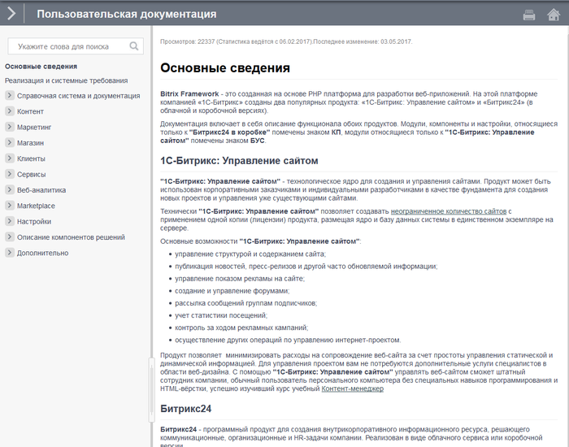
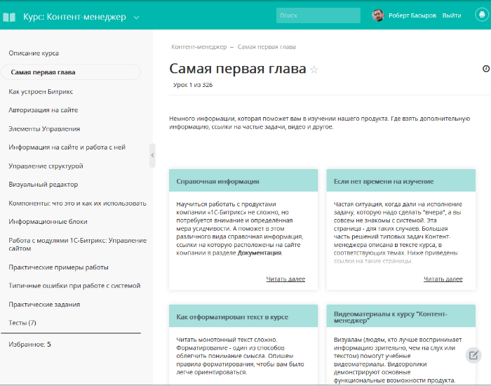

# Справочная информация

**Навигация**
- [← Оглавление курса](index.md)
- [Следующий: 6440 — Как отформатирован текст в курсе →](lesson_6440.md)

Официальная страница урока: https://dev.1c-bitrix.ru/learning/course/index.php?COURSE_ID=41&LESSON_ID=2152

Научиться работать с продуктами компании «1С-Битрикс» не сложно, но потребуется внимание и определённая мера усидчивости. А поможет в этом различного вида справочная информация, ссылки на которую расположены на сайте компании в разделе [Документация](http://dev.1c-bitrix.ru/docs/).

### Разные виды документации

- [Онлайн документация для пользователей](http://dev.1c-bitrix.ru/user_help/) - описание интерфейса системы управления сайтом, ее основных модулей и наиболее типичных операций. Также в ней содержится полное описание прикладного программного интерфейса.
- Онлайн документация для разработчиков [по старому ядру](http://dev.1c-bitrix.ru/api_help/), по ядру [D7](http://dev.1c-bitrix.ru/api_d7/) и по [Rest_API](http://dev.1c-bitrix.ru/rest_help/). Предназначена для технических специалистов со знанием PHP и HTML. В ней содержатся сведения о технологиях и основных принципах, заложенных в систему, описание классов и функций по всем продуктам.

### Учебные курсы

[Онлайн Курсы](http://dev.1c-bitrix.ru/learning/index.php#tab-online-link) - это методические пособия по работе с продуктом, которые включают в себя описание и примеры работы с системой.

### Контекстная справка

Контекстная справка выводит в Административной части системы информацию, относящуюся к открытому в данный момент разделу или странице. Доступна как в

			1С-Битрикс: Управление сайтом

                    Обилие справочной информации «1С-Битрикс: Управление сайтом» иной раз создаёт проблему: где искать ответ на свой вопрос? Для облегчения поиска иголки в стоге сена создана Контекстная помощь, доступная только в Административном разделе системы.

 [Подробнее ...](http://dev.1c-bitrix.ru/learning/course/index.php?COURSE_ID=34&LESSON_ID=5081)

		, так и в

			Битрикс24 в коробке

                    Для обучения работе в сервисе Битрикс24 создана специальная служба Поддержки24. К ней можно обратиться нажатием на кнопку со знаком вопроса в "шапке" сервиса...

 [Подробнее ...](https://dev.1c-bitrix.ru/learning/course/index.php?COURSE_ID=48&LESSON_ID=5081)

		.

### Мастер магазина

			Мастер магазина

                    Стандартный функционал «1С-Битрикс: Управление сайтом» позволяет организовать работу интернет-магазина непосредственно «из коробки», то есть после установки сайта на хостинг. Но это не значит, что интернет-магазин не нужно настраивать.

[Подробнее ...](http://dev.1c-bitrix.ru/learning/course/index.php?COURSE_ID=42&LESSON_ID=3558)

		 - встроенная в административную часть система помощи с краткой информацией по конкретной задаче в рамках настройки и эксплуатации интернет-магазина со ссылками на более детальную информацию в конкретных учебных курсах.

### FAQ - Частые вопросы

[Частые вопросы](http://dev.1c-bitrix.ru/support/faq/) - подборка решений наиболее часто встречающихся проблем при работе с продуктом в удобном представлении.

**Примечание:** В дополнение к документации, информацию, касающуюся продуктов компании «1С-Битрикс», можно получить на сайте в разделе

			форум

                    В форумах нашего Центра поддержки разработчиков вы можете задать свои вопросы и обсудить варианты их решения.

 [Подробнее ...](http://dev.1c-bitrix.ru/community/forums/)

		.

Для администраторов и разработчиков также рекомендуется познакомиться с опытом разработок сайтов на *Bitrix Framework*, который описывается в [блогах](http://dev.1c-bitrix.ru/community/webdev-blogs/) разработчиков и в [группах](http://dev.1c-bitrix.ru/community/webdev/group/search/) Социальной сети сайта компании 1С-Битрикс.
