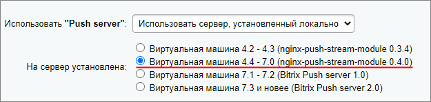
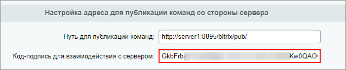

# Переход с Nginx-PushStreamModule на Bitrix Push server 2.0

**Навигация**
- [← Оглавление курса](index.md)
- [← Предыдущий: 21580 — Переход с Bitrix Push server 1.0 на Bitrix Push server 2.0](lesson_21580.md)
- [Следующий: 21594 — Использование отдельного сервера очередей →](lesson_21594.md)

Официальная страница урока: https://dev.1c-bitrix.ru/learning/course/index.php?COURSE_ID=41&LESSON_ID=21582

### Общая информация


Модуль сервера очередей **Nginx-PushStreamModule** устарел и может работать нестабильно (зависание сообщений, падения). В результате чего сообщения могут не доставляться, это вызывает высокую нагрузку на службу PHP из-за особенностей работы модуля Nginx. Также он ограничен в функционале – в нем нет поддержки protobuf и персональных каналов, которые работают без сервера, нет возможности опроса публичного канала, чтобы узнать, кто в сети, и т.д.


Последние версии модулей продуктов *«1С-Битрикс»* работают намного лучше с новым сервером очередей *Bitrix Push server 2.0*. Например, телефония и чаты работают с ним значительно быстрее, т.к. коммуницируют с пользователями напрямую, минуя PHP.


**Внимание:** Поддержка старых версий серверов очередей: *Nginx-PushStreamModule 0.3.4/0.4.0* и *Bitrix Push server 1.0* прекращена осенью 2021 года. Перейдите c *Nginx-PushStreamModule* на новый сервер очередей **Bitrix Push server 2.0** с помощью инструкции этого урока.


### 1. Обновление VMBitrix


Обновите *виртуальную машину VMBitrix* до последней стабильной версии: 2. Configure localhost settings &gt; 6. Update server.


**Важно!** Обязательно перед обновлением сделайте резервное копирование вашей *VMBitrix*. Подробнее об обновлении *виртуальной машины VMBitrix* читайте [в специальном курсе](https://dev.1c-bitrix.ru/learning/course/index.php?COURSE_ID=37&LESSON_ID=8839).


### 2. Установка Bitrix Push server 2.0


По умолчанию в *виртуальной машине VMBitrix* версии 7.4.4 и ниже в качестве сервера очередей используется *Nginx-PushStreamModule*.


В главном меню *виртуальной машины VMBitrix*: 9. Configure Push/RTC service for the pool смотрим, какой сервер используется в качестве сервера очередей. В данном примере видим, что это действительно **Nginx-PushStreamModule**:


Если тип сервера очередей будет **NodeJS-PushServer**, то можно переходить к шагу **3. Bitrix Push server 2.0 в продуктах «1С-Битрикс»**.


Выбираем пункт меню 1. Install/Update NodeJS RTC service, вводим название хоста **Hostname** и подтверждаем установку:


Дожидаемся, пока задача по установке и запуску службы *NodeJS-PushServer* будет закончена:


Проверить текущие выполняемые задачи можно с помощью меню **10. Background tasks in the pool &gt; 1. View running tasks**. Если по каким-либо причинам нужно посмотреть лог-файлы выполнения задач, то они находятся в директории `/opt/webdir/temp`.


### 3. Bitrix Push server 2.0 в продуктах «1С-Битрикс»


В административном разделе в Настройки &gt; Настройки продукта &gt; Настройки модулей &gt; Push and Pull мы видим, что сервер очередей настроен на модуль

			nginx-push-stream-module

                    

		.


Перед переходом на **Bitrix Push server 2.0** вам нужно предварительно сбросить настройки сервера очередей. Для этого нажмите на кнопку **По умолчанию**:


**Важно!** Нажимать дополнительно на кнопку **Сохранить** не нужно!


Чтобы включить новый сервер очередей *Bitrix Push server 2.0*, в опции **Использовать "Push server": установленный локально** выберите **Виртуальная машина 7.3 и новее (Bitrix Push server 2.0)** и сохраните настройки:


Все готово. Как правило, никаких настроек больше не требуется.


**Примечание**: В

			актуальных версиях

                    На декабрь 2022 года это версия 22.300.0.

		 модуля Push and Pull в настройках доступен только один вариант локального сервера очередей - *Bitrix Push server 2.0*.


### Возможные ошибки


При установке и первом запуске *Bitrix Push server 2.0* создается уникальный секретный код в файле настроек сервера очередей **/etc/push-server/push-server*.json** в секции `security` в параметре `key`:


```

"security": {
	"key": "<ваш секретный ключ>"
},
```


В *виртуальной машине BitrixVM* при первом запуске *Bitrix Push server 2.0* этот код автоматически прописывается в файл настроек ядра системы **/bitrix/.setting.php** и в базу данных, а также он виден в административном интерфейсе в поле **Код-подпись для взаимодействия с сервером**:





Бывают ситуации, когда по каким-либо причинам в файле настроек ядра **/bitrix/.setting.php** и в базе данных секретный код отличается от того, который прописан в настройках сервера очередей. Из-за этого сервер очередей работает некорректно, сообщения не доставляются.


Чтобы решить эту проблему, необходимо в меню *виртуальной машины BitrixVM* пересоздать роль *NodeJS-PushServer*: 9. Configure Push/RTC service for the pool &gt; 1. Install/Update NodeJS RTC service


Если у вас свое серверное окружение, то можно сделать это вручную:


1. Скопировать ключ из файла настроек сервера очередей **/etc/push-server/push-server*.json**.
2. Перейти в административном интерфейсе продукта *«1С-Битрикс»*: Настройки &gt; Настройки продукта &gt; Настройки модулей &gt; Push and Pull и сбросить настройки сервера очередей кнопкой **По умолчанию**.
3. Скопированный ключ вставить в поле **Код-подпись для взаимодействия с сервером** и сохранить настройки.


После этого работа сервера очередей будет восстановлена.


### Доп. материалы


- [Новые требования к серверному окружению для работы чатов](https://helpdesk.bitrix24.ru/open/12715116/)
- [Переход с Bitrix Push server 1.0 на Bitrix Push server 2.0](lesson_21580.md)
- [Настройки модуля и сервера очередей Push and Pull](lesson_2033.md)
- [Установка БУС/КП на другие окружения](/learning/course/index.php?COURSE_ID=135&CHAPTER_ID=020866)
