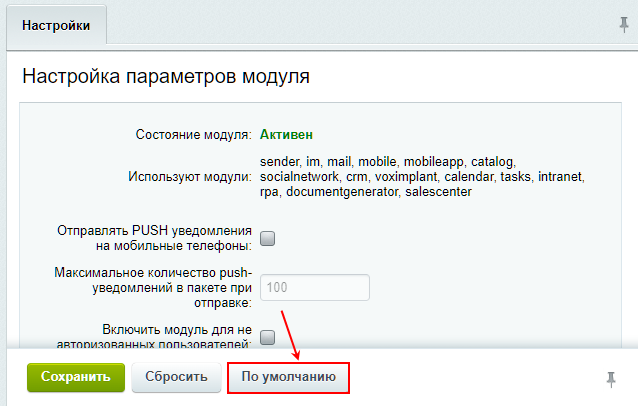

# Использование отдельного сервера очередей

**Навигация**
- [← Оглавление курса](index.md)
- [← Предыдущий: 21582 — Переход с Nginx-PushStreamModule на Bitrix Push server 2.0](lesson_21582.md)
- [Следующий: 20306 — Проверьте себя →](lesson_20306.md)

Официальная страница урока: https://dev.1c-bitrix.ru/learning/course/index.php?COURSE_ID=41&LESSON_ID=21594

### Отдельный сервер очередей


Есть вариант установки отдельно стоящего локального сервера очередей **Bitrix Push server 2.0** на базе [виртуальной машины VMbitrix](https://dev.1c-bitrix.ru/learning/course/index.php?COURSE_ID=37).


Плюс такого метода – если у вас свое серверное окружение и ресурсы сервера ограничены, то вы можете запустить отдельную машину на базе *VMbitrix*, которая будет обслуживать только роль сервера очередей, сняв при этом нагрузку с основного сервера с коробочной версией продукта «1C-Битрикс». Также удобнее будет производить дальнейшее масштабирование и обслуживание.


### 1. Настройка сервера очередей


1. [Скачайте образ виртуальной машины VMbitrix](https://www.1c-bitrix.ru/download/vmbitrix.php) под нужный вам гипервизор или [установите с помощью скрипта bitrix-env.sh](https://dev.1c-bitrix.ru/learning/course/index.php?COURSE_ID=37&LESSON_ID=8811) на отдельный сервер с CentOS 7.
2. [Создайте и настройте пул сервера](https://dev.1c-bitrix.ru/learning/course/index.php?COURSE_ID=37&CHAPTER_ID=08817): 1. Create Management pool of server, чтобы открыть все необходимые порты в CentOS для корректной работы сервисов.
3. [Обновите виртуальную машину VMBitrix](/learning/course/index.php?COURSE_ID=37&LESSON_ID=8839) до последней версии: 2. Configure localhost settings &gt; 6. Update server.
  
4. Виртуальная машина по умолчанию создает в директории сайта **/home/bitrix/www** скрипты для быстрой установки продуктов «1C-Битрикс». Этот сайт не нужен, его нужно удалить.
  Для этого перейдите в меню 6. Configure pool sites &gt; 2. Delete site и выберите директорию сайта **/home/bitrix/www**.
  
5. Создайте новый сайт 6. Configure pool sites &gt; 1. Create site и укажите: адрес будущего сервера очередей, тип `kernel`, кодировку `UTF-8`. В примере адрес сервера `push.b24test.club`.
  
  **Примечание:** Адрес (домен) сервера может быть как локальным, так и внешним – это зависит от инфраструктуры, где сервер будет располагаться. В любом случае, сервер с коробкой «1C-Битрикс» и сервер очередей должны быть доступны друг другу по сети.
6. Новый сайт создается в директории **/home/bitrix/ext_www/{адрес_вашего_сайта}/**. Также в этой директории автоматически создаются скрипты для быстрого развертывания продуктов «1C-Битрикс»:
  ```
  [root@violent-culebra ~]# ls /home/bitrix/ext_www/push.b24test.club/
  500.html  bitrix  bitrixsetup.php  images  index.php  restore.php  upload
  [root@violent-culebra ~]#
  ```
  Скрипты **bitrixsetup.php**, **restore.php** и **index.php** не нужны и оставлять в директории сайта их небезопасно. Поэтому удалите их из директории нового сайта (в примере: `push.b24test.club`) и превратите index.php в пустую страницу:
  ```
  rm -f /home/bitrix/ext_www/push.b24test.club/bitrixsetup.php && rm -f /home/bitrix/ext_www/push.b24test.club/restore.php && echo '<?php' > /home/bitrix/ext_www/push.b24test.club/index.php
  ```
  Проверьте, что в директории сайта остались безопасные каталоги и файлы:
  ```
  [root@violent-culebra ~]# ls /home/bitrix/ext_www/push.b24test.club/
  500.html  bitrix  images  index.php  upload
  [root@violent-culebra ~]#
  ```
7. В главном меню *виртуальной машины VMBitrix*: 9. Configure Push/RTC service for the pool смотрим, какой сервер используется в качестве сервера очередей. В данном примере видим, что это **Nginx-PushStreamModule**:
  
  > Если тип сервера очередей будет **NodeJS-PushServer**, то можно переходить к шагу 9 открытия порта для внешних подключений к серверу очередей.
8. Выберите пункт меню 1. Install/Update NodeJS RTC service, введите название хоста **Hostname** и подтвердите установку:
  
  Дождитесь, пока задача по установке и запуску службы *NodeJS-PushServer* будет закончена:
  
  Проверить текущие выполняемые задачи можно с помощью меню 10. Background tasks in the pool &gt; 1. View running tasks. Если по каким-либо причинам нужно посмотреть лог-файлы выполнения задач, то они находятся в директории **/opt/webdir/temp**.
9. Чтобы *Bitrix Push server* мог обслуживать внешние запросы, нужно открыть порт **8895**.
  Нужно узнать, какой файрвол используется в *VMbitrix*:
  ```
  firewall-cmd --zone=public --list-all
  ```
  Если в результате будет выведен список правил, значит используется **firewalld**, если ошибка – значит **iptables**:
  ```
  [root@violent-culebra ~]# firewall-cmd --zone=public --list-all
  -bash: firewall-cmd: command not found
  [root@violent-culebra ~]#
  ```
  Команды для открытия порта 8895:

  - **iptables**:
    ```
    iptables -A bx_public -p tcp -m state --state NEW -m tcp --dport 8895 -m comment --comment "BX: push public port" -j ACCEPT && iptables-save >> /etc/sysconfig/iptables
    ```
  - **firewalld**:
    ```
    firewall-cmd --zone=public --add-port=8895/tcp --permanent && firewall-cmd --reload
    ```
10. При установке и первом запуске *Bitrix Push server 2.0* создается уникальный секретный код в файлах настроек сервера очередей **/etc/push-server/push-server*.json** в секции `security` в параметре `key`:
  ```
  "security": {
  	"key": "<ваш секретный ключ>"
  },
  ```
  Скопируйте этот код – он пригодится для дальнейшей настройки в продукте «1C-Битрикс».
11. Все готово. Подготовка сервера очередей **Bitrix Push server 2.0** на базе *виртуальной машины VMbitrix* завершена.


### 2. Настройка Bitrix Push server 2.0 в продукте «1C-Битрикс»


1. Перейдите в административном разделе: Настройки &gt; Настройки продукта &gt; Настройки модулей &gt; Push and Pull.
  Перед подключением *Bitrix Push server 2.0* нужно предварительно сбросить настройки сервера очередей. Для этого нажмите на кнопку **По умолчанию**:
  
  **Важно!** Нажимать дополнительно на кнопку **Сохранить** не нужно!
2. Далее в опции **Использовать "Push server": установленный локально** выберите **Виртуальная машина 7.3 - 7.5 (Bitrix Push server 2.0)**.
  
  Добавьте в полях **путей для публикации и чтения команд** адрес вашего push-сервера (в примере `push.b24test.club`), а также **Код-подпись для взаимодействия с сервером** из настроек push-сервера **/etc/push-server/push-server*.json**:
  
3. Сохраните настройки.


### 3. Установка защищенного протокола


1. Для взаимодействия между продуктом «1C-Битрикс» и сервером очередей Bitrix Push server 2.0 по защищенным протоколам HTTPS и WSS, нужно, чтобы оба сайта на серверах имели SSL-сертификаты.
  В *VMbitrix* можно [подключить свой SSL-сертификат](https://dev.1c-bitrix.ru/learning/course/index.php?COURSE_ID=37&LESSON_ID=11453) или [выпустить бесплатный от Let's Encrypt](https://dev.1c-bitrix.ru/learning/course/index.php?COURSE_ID=37&LESSON_ID=11453) через меню: 8. Manage pool web servers &gt; 3. Configure certificates.
2. После того, как оба сервера будут работать по HTTPS, добавьте в полях **путей для публикации и чтения команд HTTPS и WSS** адрес вашего пуш-сервера (в примере `push.b24test.club`):
  
3. Сохраните настройки. Все готово.
