# Пример A/B-тестирования страниц

**Навигация**
- [← Оглавление курса](index.md)
- [← Предыдущий: 7201 — Настройки и запуск тестирования](lesson_7201.md)
- [Следующий: 7202 — Отчеты по тестам →](lesson_7202.md)

Официальная страница урока: https://dev.1c-bitrix.ru/learning/course/index.php?COURSE_ID=41&LESSON_ID=21638

### Видеоурок

Как мы выяснили

			ранее

**Тесты** – два варианта страницы или шаблона сайта, которые будут сравниваться друг с другом. Вариант А – это то, что видят все посетители сайта на данный момент, вариант В – то, что будет тестироваться.

Одновременно может быть запущено только одно А/В тестирование, но в рамках него может быть добавлено несколько тестов.

[Подробнее](lesson_7201.md)...

		, одновременно может быть запущено только одно А/В-тестирование. Однако в рамках этого тестирования можно добавить несколько тестов. Рассмотрим на примере, как создать и запустить A/B-тестирование с тестами для двух страниц:

- страница **Новости** – для варианта **B** скопируем эту страницу и поменяем шаблон компонента, выводящего новости;
- страница **О магазине** – пусть в варианте **B** вместо этой страницы показывается страница **Контакты**.

<!-- &lt;iframe title="Пример A/B-тестирования страниц" src="//www.youtube.com/embed/dltyVqPJDrc?feature=oembed&rel=0" allowfullscreen="" width="853" height="480" frameborder="0"&gt;
	 
	&lt;/iframe&gt; -->

### Общие параметры теста

На странице Маркетинг &gt; A/B-тестирование добавим

			новый тест.

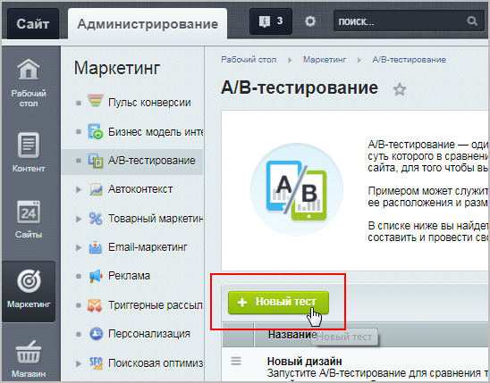

		 В открывшейся форме заполним параметры теста:

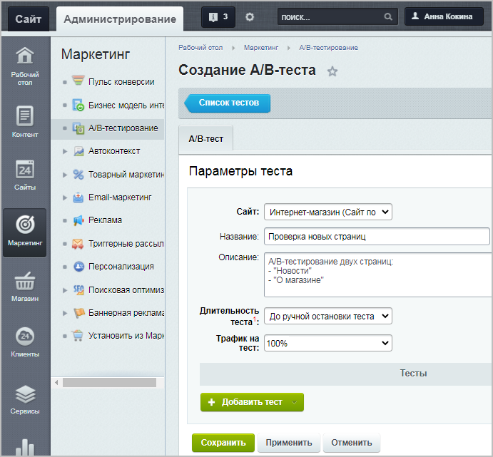

- **Сайт** – выбираем сайт, для которого хотим запустить тестирование;
- **Длительность теста** – выбираем опцию **До ручной остановки теста** (чтобы тест проводился до тех пор, пока мы сами не заходим его остановить);
- **Трафик на тест** – выбираем процент всех пользователей сайта, которые будут участвовать в тестировании. В нашем тесте укажем 100%, т.е. в тестировании участвуют все пользователи: половина из них увидит старые версии страниц (вариант **A**), а половина – новые (вариант **B**).

### Тест #1 (страница Новости)

Нажимаем кнопку **Добавить тест** и выбираем пункт

			Страница

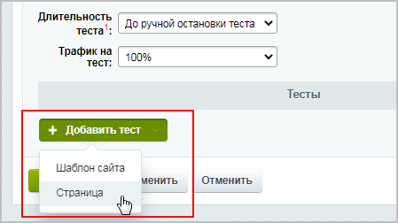

		:

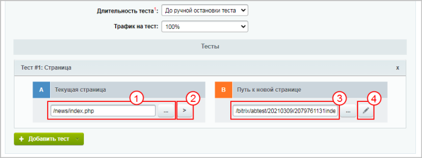

1 В блоке **A** прописываем URL тестируемой страницы **Новости** `/news/index.php` (либо можно нажать кнопку 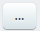 и

			выбрать страницу

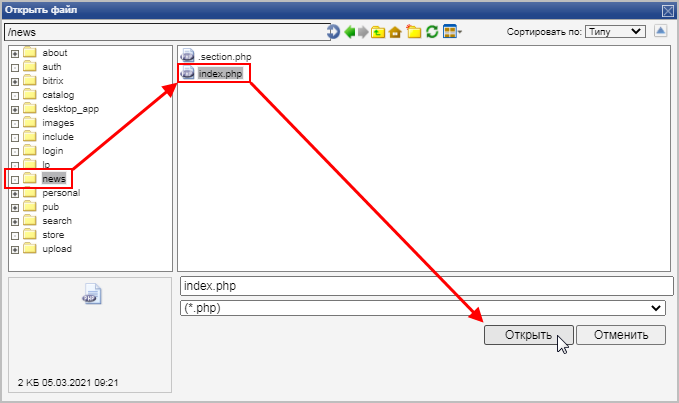

		 из структуры сайта).

2 Нажимаем кнопку **Скопировать страницу**. После этого действия в директории `/bitrix/abtest` автоматически будет создана страница-дубль 3 (блок **B**), которая полностью будет повторять содержимое страницы, указанной в блоке **A**.

4 Нажимаем кнопку **Редактировать страницу** и переходим в форму редактирования:

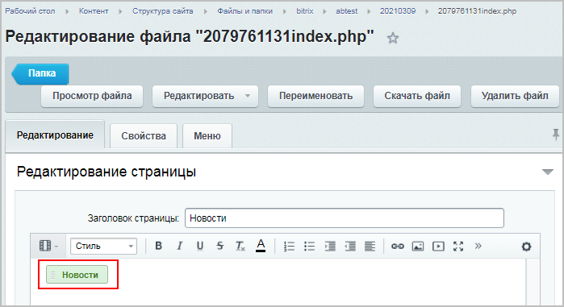

Дважды кликаем по размещенному на этой странице компоненту

			Новости

                    Комплексный компонент позволяет создать новостной раздел на сайте. Доступен просмотр детальной информации, списка элементов, настройка экспорта в rss, организация голосования за новости (или другие элементы инфоблоков), настройка отзывов, вывода материалов по темам, настройки ЧПУ и многое другое.

						[Описание компонента «Новости (комплексный компонент)» в пользовательской документации.](http://dev.1c-bitrix.ru/user_help/detail.php?ID=62967)

		 и в

			настройках компонента

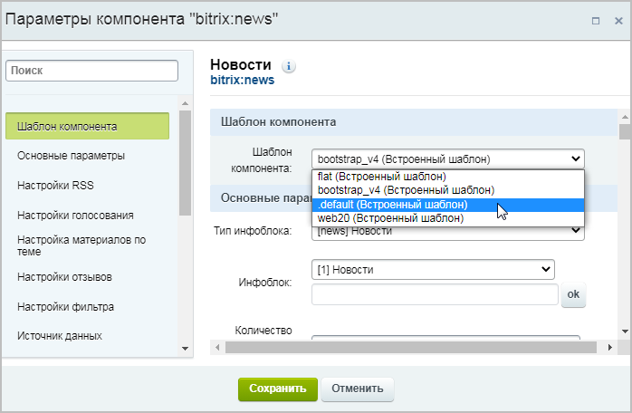

		 меняем текущий шаблон **bootstrap_v4** на **.default**. Сохраняем все внесенные на этой странице изменения.

Возвращаемся в форму создания теста и нажимаем кнопку

			Применить

		 – наши изменения сохранились, и при этом мы остались в форме редактирования теста. С помощью появившейся кнопки

			Посмотреть

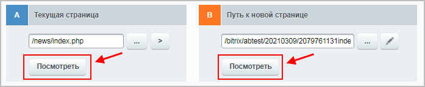

		 можно оценить внешний вид страниц (текущей страницы из блока **A** и изменённой в блоке **B**).

На этом настройка Теста #1 окончена.

### Тест #2 (страница О магазине)

Тест #2 добавляем аналогично Тесту #1 (нажимаем кнопку **Добавить тест** и выбираем пункт

			Страница

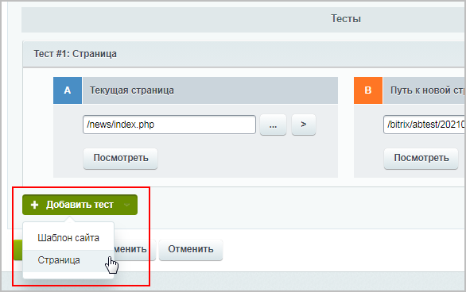

		):

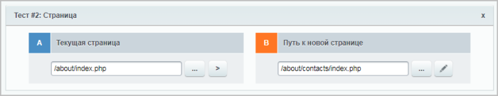

В блоке **A** прописываем URL тестируемой страницы **О магазине** `/about/index.php` (либо можно нажать кнопку  и

			выбрать страницу

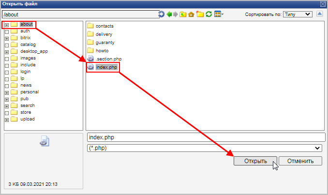

		 из структуры сайта).

В блоке **B** прописываем URL страницы `/about/contacts/index.php`, которую мы хотим во время тестирования подставлять вместо страницы `/about/index.php` (либо добавляем из структуры сайта).

Нажимаем кнопку

			Применить

		 – наши изменения сохранились, и при этом мы остались в форме редактирования теста. С помощью появившейся кнопки

			Посмотреть

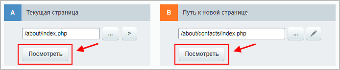

		 можно оценить внешний вид страниц (текущей страницы из блока **A** и новой в блоке **B**).

На этом настройка Теста #2 окончена.

### Результат

В результате у нас создан один A/B-тест, состоящий из двух тестов страниц:

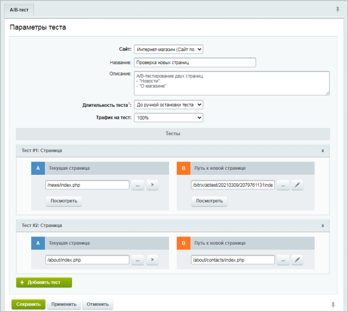

Сохраняем внесенные изменения. Созданный A/B-тест был добавлен в общий список тестов, и теперь его можно запустить:

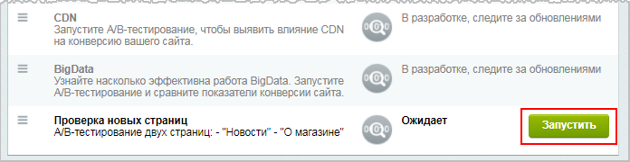

Далее переходим в публичный раздел сайта, открываем тестируемые страницы **Новости** и **О магазине** и с помощью кнопки **A/B-тест** смотрим, как эти страницы будут отображаться для пользователей из группы **B**:

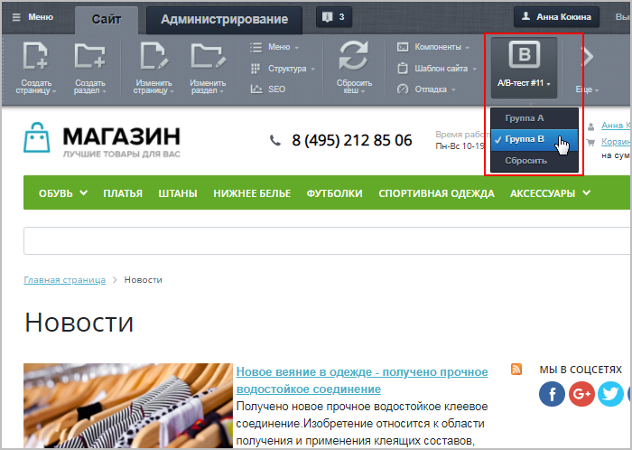

**Примечание**: при тестировании страниц их адреса (URL) остаются неизменными, поэтому проблем с переходами по страницам сайта у посетителей не возникает.
