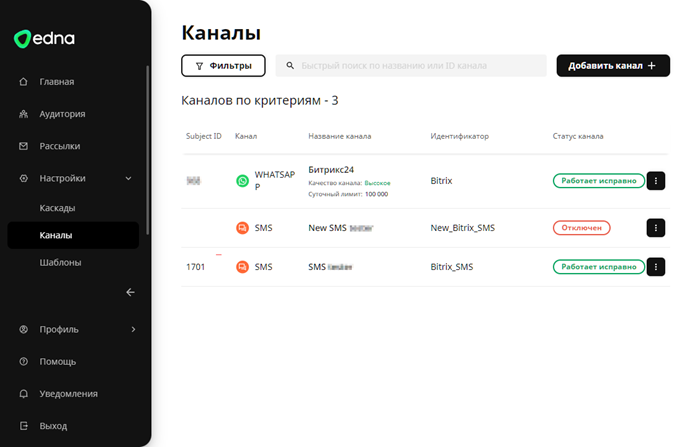
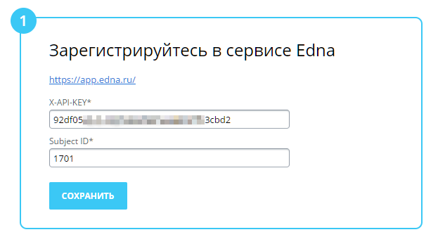
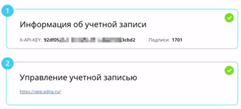

# Подключение сервиса sms.edna.ru

**Навигация**
- [← Оглавление курса](index.md)
- [← Предыдущий: 11231 — Подключение сервиса Twilio.com](lesson_11231.md)
- [Следующий: 25072 — Подключение сервиса Edna.ru WhatsApp* →](lesson_25072.md)

Официальная страница урока: https://dev.1c-bitrix.ru/learning/course/index.php?COURSE_ID=41&LESSON_ID=22074

При [настройке модуля](lesson_11233.md) «Служба сообщений» нужно подключить хотя бы одну из служб отправки SMS. В этом уроке расскажем как подключить сервис **sms.edna.ru**. В продукте он доступен с версии 21.200.0.

Дополнительную информацию об интеграции сервиса с продуктами «1С-Битрикс» вы найдете на специальной странице [сайта Edna](https://edna.ru/sms-bitrix/).

|  | ### Как подключить сервис |
| --- | --- |

Чтобы подключить сервис в продукте нам понадобятся API-ключ (X-API-KEY) и Subject ID SMS-канала Edna:

1. [Зарегистрируйтесь](https://app.edna.ru/auth/signin) в сервисе Edna.
2. Сначала получим API-ключ. Откройте личный кабинет и перейдите по пути Интеграция 1 &gt; Настройки 2:
  
  Здесь скопируйте 3 ваш API-ключ. При необходимости можно сгенерировать новый.
3. В разделе Настройки &gt; Каналы убедитесь, что у вас есть исправные SMS-каналы. У них должен быть числовой идентификатор в столбце **Subject ID** и статус «Работает исправно»:
  
  А в разделе Настройки &gt; Каскады должен быть активный каскад к каждому вашему каналу, который вы хотите использовать в Битрикс. Каскад должен состоять только из данного SMS-канала.
  > Подробную информацию о создании каналов и каскадов вы найдете в документации Edna:
  >
  > - [Как подключить канал SMS](https://docs.edna.ru/kb/adding-an-sms-channel/)
  > - [Как создать каскад](https://docs.edna.ru/kb/how-create-cascades/)
4. Переходим к настройкам со стороны Битрикс. На странице настроек модуля Настройки &gt; Настройки продукта &gt; Настройки модулей &gt; Служба сообщений нажмите на ссылку **Компания sms.edna.ru**. Откроется специальная форма, внизу которой есть два поля **X-API-KEY*** и **Subject ID**. Заполните их данными из личного кабинета:
  
5. Нажмите кнопку **Сохранить** и сервис подключится. На странице отобразится информация об
  			учетной записи
                      
  		 и ссылка на личный кабинет Edna.

#### Как получать информацию о статусах

Если вы хотите знать статусы отправки ваших сообщений (например, *Отправлено* или *Доставлено*):

- В личном кабинете Edna перейдите в Интеграция &gt; Настройки. В секции «Callback URL для статусов» нажмите кнопку **Добавить Callback URL**:
  
- В появившемся окне добавьте стандартный адрес (только замените название сайта на свое): https://[имя_сайта]/bitrix/tools/messageservice/callback_smsednaru.php
- Выполнится проверка адреса, после чего появится уведомление «Callback URL успешно изменен».

|  | ### Дополнительно |
| --- | --- |

- Как настроить интеграцию с edna в облачном Битрикс24
- [Техническая поддержка компании Edna](https://app.edna.ru/help)
