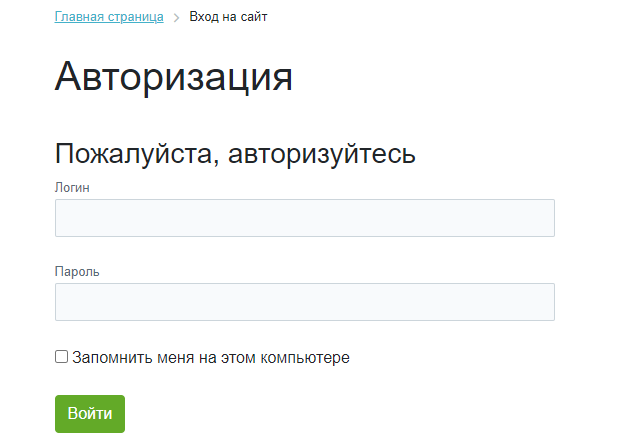

# Добавление сервисов в форму авторизации

**Навигация**
- [← Оглавление курса](index.md)
- [← Предыдущий: 3036 — Настройка модуля](lesson_3036.md)
- [Следующий: 11133 — Общие примечания →](lesson_11133.md)

Официальная страница урока: https://dev.1c-bitrix.ru/learning/course/index.php?COURSE_ID=41&LESSON_ID=23044

В зависимости от выполненных в модуле **Социальные сервисы** настроек меняется внешний вид формы авторизации.

### Как выглядит форма авторизации

Если в настройках модуля **Социальные сервисы** (Настройки &gt; Настройки продукта &gt; Настройки модулей &gt; Социальные сервисы) на вкладке **Настройки** сняты галочки со всех социальных сервисов в разделе **Внешние сервисы**, то форма авторизации примет

			простой вид

                    

		 c возможностью только ввода логина и пароля.

Если же включено и настроено использование каких-либо соц. сервисов из списка , форма авторизации отобразит кнопки выбранных социальных сервисов.

Для того, чтобы авторизация через выбранные сервисы работала, необходимо выполнить отдельные настройки для каждого сервиса в настройках модуля. В главе [Примеры настройки некоторых сервисов](https://dev.1c-bitrix.ru/learning/course/index.php?COURSE_ID=41&CHAPTER_ID=03040&LESSON_PATH=3911.4772.3040) приведены инструкции по подключению.

Не все социальные сервисы требуют настроек для работы. Если для выбранного социального сервиса нет дополнительной секции в настройках модуля, значит достаточно отметить его в списке сервисов и он станет доступен для авторизации на сайте.

 Пример таких сервисов: Liveinternet.

**Не работает авторизация в Битрикс24.Network**

Ошибка авторизации Битрикс24.Network может возникнуть из-за устаревших модулей. Если авторизация не проходит:

1) проверьте версии модулей в разделе *Настройки &gt; Настройки продукта &gt; Модули*:

- Главный модуль — не ниже 25.100.500
- Социальные сервисы — не ниже 24.100.100

2) обновите модули в разделе *Marketplace &gt; Обновление платформы*, если версии ниже требуемых.

[Как обновить продукт](https://dev.1c-bitrix.ru/learning/course/index.php?COURSE_ID=135&LESSON_ID=2693)

3) обратитесь в [техническую поддержку](https://www.1c-bitrix.ru/support/), если модули актуальны, но проблема сохраняется.

### Процесс авторизации

При авторизации через соц. сервисы открывается отдельное окно с собственным диалогом авторизации внешнего сервиса.

После успешной аутентификации пользователь возвращается на сайт и авторизуется. Если это первый вход пользователя, то он добавляется в список пользователей сайта. При этом на вкладке **Пользователь** (Настройки &gt; Пользователи &gt; Список пользователей &gt; [пользователь]) в поле **Тип авторизации** указывается сервис авторизации.

### Дополнительно

- Урок [Как создать форму авторизации (регистрации) на простых компонентах](https://dev.1c-bitrix.ru/learning/course/index.php?COURSE_ID=35&LESSON_ID=11379);
- [Список компонентов для работы с пользователями](https://dev.1c-bitrix.ru/user_help/components/sluzhebnie/user/index.php) в пользовательской документации;
- Урок [Регистрация по номеру телефона](https://dev.1c-bitrix.ru/learning/course/index.php?COURSE_ID=35&LESSON_ID=12575).
