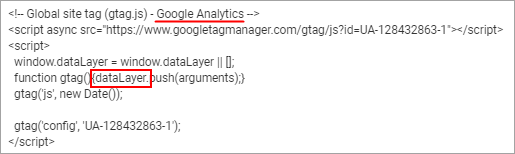
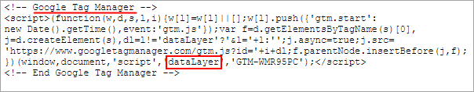
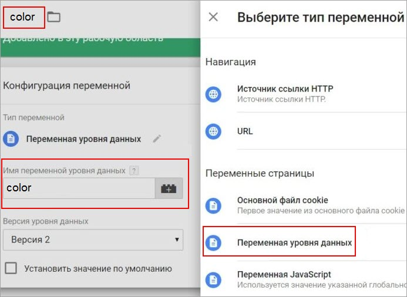
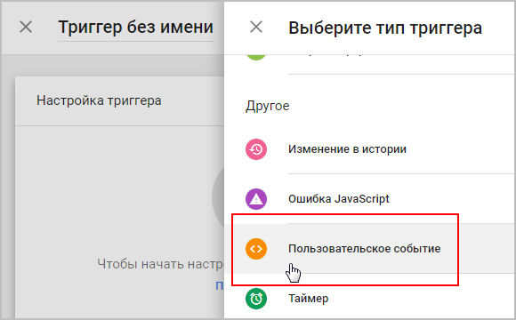

# Уровень данных

**Навигация**
- [← Оглавление курса](index.md)
- [← Предыдущий: 11833 — Создание тегов Google Tag Manager для событий интернет-магазина](lesson_11833.md)
- [Следующий: 12307 — Как подключить электронную торговлю Google →](lesson_12307.md)

Официальная страница урока: https://dev.1c-bitrix.ru/learning/course/index.php?COURSE_ID=41&LESSON_ID=23090

### Если нужно отследить другие события или переменные


Вы можете задать срабатывание тегов не только на

			события интернет-магазина


	**showDetail** - детальный просмотр товара;

	**addToCart** - добавление товара в корзину;

	**checkout** - переход на страницу оформления заказа;

	**purchase** - завершение оформления заказа (заказ совершен);

	**removeFromCart** - удаление товара из корзины.

		, но и на множество других событий или переменных. Например, на такие, как нажатие определенной кнопки, скачивание файла, или на переменную "общая сумма покупки".


Для таких потребностей рекомендуется использовать **Google Tag Manager** совместно с

			уровнем данных

                    **Уровень данных** – это объект, содержащий всю информацию, которую требуется передавать в Менеджер тегов.

		.


Очень удобно использовать **уровень данных** при отслеживании таких событий взаимодействия пользователя с элементами сайта, при которых не меняется URL страницы (например, открытие слайдера, попапа и других всплывающих элементов, заполнение или отправка формы и т.п.).


> **Уровень данных** – это объект (массив объектов) или переменная JavaScript, которая хранит и передает информацию с вашего сайта в **Google Tag Manager**. Затем эти данные могут передаваться и другим сервисам, например, в **Google Analytics** и др.
>
>
>
>
>  
>
>
>
>
>
> **dataLayer** - стандартное имя по умолчанию для массива объектов уровня данных в **Google Tag Manager**.
>
>
>
>
>  


Для того, чтобы информация через **уровень данных** попадала в **Google Tag Manager**, необходимо использовать специальную конструкцию, которая задается по определенным правилам:


- можно передавать одновременно до 300 элементов;
- можно передавать любые типы данных (строки, числа);
- все элементы, которые используются в **dataLayer**, состоят из пары
  			'ключ':'значение'
                      `dataLayer = [{'ключ1':'значение1','ключ2':'значение2'}];`
  	 Имя ключа и значения заключаются в одинарные кавычки, между собой они разделяются двоеточием. Если используется несколько пар 'ключ':'значение', то такие пары между собой разделяются запятыми. Все пары заключаются в фигурные скобки.
  		;
- для отслеживания различных действий пользователя и активации тегов используется специальная переменная `event`;
- можно использовать
  			метод `push()`
                      Универсальная конструкция, позволяющая вызывать **dataLayer** как *до*, так и *после* инициализирующего кода **Google Tag Manager**, выглядит так:
  ```
  <script>
  window.dataLayer = window.dataLayer || [];
  window.dataLayer.push({'event':'value'});
  </script>
  ```
  		 для добавления новых элементов.


### Пример


Например, у нас есть

			виджет

                    **Виджет** — это графическое приложение на странице сайта, рабочем столе компьютера или смартфона. Оно расширяет функционал гаджета или онлайн-платформы и дает пользователю полезную информацию.

		 заказа автомобиля. В нём имеются радио-кнопки выбора цвета и мы хотим отследить заказы красных автомобилей. Можно настроить динамическую переменную **уровня данных** для выбора цвета так:


```
dataLayer.push({'color': 'red'});
```


И передать несколько переменных и событий одновременно с помощью одного оператора `dataLayer.push()`:


```
dataLayer.push({
  'color': 'red',
  'conversionValue': 50,
  'event': 'customizeCar'
});
```


Кроме цвета, здесь мы передали еще переменную "Значение конверсии" и событие "Автомобиль выбран", привязанное к клику по кнопке "Заказать авто" в нашем виджете.


В интерфейсе **Google Tag Manager** необходимо создать:


1. переменную **уровня данных**
  			color
                      
  		;
2. триггер
  			Пользовательское событие
                       
  		 со значением **customizeCar**;
3. тег для передачи данных в **Google Analytics** с типом отслеживания «Событие» и триггером активации **customizeCar**.


Создавать триггеры и теги мы научились в предыдущем [уроке](lesson_11833.md).


Таким образом, мы сформировали уровень данных **DataLayer**, который передал информацию в **Google Tag Manager**. В **Google Tag Manager** запустились триггеры, теги были переданы сервису **Google Analytics**, и мы можем увидеть отчеты на странице Google Аналитики (Отчёты &gt; В режиме реального времени &gt; События).


### Документация по теме


- [Справочник для разработчиков Google. API Google Менеджера тегов](https://developers.google.com/tag-manager/reference?hl=ru#reference)
- [Справочник для разработчиков Google. Как работать с уровнями данных](https://developers.google.com/tag-manager/devguide?hl=ru)
- [Yakov Osipenkov. Уровень данных (dataLayer)](https://osipenkov.ru/datalayer/)
- [Yakov Osipenkov. Интерфейс Google Tag Manager](https://osipenkov.ru/interface-google-tag-manager/)
- [Datalayer в Google Tag Manager — что это такое и как работает?](https://odesseo.com.ua/datalayer-v-google-tag-manager-chto-eto-takoe-i-kak-rabotaet/)
