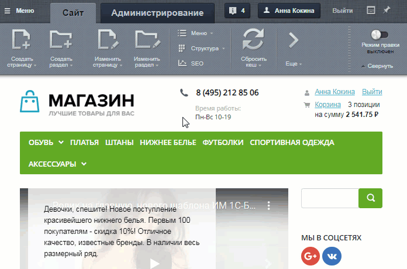
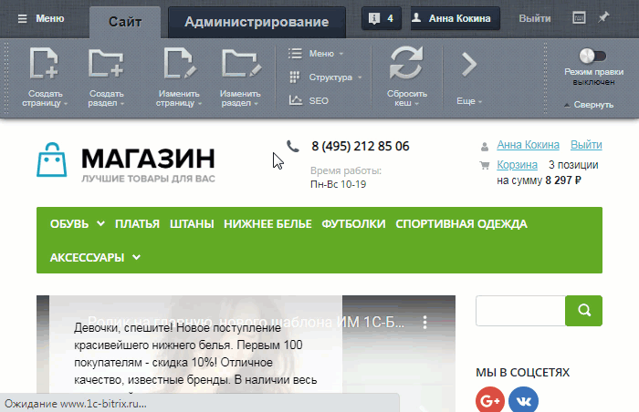
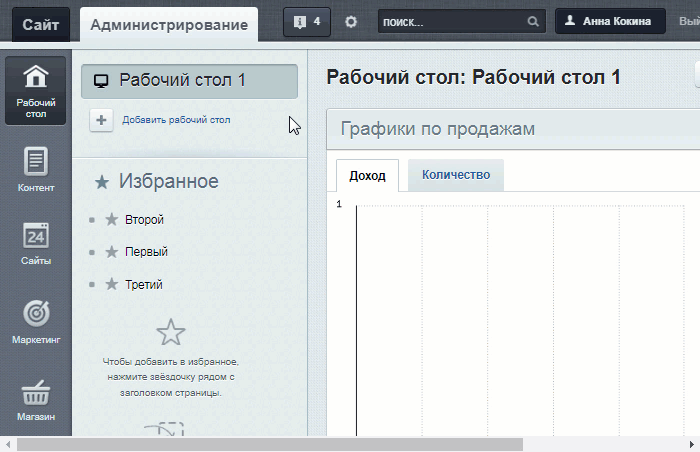
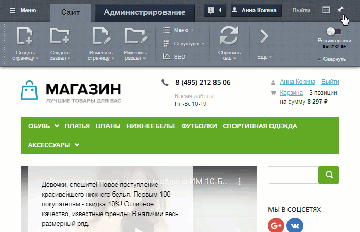
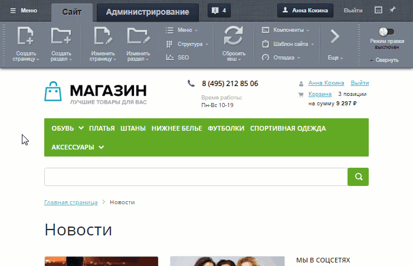
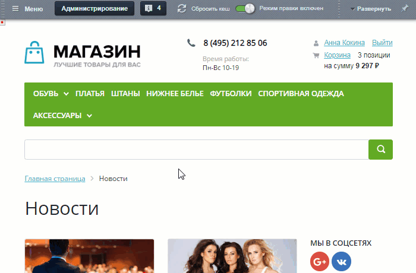
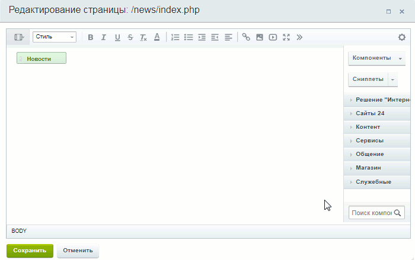
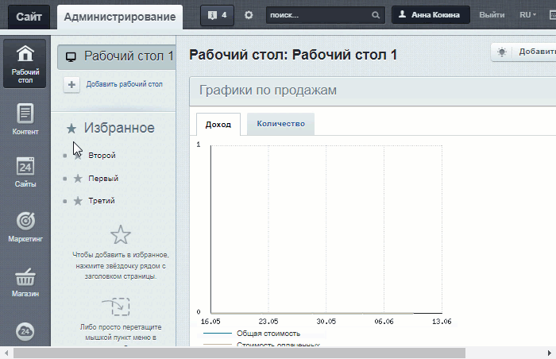
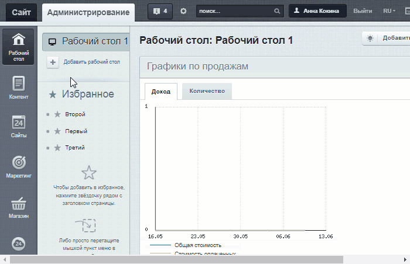

# Типовые действия на сайте

**Навигация**
- [← Оглавление курса](index.md)
- [← Предыдущий: 21926 — Общий справочник модулей](lesson_21926.md)
- [Следующий: 23444 — Как узнать редакцию продукта →](lesson_23444.md)

Официальная страница урока: https://dev.1c-bitrix.ru/learning/course/index.php?COURSE_ID=41&LESSON_ID=25050

|  | ### Типовые действия на сайте |
| --- | --- |

В этом уроке приведены спойлеры с короткими gif-анимациями действий, которые часто приходится выполнять на сайте. Сразу изучать их не обязательно: по мере прохождения курса Вы можете возвращаться к этому уроку, чтобы быстро вспомнить, как выполнить то или иное действие. Для просмотра спойлера просто кликните на "**+**" или на область спойлера.

| \|  \| **Основные кнопки панели управления**
 
 
 
 ## Включить режим "Правка"  
 
 
 
 ## Сбросить кеш страницы  
 
 
 
 ## Перейти в административную часть  
 
 
 
 ## Перейти в публичную часть  
 
 
 
 ## Свернуть/развернуть панель управления  
 
 
 
 ## Закрепить/открепить панель управления в верхней части экрана  \| \| --- \| --- \| \|  \| **Работа со страницей в публичной части**
 
 
 
 ## Создать страницу  
 
 
 
 ## Изменить свойства страницы  
 
 
 
 ## Изменить страницу в визуальном редакторе  
 
 
 
 ## Изменить страницу в панели управления  \| \|  \| **Работа с разделом в публичной части**
 
 
 
 ## Создать раздел  
 
 
 
 ## Изменить свойства раздела  
 
 
 
 ## Изменить раздел в панели управления  \| \|  \| **Работа с компонентами**
 
 
 
 ## Открыть параметры компонента в публичной части  
 
 
 
 ## Открыть параметры компонента в визуальном редакторе  
 
 
 
 ## Добавить компонент в визуальном редакторе  
 
 
 
 ## Свернуть/развернуть панель компонентов в визуальном редакторе  \| \|  \| **Работа с инфоблоками**
 
 
 
 ## Добавить тип инфоблока  
 
 
 
 ## Добавить инфоблок  \| \|  \| **Работа в административном разделе**
 
 
 
 ## Создать страницу в административной части  
 
 
 
 ## Создать раздел в административной части  
 
 
 
 ## Открыть настройки Главного модуля  
 
 
 
 ## Загрузить файлы в папку upload  
 
 
 
 ## Открыть список групп пользователей  
 
 
 
 ## Создать резервную копию  \| |
| --- |
