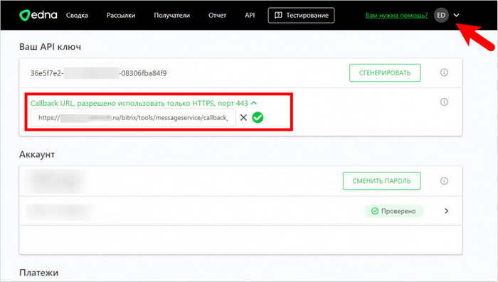
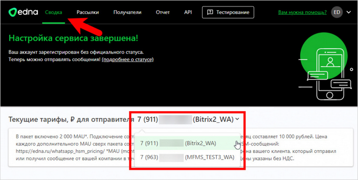
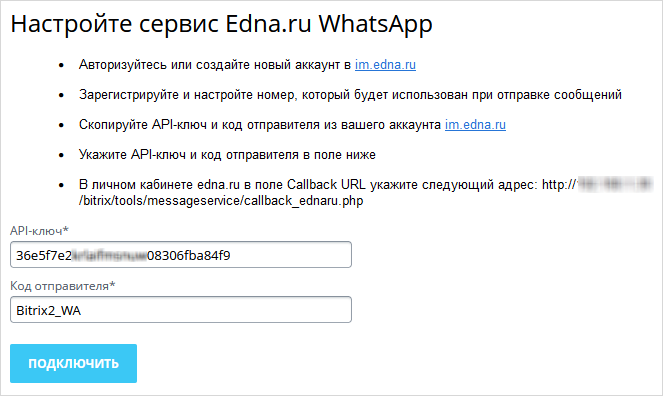

# Подключение сервиса Edna.ru WhatsApp*

**Навигация**
- [← Оглавление курса](index.md)
- [← Предыдущий: 22074 — Подключение сервиса sms.edna.ru](lesson_22074.md)
- [Следующий: 20126 — Проверьте себя →](lesson_20126.md)

Официальная страница урока: https://dev.1c-bitrix.ru/learning/course/index.php?COURSE_ID=41&LESSON_ID=25072

* Компания Meta, владеющая WhatsApp, признана экстремистской и запрещена на территории Российской Федерации.

|  | ### Сервис предоставлен компанией Edna |
| --- | --- |

**Примечание:** изначально сервис **Edna.ru WhatsApp** в полном объеме был доступен только в *1С-Битрикс24*. С версии **22.300.0** модуля **Служба сообщений** интеграция со службой **Edna.ru WhatsApp** возможна и в *1С-Битрикс: Управление сайтом*. Однако стандартные рассылки через интерфейс в *1С-Битрикс: Управление сайтом* работать не будут. Эта интеграция была создана для облегчения работы разработчикам и партнёрам, которые могут подключить службу **Edna.ru WhatsApp** через интерфейс, а потом уже самостоятельно через код настроить рассылку в **WhatsApp**.

Подключите сервис всего за несколько простых шагов:

1. Выполните настройки со стороны сервиса [im.edna.ru](https://im.edna.ru/auth/signin):

  - Авторизуйтесь или создайте новый аккаунт.
  - Зарегистрируйте и настройте номер, который будет использован при отправке сообщений.
  - Перейдите на страницу профиля в личном кабинете и скопируйте **API-ключ**:
     
  - В поле **Callback URL** укажите следующий адрес: https://[имя_вашего_сайта]/bitrix/tools/messageservice/callback_ednaru.php.
     
    **Важно!** Сайт должен работать по протоколу
    			HTTPS
                        Перевод сайта на работу по протоколу https обеспечивает защиту от атак, основанных на прослушивании сетевого соединения. В административном разделе создана специальная страница с указанием последовательности работ по настройке HTTPS соединения.
    Подробнее в курсе [Администратор. Базовый](https://dev.1c-bitrix.ru/learning/course/index.php?COURSE_ID=35&LESSON_ID=3261).
    		.
  - Скопируйте **код отправителя** из вашего аккаунта. Взять его можно в разделе **Сводка**, рядом с номером телефона в скобках (в примере это Bitrix2_WA).
    
2. Выполните настройки со стороны *1С-Битрикс: Управление сайтом* или *1С-Битрикс24*:
  Выполнится подключение сервиса и в форме отобразится информация об учетной записи.

  - На странице настроек модуля Настройки &gt; Настройки продукта &gt; Настройки модулей &gt; Служба сообщений нажмите на ссылку **Edna.ru WhatsApp**.
  - В открывшейся форме введите скопированные ранее **API-ключ** и **код отправителя**:
    
  - Нажмите кнопку **Сохранить**.
