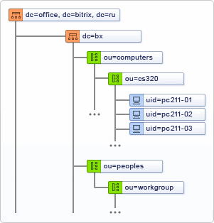

# Назначение и возможности модуля

**Навигация**
- [← Оглавление курса](index.md)
- [← Предыдущий: 20186 — Практические задания](lesson_20186.md)
- [Следующий: 2543 — Схема работы модуля →](lesson_2543.md)

Официальная страница урока: https://dev.1c-bitrix.ru/learning/course/index.php?COURSE_ID=41&LESSON_ID=2542

### Что может модуль LDAP

**AD/LDAP** модуль реализован с учетом особенностей работы протоколов

			LDAP

                    **LDAP** (англ. Lightweight Directory Access Protocol -  протокол прикладного уровня для доступа к службе каталогов X.500, разработанный IETF, относительно простой протокол, использующий TCP/IP и позволяющий производить операции аутентификации (bind), поиска (search) и сравнения (compare), а также операции добавления, изменения или удаления записей.

		 и

			AD

                    **Active Directory** («Активный каталог», AD) - службы каталогов корпорации Microsoft для операционных систем семейства Windows Server.

		, один из которых должен быть установлен на корпоративном сервере.

В основе работы перечисленных протоколов лежит принцип хранения информации в виде записей, обладающих набором атрибутов и хранящихся в базе данных с древовидной иерархической структурой. Таким образом, при настройке на сервере локальной вычислительной сети **LDAP** или **AD** протокола информация о группах пользователей будет представляться в следующем виде:

Используя данную структуру хранения данных, модуль **AD/LDAP** позволяет настраивать соответствие групп пользователей корпоративной сети группам пользователей *Bitrix Framework*.

Модуль позволяет подключаться к нескольким AD. Обращение к AD серверу происходит при каждой авторизации пользователя, либо при импорте пользователей.

### Таблица соответствий

Соответствие групп пользователей задается в специальной **таблице соответствий** в административном разделе Bitrix Framework. При этом возможно несовпадение имен групп пользователей Bitrix Framework с именами групп пользователей корпоративной сети. Например, группе пользователей корпоративной сети **Techsupport**, к которой относятся сотрудники технической поддержки корпоративной сети, может быть поставлена в соответствие группа пользователей **Techsupport stuff**, созданная в Bitrix Framework. В результате сотрудники службы технической поддержки корпоративной сети смогут выполнять обязанности сотрудников службы технической поддержки Bitrix Framework.

Группы пользователей внутри компании обладают правами на доступ к определенным ресурсам корпоративной сети, а сопоставленные им группы пользователей в Bitrix Framework обладают правами на доступ к ресурсам продукта *«1С-Битрикс»*. Например, группа пользователей **Techsupport** наделена правами на доступ к почтовому серверу сети, а группа пользователей Bitrix Framework **Techsupport stuff** обладает правами на доступ к модулю **Техническая поддержка**.

В соответствии с приведенным выше примером, пользователь, относящийся к группе **Techsupport** корпоративной сети, при попытке авторизации в системе Bitrix Framework будет добавлен в группу пользователей **Techsupport stuff** системы Bitrix Framework. После чего в системе автоматически будет заведен аккаунт данного пользователя, на основе данных, хранящихся на корпоративном сервере.

### Пользователь в нескольких группах

Допустима привязка пользователя к одной, двум или более группам. В системе могут быть настроены группы пользователей, для которых не установлено соответствие с группами пользователей в корпоративной сети. Принадлежность пользователей к такой группе задается вручную администратором системы. Все изменения аккаунта пользователя на корпоративном сервере будут автоматически учтены в аккаунте пользователя в системе Bitrix Framework во время его следующей авторизации. При этом изменения затронут пользователей только тех групп, для которых задано соответствие группам пользователей корпоративной сети.

### Итак:

Модуль **AD/LDAP** позволяет:

- интегрировать проекты, созданные на Bitrix Framework в корпоративную сеть;
- Импортировать пользователей
                      Для добавления целого списка пользователей в систему служит специальная страница административного раздела **Импорт пользователей** (Настройки &gt; Пользователи &gt; Импорт пользователей). Для импорта пользователей из **Active Directory / LDAP** выполните следующее:
  [Подробнее ...](https://dev.1c-bitrix.ru/learning/course/index.php?COURSE_ID=35&LESSON_ID=2013)
  		 корпоративной сети в продукты *Bitrix Framework*;
- настроить соответствие групп пользователей корпоративной сети и групп пользователей Bitrix Framework;
- автоматически создавать аккаунт пользователя после его регистрации исходя из **таблицы соответствий** (данные для создания аккаунта запрашиваются из базы данных корпоративного сервера);
  В модуле AD/LDAP есть ограничение по числу учетных записей.
  - 1С-Битрикс: Управление сайтом, редакция Энтерпрайз — можно создать не более 1000 пользователей, даже если в Active Directory их больше.
  - Коробочная версия Битрикс24 — лимит пользователей зависит [от тарифного плана](https://www.bitrix24.ru/prices/self-hosted.php).
- централизованно управлять изменениями аккаунтов пользователей системы через корпоративный сервер.

Модуль **AD/LDAP интеграция** так же позволяет использовать

			NTLM авторизацию

                    NTLM (NT LAN Manager) - протокол сетевой аутентификации, разработанным фирмой *Microsoft* для *Windows NT*

		. Чтобы ею воспользоваться, нужен веб-сервер *IIS* или *Apache* с модулем **mod_ntlm** или **mod_auth_sspi**.
