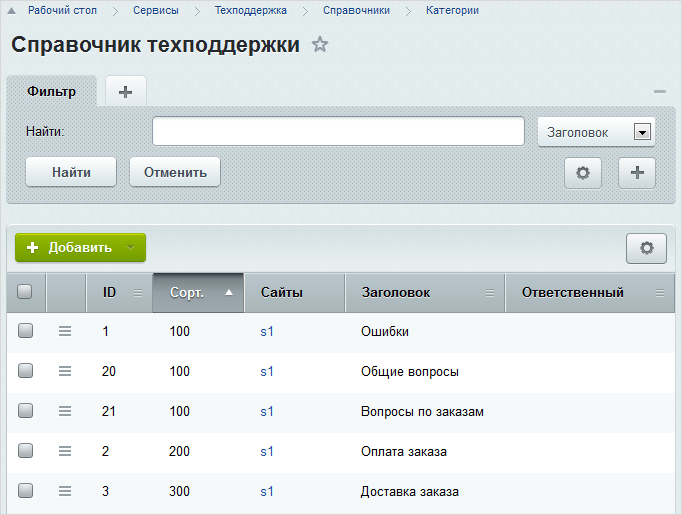
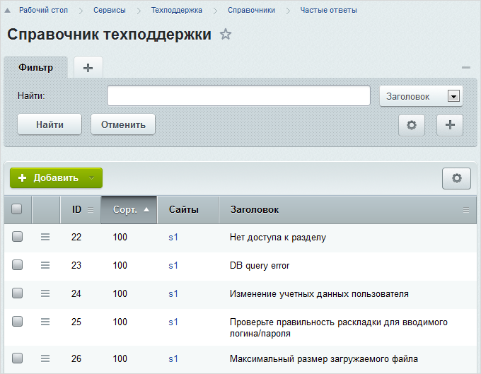

# Справочники

**Навигация**
- [← Оглавление курса](index.md)
- [← Предыдущий: 2686 — Создание мастера](lesson_2686.md)
- [Следующий: 2621 — Назначение ответственного за обращение →](lesson_2621.md)

Официальная страница урока: https://dev.1c-bitrix.ru/learning/course/index.php?COURSE_ID=41&LESSON_ID=2619

### О справочниках

> **Справочники** – группы свойств, относящихся к обращениям в службу поддержки. Данные свойства носят информационный характер и не влияют на общий процесс обработки обращений.

Перед началом работы выполните настройку необходимых справочников. Это позволит:

- автоматизировать процесс назначения ответственных за рассмотрение обращений в зависимости от их параметров;
- выполнять группировку поступающих обращений;
- отслеживать уровни сложности проблем и эффективность их решения.

Основные типы справочников используемые в системе:

- Категории;
- Критичности;
- Статусы;
- Оценки ответов;
- Частые ответы;
- Источники;
- Сложность.

### Категории

> **Категории обращений** – это справочник сообщений, характеризующих область, к которой относится обращение (например, «Оформление заказа», «Оплата заказа», «Ошибки установки»).

Настройка категорий выполняется на странице **Категории** (Сервисы &gt; Техподдержка &gt; Справочники &gt; Категории):

При создании обращения пользователь может выбрать подходящую категорию (из числа доступных), к которой, по его мнению, относится описываемая проблема.

Список доступных пользователю категорий определяется

			SLA.

**SLA** – это описание обязательств компании по предоставлению определенного уровня сервиса (в данном случае технической поддержки) тем или иным пользователям. Уровни сервиса используются для управления приоритетами пользователей на получение поддержки.

[Подробнее](lesson_2617.md#sla)...

### Критичности

> **Критичность обращений** – это справочник сообщений, отражающих уровень критичности (необходимость срочного решения) описываемой пользователем проблемы. Например, «Низкая», «Средняя», «Высокая».

Управление справочником осуществляется на странице **Критичности** (Сервисы &gt; Техподдержка &gt; Справочники &gt; Критичности):

Уровень критичности назначается пользователем при создании обращения и носит исключительно информационный характер.

Перечень доступных пользователю уровней критичности определяется

			SLA.

**SLA** – это описание обязательств компании по предоставлению определенного уровня сервиса (в данном случае технической поддержки) тем или иным пользователям. Уровни сервиса используются для управления приоритетами пользователей на получение поддержки.

[Подробнее](lesson_2617.md#sla)...

При более детальном рассмотрении проблемы сотрудник техподдержки может изменить критичность обращения.

### Статусы

> **Статусы** – это информационные сообщения, характеризующие этап обработки (или состояние) обращения. Например, «Принято к рассмотрению», «В стадии решения», «Успешно решено» и т.п.

Справочник статусов создается на странице **Статусы** (Сервисы &gt; Техподдержка &gt; Справочники &gt; Статусы):

Статус обращения назначается при его рассмотрении сотрудником техподдержки.

### Оценки ответов

> **Оценки ответов** - справочник содержит список оценок, которые клиент техподдержки может выставить за предоставленный ему ответ.

Управление справочником осуществляется на странице **Оценки ответов** (Сервисы &gt; Техподдержка &gt; Справочники &gt; Оценки ответов):

Список доступных пользователю оценок определяется

			SLA.

**SLA** – это описание обязательств компании по предоставлению определенного уровня сервиса (в данном случае технической поддержки) тем или иным пользователям. Уровни сервиса используются для управления приоритетами пользователей на получение поддержки.

[Подробнее](lesson_2617.md#sla)...

Оценки ответов используются для контроля качества работы службы технической поддержки.

### Частые ответы

Наиболее часто даваемые ответы могут быть сохранены в справочнике **Частые ответы** (Сервисы &gt; Техподдержка &gt; Справочники &gt; Частые ответы):

Далее типовые ответы могут быть использованы при создании ответов на обращения.

Это позволит сократить затраты времени на обработку часто задаваемых вопросов.

### Источники

> **Источники** - справочник содержит список источников, характеризующий откуда или от кого пришло обращение.

Управление справочником осуществляется на странице **Источники** (Сервисы &gt; Техподдержка &gt; Справочники &gt; Источники):

Источник обращения указывается сотрудником техподдержки при его рассмотрении.

### Сложность

> **Сложность** - справочник содержит описание уровней сложности обращений. Уровень сложности обращения может использоваться, например, для контроля времени, затрачиваемого на решение проблемы сотрудниками техподдержки, а также при контроле общего уровня поступающих запросов.

Управление справочником осуществляется на странице **Сложность** (Сервисы &gt; Техподдержка &gt; Справочники &gt; Сложность):

Сложность обращения оценивается сотрудником техподдержки при его рассмотрении.

### Документация по теме

- [Типы справочников техподдержки](https://dev.1c-bitrix.ru/user_help/service/support/ticket_dict/ticket_dict_list.php)
- [Создание и редактирование записи справочника](https://dev.1c-bitrix.ru/user_help/service/support/ticket_dict/ticket_dict_edit.php)
