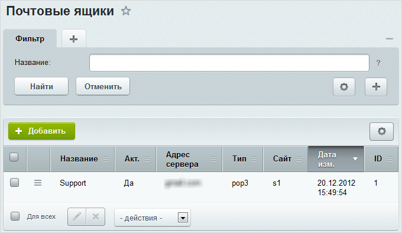

# Механизм для создания обращений по почте

**Навигация**
- [← Оглавление курса](index.md)
- [← Предыдущий: 2641 — Создание публичного интерфейса](lesson_2641.md)
- [Следующий: 2623 — Рабочий стол →](lesson_2623.md)

Официальная страница урока: https://dev.1c-bitrix.ru/learning/course/index.php?COURSE_ID=41&LESSON_ID=2622

Пользователь может создать обращение в техническую поддержку несколькими способами, например, написав электронное письмо на адрес технической поддержки компании. Чтобы данный механизм получения обращений работал, необходимо выполнить следующие настройки в системе:

### Настройки со стороны модуля "Техподдержка"

- на странице **Источники** (Сервисы &gt; Техподдержка &gt; Справочники &gt; Источники) создайте источник **E-Mail** (если он еще не создан), причем в поле **Символьный идентификатор** должно быть указано **email**:
  
- на странице **Категории** (Сервисы &gt; Техподдержка &gt; Справочники &gt; Категории) создайте категорию, которая будет использоваться для обращений, поступающих в техподдержку по почте. В поле **Символьный идентификатор** обязательно укажите значение **email**:
  

### Настройки со стороны модуля "Почта"

- на странице **Почтовые ящики** (Сервисы &gt; Почта &gt; Почтовые ящики) должна быть заведена учетная запись электронной почты службы технической поддержки:
  
  **Примечание:** Подробная информация по добавлению почтовых ящиков представлена в главе **Почта**, урок
  			Почтовые ящики.
  Управление учетными записями электронной почты осуществляется на странице **Почтовые ящики** (Сервисы &gt; Почта &gt; Почтовые ящики).
  Для добавления новой учетной записи служит кнопка **Добавить**, расположенная на контекстной панели. Переход к редактированию существующей записи осуществляется с помощью меню действий (пункт **Изменить**) либо с помощью двойного клика по соответствующей записи.
  [Подробнее](lesson_2862.md)...
- на странице **Правила обработки почты** (Сервисы &gt; Почта &gt; Правила) добавьте новое правило обработки почтовых сообщений. При создании правила выберите тип
  			добавление сообщения в техподдержку.
  
- В форме создания правила на закладке **Параметры** обязательно укажите название правила и выберите почтовый ящик, к сообщениям которого будет применяться правило.
- На закладке
  			Условия
  
  		 укажите условия, при которых почтовое сообщение будет добавлено в техподдержку:
- Кроме того, в поле **Определять по EMail ранее зарегистрированного пользователя** отметьте опцию **да, пытаться привязать обращение к пользователю**. Затем укажите, к какому сайту привязывать обращение, и выберите категорию, при создании которой в качестве символьного идентификатора было указано значение **email** (см. вышеизложенное описание по созданию категории **Обращения по почте**).
  
  При необходимости можно назначить уровень критичности для новых обращений, полученных по почте (уровни критичности должны быть созданы заранее на странице Сервисы &gt; Техподдержка &gt; Справочники &gt; Критичности.

В результате, если пользователь напишет письмо на адрес технической поддержки компании, то оно будет добавлено в

			список обращений.

