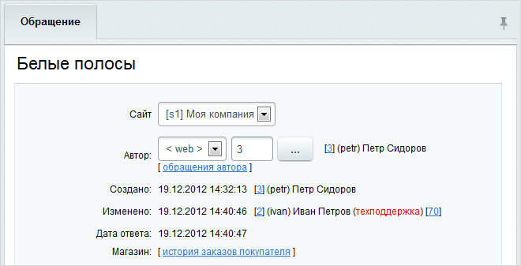
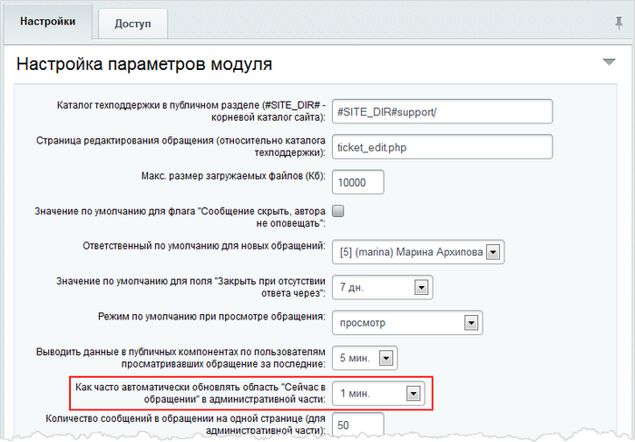
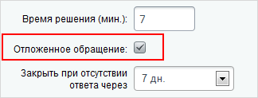
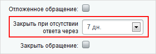

# Работа с обращениями

**Навигация**
- [← Оглавление курса](index.md)
- [← Предыдущий: 2624 — Обращения](lesson_2624.md)
- [Следующий: 2565 — Графики →](lesson_2565.md)

Официальная страница урока: https://dev.1c-bitrix.ru/learning/course/index.php?COURSE_ID=41&LESSON_ID=2625

### Работа с обращениями

Чтобы ответить на обращение, нужно перейти к его изменению с помощью двойного клика по записи в списке либо через соответствующий пункт контекстного меню:

**Примечание**: администраторам техподдержки отображаются все сообщения, сотрудникам – только те обращения, за рассмотрение которых они отвечают.

Форма просмотра обращения состоит из трех частей:

- Информационная часть;
- Обсуждение;
- Ответ.

### Информационная часть

Данная часть содержит следующие данные:

- сайт, на котором было создано обращение;
- источник обращения (е-mail, телефон, web (форма на сайте), форум) и автор обращения;
  **Примечание**: обращение пользователя в службу поддержки (например, если пользователь создал обращение посредством телефонного звонка) может быть зарегистрировано администратором либо сотрудником техподдержки. При этом с помощью поля **Автор** обращение привязывается к конкретному пользователю в системе. Таким образом, дальнейшее обсуждение вопроса может проходить в рамках обращения.
- дату создания и изменения обращения;
- дату и время последнего результативного ответа на обращение (т.е. ответа, приведшего к изменению индикатора обращения на зеленый).
- ссылку на историю заказов пользователя - автора обращения. Отображается при условии наличия установленного модуля **Интернет-магазин**.

### Обсуждение

Данная часть содержит:

- список всех сообщений в рамках обращения;
- записи (логи) о действиях сотрудников техподдержки и создателя обращения (выделяются желтым фоном). Например, об ответе на обращение, изменении или дополнении обращения, назначении ответственного и т.д.;
- записи о действиях системы (отображаются розовым цветом). Например, об изменении индикатора обращения, истечение даты ответа, автоматическом закрытии обращения и т.п.

### Ответ

Данная часть служит для создания ответа на обращение. Сообщение открывается в одном из следующих режимов:

- **Просмотр**;
- **Ответ**.

**Примечание**: выбор режима работы с сообщением по умолчанию осуществляется в настройках модуля **Техподдержка** (Настройки &gt; Настройки продукта &gt; Настройки модулей &gt; Техподдержка):

Если сообщение открыто в режиме **Просмотр**, то для того чтобы начать отвечать на обращение, нужно переключиться в

			режим ответа.

**Примечание:** кнопка режима, в котором ведется работа с обращением, является неактивной.

В

			специальной области,

		 расположенной в левой части формы, отображается список пользователей, открывших сообщение.

Для каждого пользователя отображается иконка режима, в котором выполняется просмотр сообщения:

 - режим просмотра;
 - режим ответа.

Это позволяет организовать коллективную работу над обращениями и избежать ответа на сообщение одновременно несколькими сотрудниками.

**Примечание**: обновление списка пользователей, просматривающих сообщение, выполняется автоматически в соответствии с настройками модуля **Техподдержка**:

Иконка  позволяет обновить список пользователей, просматривающих сообщение в данный момент, вручную.

При переключении в режим ответа начинается

			учет времени,

		 затрачиваемый сотрудником на ответ на обращение.

Таким образом, если по умолчанию обращение открывается в режиме **Ответ**, то подсчет времени начинается немедленно.

При работе с сообщением сотрудник техподдержки может:

- Создать ответ на обращение.
- Создать скрытое сообщение в рамках обращения.
  Скрытое обращение будет доступно для просмотра только сотрудникам техподдержки.
- Определить статус, критичность, сложность, категорию, уровень поддержки для обращения, а также назначить сотрудника, ответственного за решение проблемы.
  **Примечание**: при изменении уровня поддержки или категории, в качестве сотрудника, ответственного за решение проблемы, может быть назначен сотрудник, установленный в параметрах категории или уровня поддержки по умолчанию. Для этого служит иконка , расположенная рядом с соответствующим полем.
- Если ответ на обращение не может быть дан в ближайшее время либо необходимо поддерживать его актуальность, то сообщение может быть сохранено в качестве
  			отложенного.
  
  		 При этом текущий статус (индикатор сообщения) изменен не будет.
- Для того чтобы закрыть сообщение, следует установить флаг в поле
  			Закрыть сообщение.
  
- Использование поля
  			Закрыть при отсутствии ответа через
  
  		 позволяет определить период, по истечении которого обращение будет закрыто автоматически:
  Обращение закрывается автоматически при условии, что после ответа сотрудника техподдержки автор не добавлял в это обращение новые сообщения.
  **Примечание**: значение поля **Закрыть при отсутствии ответа через** по умолчанию задается на странице настроек модуля **Техподдержка**:
  

В соответствии с настройками почтовых шаблонов сообщения обо всех изменениях в рамках обращения (ответе на вопрос, изменении ответственного или статуса обращения и т.д.) дублируются на электронный адрес создателя обращения, ответственного сотрудника и администратора службы поддержки.

### Документация по теме

- [Обращения](https://dev.1c-bitrix.ru/user_help/service/support/ticket_list.php)
- [Создание и редактирование обращения](http://dev.1c-bitrix.ru/user_help/service/support/ticket_edit.php)

<!-- &lt;p&gt;Для администраторов системы доступна возможность настройки пользовательских свойств для обращений: &lt;/p&gt;

 &lt;p&gt;&lt;img src="/images/admin_expert/support/ticket_prop.png"&gt; &lt;/p&gt;

&lt;p&gt;Ссылка &lt;b&gt;Добавить пользовательское свойство&lt;/b&gt; служит для перехода к созданию нового пользовательского поля для формы создания/редактирования обращения (см. &lt;a href="/learning/course/index.php?COURSE_ID=35&LESSON_ID=3874"&gt;пример по созданию пользовательского свойства&lt;/a&gt;).&lt;/p&gt; -->
