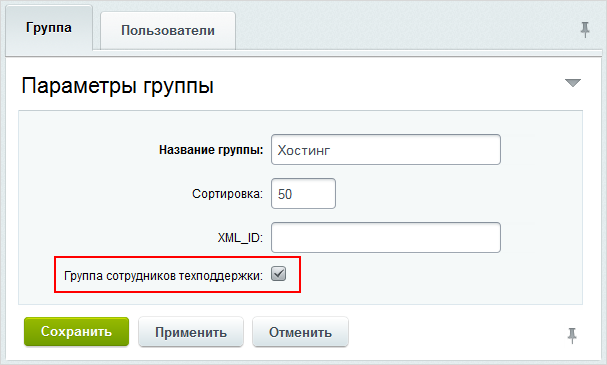
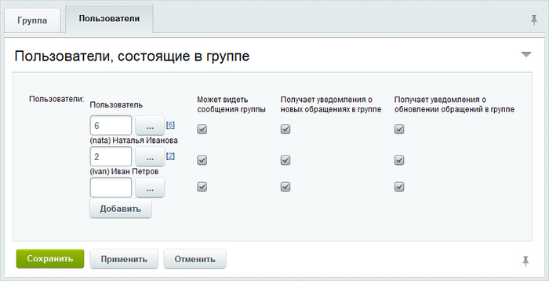
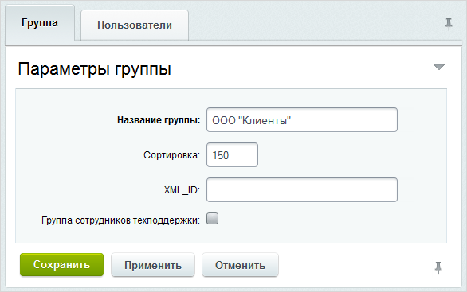

# Группы

**Навигация**
- [← Оглавление курса](index.md)
- [← Предыдущий: 5175 — Расписания и исключения](lesson_5175.md)
- [Следующий: 5337 — Спецобращения →](lesson_5337.md)

Официальная страница урока: https://dev.1c-bitrix.ru/learning/course/index.php?COURSE_ID=41&LESSON_ID=2628

> **Группы** созданы для облегчения коллективной работы с обращениями. Они могут быть как клиентскими, так и для сотрудников поддержки. Клиентские группы включают, как правило, пользователей от одного клиента компании. Группы техподдержки включают в себя, как правило, сотрудников одного отдела.

Например, у компании есть сотрудники техподдержки. К ним поступают обращения от сотрудников клиента.

Каждый сотрудник техподдержки работает только лишь с теми обращениями, в параметрах которых он указан как ответственный за решение проблемы.
Но как быть, если необходимо для упрощения работы отдела техподдержки обеспечить лёгкий доступ всех или части сотрудников к общим обращениям?

Для этого достаточно создать группу (Сервисы &gt; Техподдержка &gt; Группы), отметить в настройках опцию **Группа сотрудников техподдержки**

а на закладке **Пользователи** включить в неё нужных сотрудников и указать, смогут ли они видеть сообщения группы или получать уведомления

Тогда обращения для любого члена группы станут видны его соседям по группе (другим сотрудникам техподдержки).

**Примечание:** В состав такой группы могут входить только

			сотрудники техподдержки.

**Сотрудник техподдержки** – доступ ко всем пунктам меню и страницам модуля открыт. Пользователь работает с теми обращениями, в параметрах которых он указан ответственный за решение проблемы.

[Подробнее](lesson_2617.md)...

В свою очередь, у клиента есть сотрудники, которые обращаются в техподдержку компании. Там аналогичная ситуация: обращение, отправленное в техподдержку, видит только его автор, что не всегда удобно. Если, к примеру, сотрудник ушёл в отпуск, то его обращения должен вести кто-то другой, при этом передавать логин/пароль, естественно, некорректно. Поэтому клиент обращается в компанию с просьбой дать доступ к обращениям сотрудника, ушедшего в отпуск, например, всем другим его сотрудникам, зарегистрированным на сайте.

Для этого администратору техподдержки необходимо лишь объединить сотрудников клиента в одну группу и убрать опцию

			Группа сотрудников техподдержки

		 в настройках:

|  | #### Документация по теме: |
| --- | --- |

- [Группы](https://dev.1c-bitrix.ru/user_help/service/support/ticket_group_list.php)
- [Создание и редактирование группы](https://dev.1c-bitrix.ru/user_help/service/support/ticket_group_edit.php)
