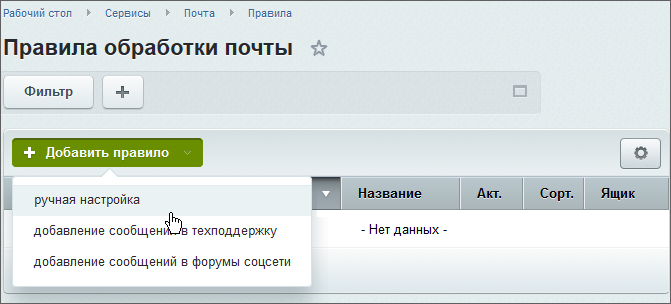
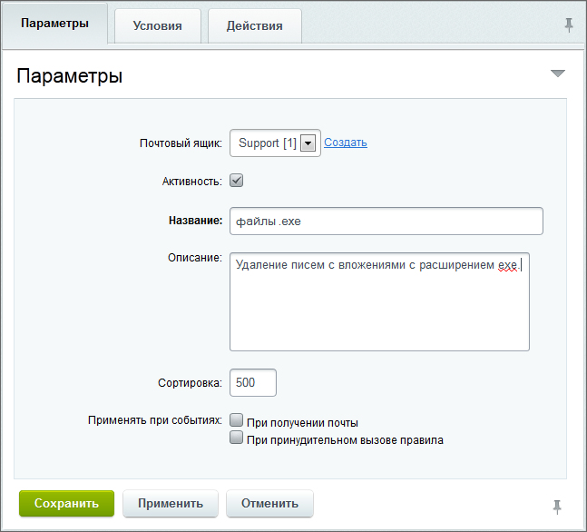

# Правила

**Навигация**
- [← Оглавление курса](index.md)
- [← Предыдущий: 2865 — Журнал работы](lesson_2865.md)
- [Следующий: 2862 — Почтовые ящики →](lesson_2862.md)

Официальная страница урока: https://dev.1c-bitrix.ru/learning/course/index.php?COURSE_ID=41&LESSON_ID=2665

### Добавление правила

Управление правилами обработки почтовых сообщений осуществляется на странице **Правила обработки почты** (Сервисы &gt; Почта &gt; Правила). Правило можно добавить только для системных ящиков.

Для создания нового правила служит кнопка контекстной панели **Добавить правило**, в выпадающем меню которой необходимо выбрать тип создаваемого правила:

- **ручная настройка** – все параметры правила доступны для изменения и настройки;
- **добавление сообщений в форумы соцсети** – правило создается на основе специального шаблона (шаблон предназначен для облегчения создания правил фильтрации сообщений, адресованных в форумы соцсети);
- **добавление сообщения в техподдержку** – правило создается на основе специального шаблона (шаблон предназначен для облегчения создания правил фильтрации сообщений, адресованных в службу технической поддержки);

Форма создания (редактирования) правила обработки почты разбита на три закладки.

### Закладка "Параметры"

На закладке **Параметры** указываются основные параметры:

Большая часть полей ясна из названия, поясним только одно поле. **Применять при событиях** – выберите события, при которых следует применять это правило:

- **При получении почты** – правило будет применяться автоматически при получении почты;
- **При принудительном вызове правила** – правило будет применяться при его вызове (например, может быть применено вручную при просмотре почтового сообщения).

### Закладка "Условия"

На закладке **Условия** задаются условия, при выполнении которых данное правило будет применено к сообщению.

При создании правила с шаблоном **Добавление сообщения в техподдержку** на  данной закладке отображается

			дополнительная группа настроек.

- **Определять по E-Mail ранее зарегистрированного пользователя** – если это условие установлено в **да, пытаться привязать обращение к пользователю**, то при получении нового сообщения правило будет предпринимать попытки найти зарегистрированного пользователя с таким адресом в базе данных и привязать сообщение к нему. В противном случае, при получении писем с любых адресов сообщения в модуле техподдержки будут создаваться как анонимные.
- **Добавлять новое сообщение в уже открытое обращение** – условие определяет, сообщения с какого адреса могут быть добавлены в открытое обращение в техподдержку. При установке флага **как скрытое** сообщение будет доступно только сотрудникам техподдержки.
- **Шаблоны темы для определения ответа на обращение** – регулярные выражения, применяемые для сортировки входящих сообщений. Поле предназначено для разработчиков; не рекомендуется изменять его значение без надобности.
- **Привязывать новое обращение к сайту** – указание на сайт, к которому будет привязано вновь создаваемое обращение.
- **Привязывать новое обращение к категории** – указание на тематическую категорию, к которой будет привязано вновь создаваемое обращение.
- **Назначить новому обращению критичность** – позволяет указать критичность вновь создаваемого обращения.

### Закладка "Действия"

Если параметры сообщения удовлетворяют условиям правила, то к сообщению будут применены действия, заданные на закладке **Действия**.

- **Установить статус прочтенности** – позволяет отметить все сообщения, к которым будет применяться это правило, как прочитанные.
- **Установить пометку спам** – позволяет отметить все сообщения, к которым будет применяться это правило, как сообщения массовой рассылки.
- **Действие на PHP-скрипте** – опциональный PHP-скрипт, который исполняется во время применения правила к сообщению.
- **Удалить сообщение** – удаляет сообщения, к которым применяется правило.
- **Не обрабатывать другими правилами** – указывает, что после применения данного правила к конкретному сообщению остальные правила не будут применены к нему, даже если сообщение удовлетворяет условиям этих правил.

### Документация по теме

- [Правила](https://dev.1c-bitrix.ru/user_help/service/mail/mail_filter_admin.php)
