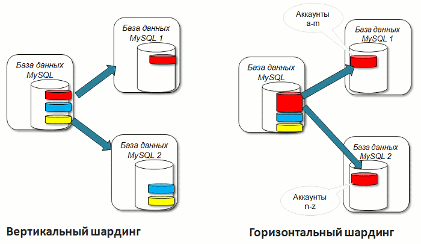
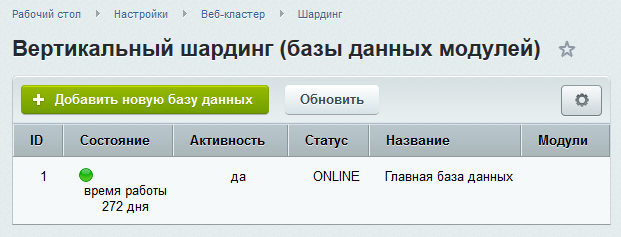
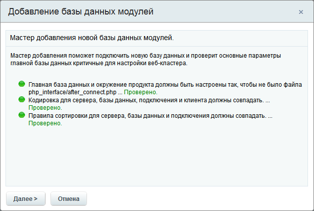
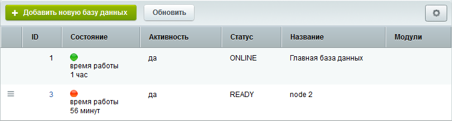
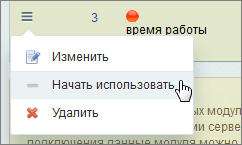
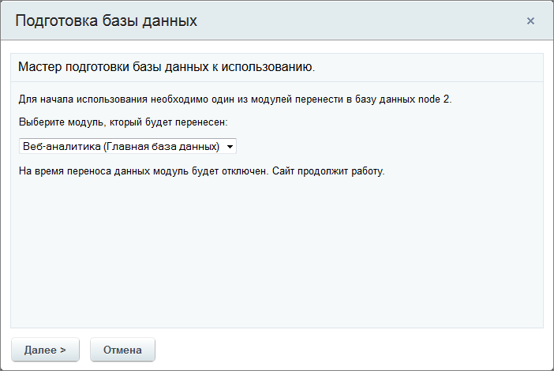
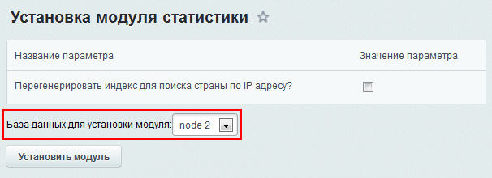
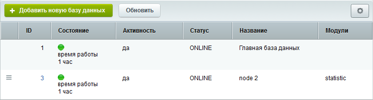

# Шардинг

**Навигация**
- [← Оглавление курса](index.md)
- [← Предыдущий: 2730 — Веб-сервера](lesson_2730.md)
- [Следующий: 2728 — Хранение сессий в базе данных →](lesson_2728.md)

Официальная страница урока: https://dev.1c-bitrix.ru/learning/course/index.php?COURSE_ID=41&LESSON_ID=2690

Тему урока можно изучить в новом формате — [в документации по Bitrix Framework](https://docs.1c-bitrix.ru/pages/performance/sharding.html). В ней улучшена структура, описание, примеры.

### Выносим работу отдельных модулей на сторонний сервер

Шардинг позволяет перераспределить нагрузку, создаваемую запросами между различными серверами, за счёт выноса данных некоторых модулей в отдельную базу данных.

> **Вертикальный шардинг** - разделение одной базы данных веб-приложения на две и более базы данных за счет выделения отдельных модулей, без изменения логики работы веб-приложения. (Таблицы разносятся по серверам.)

> **Горизонтальный шардинг** - распределение однотипных данных веб-приложения (например, учетных записей) между отдельными базами данных. (Таблица делится на части и части разносятся по серверам.)

В "1С-Битрикс: Управление сайтом" и "Битрикс24 в коробке" поддерживается только **Вертикальный шардинг** и перенос данных модулей **Веб-аналитика** и **Поиск**

### Настройка шардинга

Добавление новой БД делается на странице **Вертикальный шардинг (базы данных модулей)** (Настройки &gt; Веб-Кластер &gt; Шардинг). Для вынесения таблицы с данными модуля в отдельную базу:

- Нажмите на контекстной панели кнопку
  			Добавить новую базу данных
                      
  		. После чего откроется окно мастера добавления новой базы данных модулей.
- Пройдите все шаги мастера. Если необходимо, произведите настройки, в соответствии с рекомендациями. Вы должны получить полностью
  			"зелёный" список
                      
  		.

  Укажите
  			параметры подключения БД
                      
  		 и исправьте, при необходимости, параметры до получения "зелёного" списка.
  После чего база появится в списке, но будет не задействована.
  

### Перенос данных

Теперь перенесём данные модуля в добавленную базу данных. Это можно выполнить двумя способами:

- Первый способ доступен только для MySQL: в списке баз данных модулей в меню действий выбранной базы данных выполнить команду
  			Начать использовать
                      
  		. Запустится мастер переноса данных. В нем выберите
  			модуль, который будет перенесен
                      
  		.
  **Внимание!** Любые модификации данных в модуле на период копирования сохранены не будут.
- Второй способ: удалите модуль и установите его заново. На первом шаге установки укажите базу данных для использования модулем. В этом случае таблицы модуля не будут перенесены.
  

После переноса таблиц модуля в подключенную базу данных список будет иметь следующий вид:

**Примечание:** Для **mssql** и **oracle** версий вместо мастера будет отображена форма **Редактирование подключения к базе данных**.
