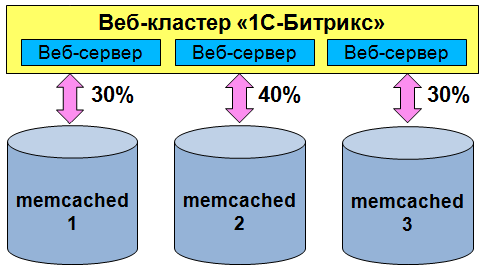
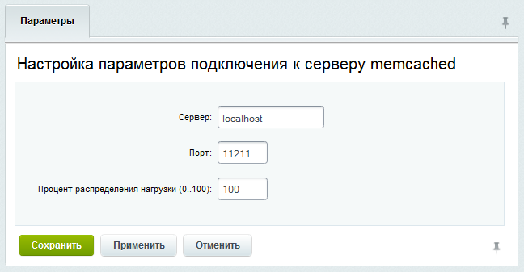
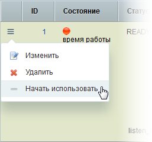
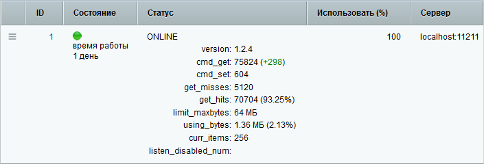

# Memcached

**Навигация**
- [← Оглавление курса](index.md)
- [← Предыдущий: 3088 — Master-master репликация](lesson_3088.md)
- [Следующий: 2730 — Веб-сервера →](lesson_2730.md)

Официальная страница урока: https://dev.1c-bitrix.ru/learning/course/index.php?COURSE_ID=41&LESSON_ID=2725

### Кеш в оперативной памяти

> **memcached сервер** - сервер, позволяющий сохранять кеш не в файлах, а в оперативной памяти. memcached можно использовать и для [хранения сессий](https://dev.1c-bitrix.ru/learning/course/index.php?COURSE_ID=43&LESSON_ID=2465).

Использование нескольких memcached-серверов:

- повышает надежность системы за счет устойчивости подсистемы кеширования к выходу из строя отдельных компонентов,
- повышает эффективность за счет централизованного использования кеша веб-приложением,
- обладает неограниченной масштабируемостью за счет добавления новых memcached-серверов.

Если произошёл отказ всех memcached-серверов, то подсистема кеширования снова начинает использовать

			файловый кеш

                     После возврата к файловому кешу рекомендуется удалить старый, неактуальный файловый кеш `bitrix\cache bitrix\stack_cache`.

		.




**Внимание!** Для работы потребуется **php** расширение **memcache**.

Некоторые версии расширения **memcache** имеют ошибку, приводящую к значительному снижению производительности при наличии более одного подключения. С помощью [панели производительности](https://dev.1c-bitrix.ru/learning/course/index.php?COURSE_ID=35&CHAPTER_ID=03376&LESSON_PATH=3906.6663.4904.3376) получите оценку производительности до добавления подключения и после. При наличии значительной разницы попробуйте установить другую версию расширения memcache.

Если используется несколько memcache-серверов, нужно установить значение  переменной [memcache.hash_strategy string](http://www.php.net/manual/ru/memcache.ini.php#ini.memcache.hash-strategy) в **consistent** (по умолчанию это выключено!). Такое значение нужно для следующего: если один из мемкэшей сломается, начнется ресурсоемкая операция перетасовки ключей между мемкэшами, замедляющая работу веб-кластера. А если установить в **consistent** - проблем практически не будет.

**Примечание:** *«1С-Битрикс: Веб-окружение»* для *Linux* уже содержит сервер **memcached**. Для его запуска необходимо выполнить команды:

```

chkconfig memcached on
service memcached start
```

### Подключение серверов memcached

Сервера подключают на странице **Подключения к memcached** (Настройки &gt; Веб-кластер &gt; [_название_группы_] &gt; Memcached):


- Нажмите кнопку **Добавить** на контекстной панели и в форме
  			Настройка параметров подключения к серверу memcached
                      Обычно по умолчанию порт memcached сервера равен 11211
  
  		 укажите адрес и порт сервера.
  **Примечание:** Если подключаемые к кластеру memcached серверы разной мощности или с разным объемом оперативной памяти, то желательно соответственно настроить коэффициент их использования через настройку параметра **Процент распределения нагрузки (0..100)**.
- Для запуска его в работу  в меню действий выберите пункт
  			Начать использовать
                      
  		.

Теперь сервер используется вместо файлового кеша:



**Примечание:** Настройки подключения серверов memcached хранятся в файле `\bitrix\modules\cluster\memcache.php`. Соответственно любые изменения настроек подключения будут автоматически применены на остальные ноды кластера при настроенной файловой синхронизации в кластере.

### Рекомендации по настройке

При настройке подсистемы кластерного кеширования обратите внимание на параметр: `get_hits: #count# (#hitrate#%)`
где, `#hitrate#` - показывает эффективность кеширования. Это значение надо довести как можно ближе к 100%.

Экспериментально отрегулируйте эффективность, постепенно увеличивая объем памяти, выделяемой серверу memcached (`limit_maxbytes`). Начните с объема памяти в 128MB и увеличивайте с шагом в 32MB, пока `#hitrate#` перестанет заметно увеличиваться.

Также рекомендуется периодически анализировать и использование кеша приложением (параметр `using_bytes`).


За счет использования в сервере memcached алгоритма [LRU](https://ru.wikipedia.org/wiki/%D0%90%D0%BB%D0%B3%D0%BE%D1%80%D0%B8%D1%82%D0%BC%D1%8B_%D0%BA%D1%8D%D1%88%D0%B8%D1%80%D0%BE%D0%B2%D0%B0%D0%BD%D0%B8%D1%8F) в кеше будут храниться только наиболее актуальные данные, а редко используемые - вытесняться. Это не позволит объему кеша безгранично разрастаться в размерах, что приводило не только к неэффективному использованию ресурсов системы, но и отрицательно сказывалось на скорости работы с кешем за счет роста его объема. В результате кеш веб-кластера будет автоматически поддерживаться в максимально эффективном состоянии: как по скорости доступа, так и по использованию ресурсов.

**Примечание**: Константа `BX_CLUSTER_GROUP` должна быть установлена в файле **dbconn.php**. В противном случае не будет работать

			Композитный сайт

                    Скорость отображения страниц сайта, создаваемых с помощью CMS, на данный момент - одна из основных проблем сайтостроения. От этой скорости многое зависит. Современного пользователя уже не устраивают страницы, открывающиеся более 1 секунды, он предпочтёт более быстрые сайты конкурентов.

[Подробнее ...](/learning/course/index.php?COURSE_ID=39)

		.

### Дополнительно

- Практический пример: урок [Кластеризация кеша (memcached)](lesson_2989.md);
- Статья [Технологии кластеризации 1С-Битрикс - эффективное кэширование в memcached](https://dev.1c-bitrix.ru/community/blogs/alexander_serbul/clustering-technology-1cbitrix-effective-caching-in-memcached.php).
