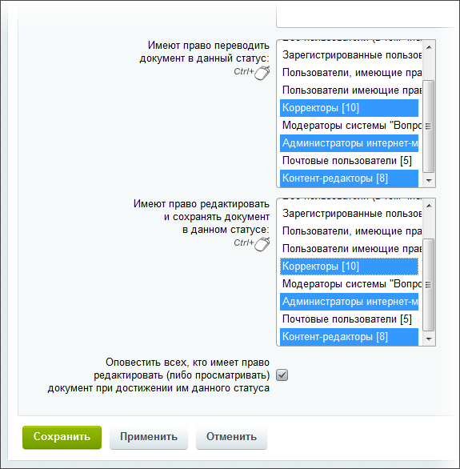
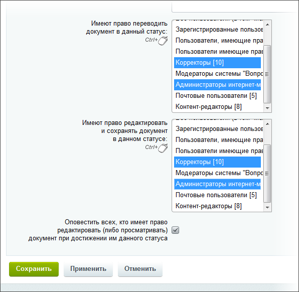
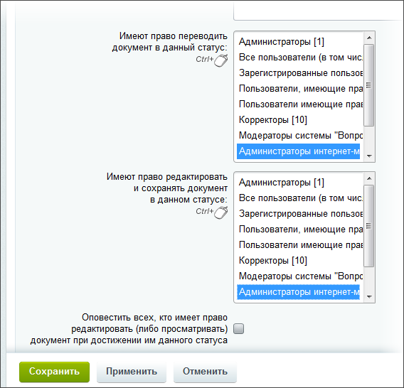

# Статусы для инфоблоков

**Навигация**
- [← Оглавление курса](index.md)
- [← Предыдущий: 5049 — Документооборот при работе с инфоблоками](lesson_5049.md)
- [Следующий: 20274 — Проверьте себя →](lesson_20274.md)

Официальная страница урока: https://dev.1c-bitrix.ru/learning/course/index.php?COURSE_ID=41&LESSON_ID=2759

|  | ### Этапы работы с документом |
| --- | --- |

Статус – это то, что обозначает определенный этап в работе с документом. Статусы так же ограничивают доступ к документу для пользователей.

Работа со статусами в инфоблоках аналогична созданию статусов

			для физических страниц

Нажмите на кнопку, откроется форма создания.

[Подробнее](lesson_3124.md)...

		 и ведётся на странице административного раздела Контент &gt; Документооборот &gt; Статусы:

|  | #### Настройка |
| --- | --- |

Вы можете использовать имеющиеся статусы, можете создать новые. Мы рассмотрим пример изменения текущих.

Откройте на изменение статус **Черновик** и укажите права на управление сообщениями новостного блока в данном статусе:

Такие настройки позволят всем нашим группам пользователей создавать и редактировать новости в статусе **Черновик** для их дальнейшей проверки корректором.

Откройте на изменение статус **Готов** и укажите права на управление сообщениями новостного блока в данном статусе:

Настройка прав для данного статуса позволяет корректорам и администраторам создавать и редактировать новости в этом статусе.

И права **Администраторов интернет-магазина** на статус **Опубликован**:

Такая настройка прав позволяет публиковать новости только администраторам интернет-магазина.

В результате сотрудники группы **Контент-редакторы** смогут только создавать или изменять новости (находящиеся в статусе черновика), но не смогут публиковать их на сайте. **Корректоры** смогут править документ, но не публиковать. **Администраторы интернет-магазина** смогут делать все, в том числе и публиковать. Готовность к публикации всегда будет подтверждаться корректором или администратором интернет-магазина.
