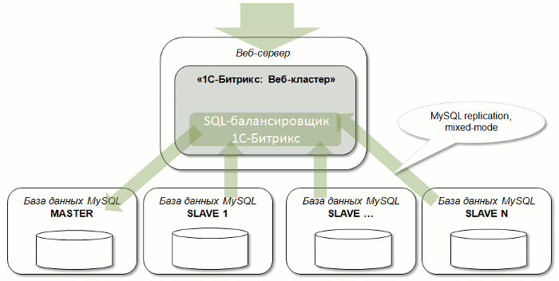
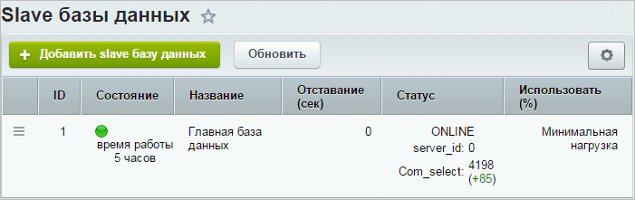
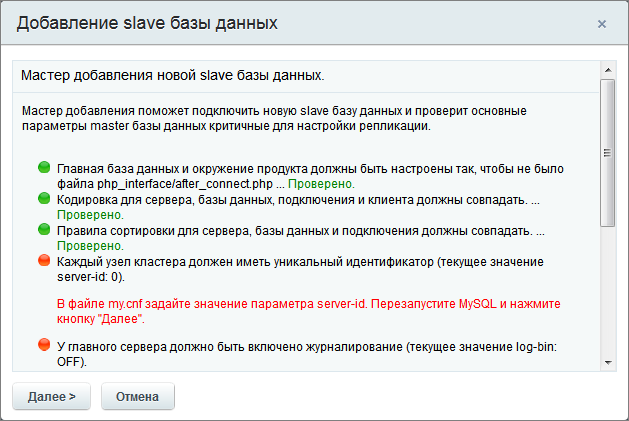
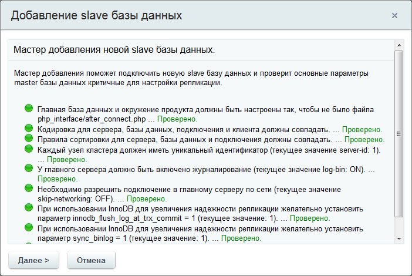
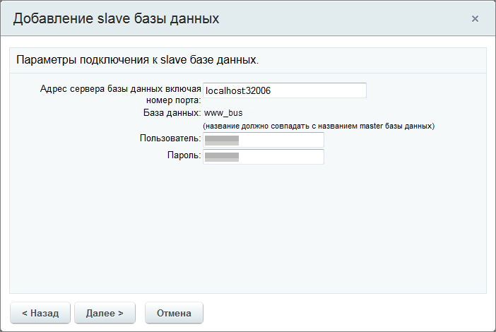
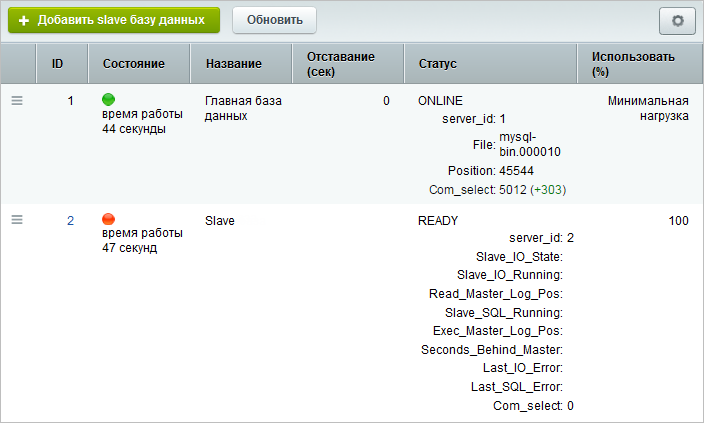
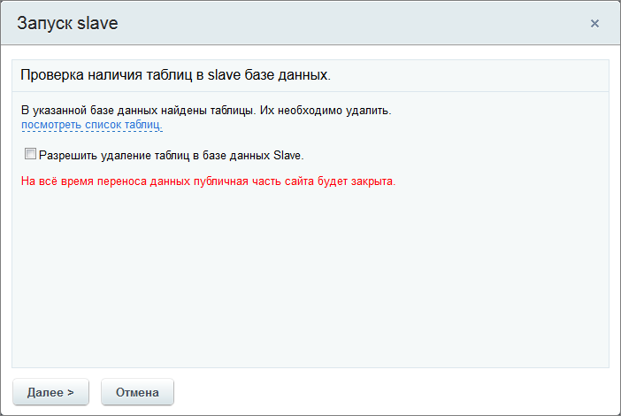

# Master-Slave репликация

**Навигация**
- [← Оглавление курса](index.md)
- [← Предыдущий: 3079 — Настройки модуля и группы серверов](lesson_3079.md)
- [Следующий: 10273 — Резервная копия →](lesson_10273.md)

Официальная страница урока: https://dev.1c-bitrix.ru/learning/course/index.php?COURSE_ID=41&LESSON_ID=2773

### Настройка и подключение резервной базы данных для снятия нагрузки с основной БД

Подключение к сайту дополнительных серверов баз данных позволяет снизить нагрузку на основную базу данных. В этом случае чтение данных происходит из дополнительных (slave) баз данных, а запись - в основную.



**Примечание**. С версии **24.0.0** Главного модуля настройки кластера позволяют перенаправлять 100% нагрузки на slave-серверы. Подробности читайте в уроке [Балансировка запросов в кластере](https://dev.1c-bitrix.ru/learning/course/index.php?COURSE_ID=43&LESSON_ID=9221).

### Подключение

Подключение и настройка дополнительных (slave) баз данных осуществляется на странице **Slave базы данных** (Настройки &gt; Веб-кластер &gt; Группа #1 &gt; Репликация).



**Внимание!** При использовании нескольких веб-серверов в файле `/bitrix/

			.settings.php

                    Секция connections. Параметры соединения с базой данных и другими источниками данных. Подробнее...` на всех серверах обязательно должен быть указан адрес подключения к главной базе данных (master). Желательно указывать прямой IP-адрес или быть уверенным, что для каждого веб-сервера будет происходить соединение именно с сервером главной базы данных в случае обращения не по IP-адресу. Использование адреса вида `localhost` при такой конфигурации запрещено.

Для репликации необходимо использовать разные серверы с быстрым каналом связи между собой.

В настройках модуля **Веб-кластер** можно указать

			время отставания slave базы

                    

		 данных от master, после которого она будет автоматически отключена для снижения риска рассинхронизации данных.

**Примечание:** Для работы репликации учетные записи основного и резервных master/slave-серверов должны иметь, кроме стандартных, также привилегии: **SUPER**, **REPLICATION CLIENT**, **REPLICATION SLAVE**.

## Учетные записи

Их три, но для простоты администрирования рекомендуется объединить в одну.

1. Учетная запись для работы приложения с базой данных (БД) для всех нод кластера (определяемая в **dbconn.php**).
  ```
  GRANT SELECT,LOCK TABLES,CREATE TEMPORARY TABLES,INSERT,UPDATE,DELETE,CREATE,DROP,ALTER,INDEX, REPLICATION CLIENT, RELOAD ON bitrixcluster.* TO 'bitrixcluster'@'%' IDENTIFIED BY '123456';
  ```
  `REPLICATION CLIENT` - для отображения статистики мастера.
  `RELOAD`- используется в master-БД во время переноса таблиц в slave-БД для `"FLUSH TABLES WITH READ LOCK"`.
  Под этой же учетной записью (именно логин/пароль) при добавлении slave-базы через административный интерфейс система пытается запустить потоки слейва (`CHANGE MASTER TO #логин/пароль учетной записи в master-БД#`), поэтому ей также нужны привилегии: **REPLICATION SLAVE**.
2. Учетная запись для управления slave-нодами из административного интерфейса веб-кластера. Создается в каждой slave-БД и указывается при подключении слейва в административном интерфейсе веб-кластера.
  `GRANT REPLICATION CLIENT on *.* TO 'bitrixcluster_slave'@'%' IDENTIFIED BY '123456';` - нужна для отображения статистики слейва в административном интерфейсе.
  `GRANT SUPER on *.* TO 'bitrixcluster_slave'@'%';` - нужна для отображения запуска/остановки слейва и изменения параметров репликации из административного интерфейса слейвов веб-кластера.
  `GRANT SELECT,LOCK TABLES,CREATE TEMPORARY TABLES,INSERT,UPDATE,DELETE,CREATE,DROP,ALTER,INDEX ON bitrixcluster.* TO 'bitrixcluster_slave'@'%' IDENTIFIED BY '123456';` - нужна для первоначального экспорта в БД слейва данных из БД мастера.
3. Учетная запись для загрузки бинлогов в slave-БД с master-БД (для собственно организации процесса репликации). Создается на master-БД для каждого подключения slave-БД (можно использовать одну учетную запись для всех слейвов).
  `GRANT REPLICATION SLAVE on *.* TO 'bitrixcluster_replica'@'%';`

- Нажмите кнопку **Добавить slave базу данных**. После чего откроется окно мастера добавления новой slave базы данных.
     В первом окне будут выведены
  			рекомендации по настройке системы
                      
  		, критичные для работы. Обязательно исправьте их, пока проверка не покажет, что
  			всё в порядке
                      
  		.
  Пройдите все
  			шаги мастера
                      
   И так далее...
  		.

После прохождения мастера база появится в списке, но будет не задействована:



В списке slave баз данных в меню действий выполните команду

			Начать использовать

                    

		 и следуйте рекомендациям мастера.


**Внимание!** Запуск репликации начинается с копирования содержимого базы данных. На время копирования

			публичная часть сайта будет закрыта

                    

		, а административная нет.
Любые неучтенные модификации данных в период копирования могут в дальнейшем повлиять на правильность работы сайта.

После успешного подключения slave-сервера баз данных отображается его

			статус

                    

		.

### Настройка параметров базы данных

При необходимости измените настройки подключения базы.  Для этого дважды кликните по желаемой базе в списке или воспользуйтесь пунктом меню действий **Изменить**. Откроется форма **Настройка параметров главной базы/slave базы данных**:


Значение в поле **Процент распределения нагрузки (0..100)** указывается для каждой базы в отдельности. Эта опция перераспределяет большую часть нагрузки на более быстрые и мощные серверы в составе кластера.


**Примечание:** Для главной базы существует отдельная опция, которая позволяет

			Минимизировать нагрузку

                    

		 на нее.

### Особенности обращений к master базе

Если на хите в системе происходит запись в **master** базу, то последующие операции чтения (запросы) данных будут тоже происходить из **master** базы, а не **slave**.

Это связано с особенностью кластерной архитектуры: только так можно быть уверенным в том, что при запросе этих данных они будут актуальны, т.к. синхронизация со слейвами всегда имеет определенное отставание (данных там просто может еще и не быть).

**Примечание для разработчиков:** Собственные запросы на запись в системе (пример - **веб аналитика**) обрамлены специальными методами класса [CDatabase](http://dev.1c-bitrix.ru/api_help/main/reference/cdatabase/index.php): *StartUsingMasterOnly* и *StopUsingMasterOnly*. Которые соответственно начинают и заканчивают использование только мастер базы.

Вы можете обернуть свои АПИ вызовы на запись такими конструкциями, но должны быть уверены, что дальше по коду не будет чтения этих данных из базы.

### Дополнительно

- Урок [Настройка репликации MySQL, аварийное переключение slave-&gt;master](lesson_2976.md) - пример тонкой настройки реплицации.
