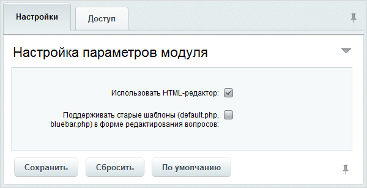

# Опросы, голосования

**Навигация**
- [← Оглавление курса](index.md)
- [← Предыдущий: 5266 — Календарь событий](lesson_5266.md)
- [Следующий: 20242 — Проверьте себя →](lesson_20242.md)

Официальная страница урока: https://dev.1c-bitrix.ru/learning/course/index.php?COURSE_ID=41&LESSON_ID=2859

Как использовать модуль, подробно рассказано в курсе Контент-менеджер в главе

			Опросы.

**Опрос** — очень удобный метод сбора мнений от посетителей сайта по разным вопросам. Опросы дают возможность быстро и с минимальными затратами собрать большой объем данных и принять правильное бизнес-решение по результатам исследования.

[Подробнее](https://dev.1c-bitrix.ru/learning/course/index.php?COURSE_ID=34&CHAPTER_ID=011389&LESSON_PATH=3905.4753.11389)...

|  | ### Настройка модуля |
| --- | --- |

Настройка параметров модуля производится на странице Настройки &gt; Настройки продукта &gt; Настройки модулей &gt; Опросы, голосования:

На вкладке **Настройки** указываются следующие параметры:

- **Использовать HTML редактор** - отмеченная опция разрешает использовать визуальный редактор при создании вопросов и описания опросов.
- **Поддерживать старые шаблоны (default.php, bluebar.php) в форме редактирования вопросов** - флажок в этом поле сохраняет работоспособность старых компонентов опросов из ранних версий "1С-Битрикс: Управление сайтом".

На вкладке **Доступ** настраиваются права доступа к модулю Опросы для групп пользователей. Работа на вкладке аналогична таковой для модуля

			Веб-формы

На вкладке **Доступ** указывается уровень доступа к настройкам форм и результатам заполнения.

Чтобы добавить право доступа для какой-либо группы пользователей, нажмите ссылку **Добавить право доступа**. В противном случае ко всем группам пользователей, кроме администраторов, будет применено право доступа **По умолчанию**.

[Подробнее](lesson_2858.md#dostup)...

		.

|  | #### Документация по теме: |
| --- | --- |

- [Настройки модуля](https://dev.1c-bitrix.ru/user_help/service/vote/settings.php)
