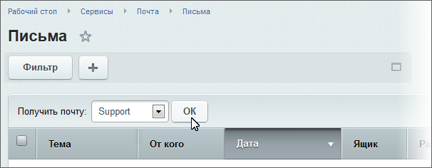
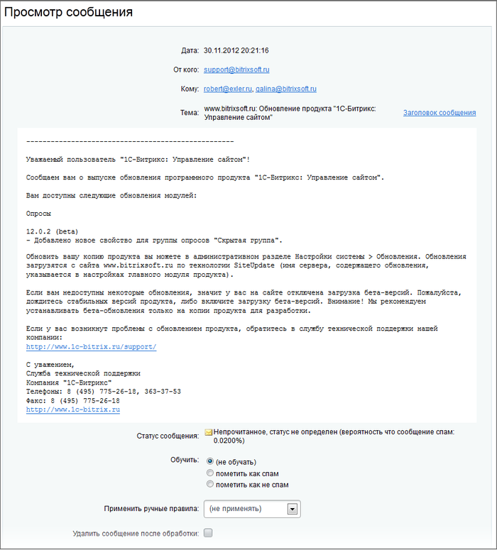

# Письма

**Навигация**
- [← Оглавление курса](index.md)
- [← Предыдущий: 2861 — Настройки модуля](lesson_2861.md)
- [Следующий: 2865 — Журнал работы →](lesson_2865.md)

Официальная страница урока: https://dev.1c-bitrix.ru/learning/course/index.php?COURSE_ID=41&LESSON_ID=2864

|  | ### Читаем письма |
| --- | --- |

Список всех полученных почтовых сообщений хранится на странице **Письма** (Сервисы &gt; Почта &gt; Письма).

Для получения сообщений в ручном режиме служит поле

			Получить почту,

		 расположенное на контекстной панели. Выберите почтовый ящик, письма которого хотите получить, и нажмите кнопку **OK**. Отобразится информация о доставке почты.

С помощью кнопок, расположенных на контекстной панели, вы можете перейти к просмотру списка полученных сообщений либо записей журнала работы. В списке сообщений иконки сообщений так же говорят о

			состоянии писем.

Просмотр письма осуществляется в такой форме:

С помощью полей формы вы можете:

- обучить систему фильтрации спама (поле **Обучить**);
- применить к письму созданное ранее правило (поле **Применить ручные правила**);
- пометить прочитанное сообщение на удаление.

**Примечание:** аналогичные действия могут быть выполнены для каждого сообщения с помощью его

			меню действий

                    

		 на странице **Письма**.

|  | #### Документация по теме: |
| --- | --- |

- [Письма](https://dev.1c-bitrix.ru/user_help/service/mail/mail_message_admin.php)
