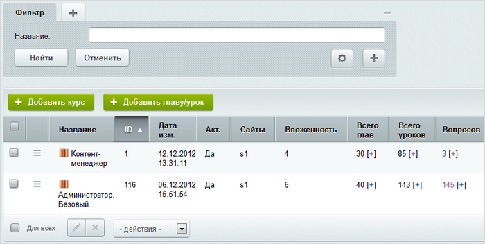

# Курсы

**Навигация**
- [← Оглавление курса](index.md)
- [← Предыдущий: 5792 — Учебные группы](lesson_5792.md)
- [Следующий: 2875 — Главы и уроки →](lesson_2875.md)

Официальная страница урока: https://dev.1c-bitrix.ru/learning/course/index.php?COURSE_ID=41&LESSON_ID=2873

|  | ### Создание курса |
| --- | --- |

Управление учебными курсами в Административном разделе осуществляется на странице Сервисы &gt; Обучение &gt; Курсы:

Для добавления нового курса служит кнопка **Добавить курс**, расположенная на контекстной панели. Переход к редактированию существующей записи осуществляется с помощью меню действий (пункт **Изменить**).

Форма создания/редактирования состоит из нескольких закладок:

1. На закладке **Курс** задаются основные параметры.
  
  А также можно настроить рейтинг на страницах курса (опции **Включить рейтинг** и **Вид кнопок рейтинга**).
  **Важно!**Если курс был деактивирован, то результаты тестов и сертификаты по нему будут недоступны пользователям. Если курс был удален, то результаты тестов и сертификаты по нему будут также удалены.
2. На закладке **Анонс** задается описание для анонса, которое отображается на странице со списком курсов.
3. Подробное описание, которое отображается на странице детального просмотра курса, задается на закладке **Подробно**.
4. На закладке **Права доступа** выполняется настройка прав доступа пользователей и групп пользователей к курсу (подробную информацию об уровнях прав доступа смотрите в [документации по продукту](http://dev.1c-bitrix.ru/user_help/service/learning/learn_course_edit.php)).
  
  На закладке перечисляются пользователи и группы пользователей, для которых настроены права доступа к модулю **Обучение**. Эти записи отредактировать невозможно, поскольку права доступа на модуль перекрывают права доступа на курс. Таким образом, если пользователям и группам пользователей уже установлены права на модуль **Обучение**, то они обладают этими же правами доступа и на все курсы системы.
  Настройка прав доступа некоторым другим пользователям и группам пользователей выполняется с помощью ссылки **Добавить**. По ее нажатию открывается
  			окно выбора пользователей и групп.
   
  Выберите пользователей или группы, для которых настраиваются права доступа, и задайте для них нужный уровень прав.
  **Примечание:** Обычно при создании курса доступ к нему предоставляется только для тех групп, пользователи которых осуществляют создание. После того, как курс готов, его делают доступным для всех необходимых групп пользователей.
5. На закладке **Доп. поля** можно задать иконку для курса, добавить файлы к материалам, указать, за сколько дней предупреждать о закрытии курса и прекращать тестирование и т.д.

|  | #### Документация по теме: |
| --- | --- |

- [Список курсов, глав и уроков](https://dev.1c-bitrix.ru/user_help/service/learning/learn_unilesson_admin.php)
- [Создание и редактирование курса](https://dev.1c-bitrix.ru/user_help/service/learning/learn_course_edit.php)
