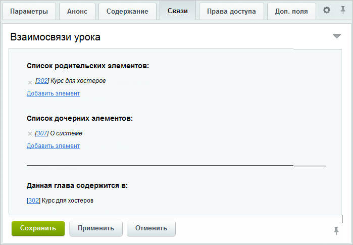
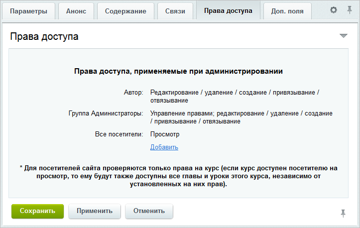

# Главы и уроки

**Навигация**
- [← Оглавление курса](index.md)
- [← Предыдущий: 2873 — Курсы](lesson_2873.md)
- [Следующий: 3104 — Вопросы →](lesson_3104.md)

Официальная страница урока: https://dev.1c-bitrix.ru/learning/course/index.php?COURSE_ID=41&LESSON_ID=2875

Начиная с 12-ой версии продукта, курсы, главы и уроки могут быть как родительскими, так и дочерними элементами по отношению друг к другу, т.е. доступна возможность привязки к любым уже имеющимся в системе главам и курсам.

При этом один и тот же урок может быть привязан к нескольким главам разных курсов. Это очень удобно, когда у вас есть несколько курсов на схожие тематики. Можно создать один урок с общей для всех курсов информацией и привязать его сразу ко всем этим курсам. Как пример – урок

			"Как отформатирован текст в курсе",

		 который прикреплен ко всем обучающим курсам «1С-Битрикс». И когда вы правите этот урок в одном из курсов, то текст правится сразу во всех курсах, к которым он прикреплен.

Когда создается новая глава, она считается просто уроком. И только тогда, когда в нее будет добавлен хотя бы один урок, она становится полноценной главой. Аналогично, если некоторый урок **А** сделать вложенным в урок **Б**, то урок **Б** становится главой. Если же из главы удалить единственный урок, то она превращается в урок.

|  | ### Процесс создания |
| --- | --- |

Прежде чем приступить к созданию главы (урока), необходимо перейти в тот раздел курса, где она (он) должна находиться:

- если в верхнем уровне курса, то перейдите на страницу Сервис &gt; Обучение &gt; Курсы;
- если в некоторой главе курса, то перейдите на страницу Сервис &gt; Обучение &gt; Курсы &gt; **название_главы**.

**Примечание:** В продукте доступна возможность создания свободных, ни к чему не привязанных глав и уроков. Это можно выполнить со страницы **Список всех уроков** (Сервис &gt; Обучение &gt; Список всех уроков) с помощью кнопки **Добавить главу/урок**. Привязка к курсу или главе может быть выполнена позже с помощью настройки связей.

Перейти к созданию главы или урока курса можно с помощью кнопки **Добавить главу/урок**, расположенной на контекстной панели, либо с помощью ссылки [+], расположенной в столбце **Всего глав** (или **Всего уроков**):

**Примечание:** Ссылка [+] встречается не только в списке глав/уроков. Она встречается и в других списках системы. Означает она то, что с её помощью можно создать ещё один элемент той или иной сущности.

В форме создания главы/урока указываются:

- основные параметры, среди которых обязательно задается название (как оно будет отображаться в меню курса в административном и публичном разделах);
- краткое описание и детальное содержание на закладках **Анонс** и **Содержание** соответственно;
- дополнительные поля на закладке **Доп. поля**.

**Внимание!** При установке галочки "Не публиковать" данная глава/урок не будет отображаться в списке уроков курса при настройке тестов и к ней невозможно будет привязать [тест](lesson_2877.md#create). Нужно сначала задать такую привязку и лишь затем ставить отметку "Не публиковать".

**Примечание:** Полное описание формы создания и редактирования представлено в [документации по продукту](http://dev.1c-bitrix.ru/user_help/service/learning/learn_unilesson_edit.php).

После сохранения урок (или будущая глава) будет добавлен в

			общий список

		 соответствующего уровня.

Процесс создания урока на этом полностью завершен. Для создания полноценной главы необходимо повторить описанный выше процесс по созданию урока внутри создаваемой главы (либо в форме редактирования главы добавить ей дочерние элементы).

Переход к редактированию осуществляется с помощью меню действий (пункт **Изменить**). В форме редактирования дополнительно доступны две закладки: **Связи** и **Права доступа**. Сначала рассмотрим подробно закладку **Связи**:

В списке родительских элементов указываются курсы/главы, к которым принадлежит редактируемая глава/урок, а в списке дочерних – главы и уроки, включенные в текущую главу (урок).

Чтобы привязать редактируемую главу/урок к другим курсам/главам или, наоборот, включить в неё имеющиеся в системе элементы, выполните следующие действия:

1. Нажмите на соответствующую ссылку **Добавить элемент**. Откроется окно со списком всех имеющихся в системе курсов, глав и уроков.
2. Выберите необходимый элемент с помощью меню действий (пункт **Выбрать**) или двойного клика по соответствующей записи.

Созданная связь отобразится в форме редактирования.

Статус "Не публиковать" устанавливается для каждого родительского курса отдельно.

**Внимание!** Один и тот же урок нельзя сделать дочерним несколько раз в рамках одного курса.

Чтобы отвязать главу/урок от какого-нибудь родителя или открепить некоторые вложенные элементы, удалите соответственно запись о родительском или дочернем элементе по кнопке **x**, расположенной рядом с названием элемента.

На закладке **Права доступа** для главы или урока можно выполнить отдельную настройку прав доступа пользователей и групп пользователей.

На закладке перечислены пользователи и группы пользователей, для которых настроены права доступа к модулю **Обучение**. Эти записи отредактировать невозможно, поскольку права доступа на модуль перекрывают права доступа на курс, главы и уроки. Таким образом, если пользователям и группам пользователей уже установлены права на модуль **Обучение**, то они обладают этими же правами доступа и на все курсы системы, главы и уроки.

Кроме того, права на курс (главу) перекрывают права на вложенные элементы. Например, если пользователям и группам заданы некоторые права на курс (главу), а на вложенные главы и/или уроки установлены меньшие права, то этим пользователям и группам вложенные главы и уроки будут доступны в соответствии с правами на курс (вышележащую главу). Если же на некоторые главы (уроки) заданы большие права, чем на курс (главу), то конечные права на главы (уроки) суммируются.

Настройка прав доступа дополнительным пользователям и группам пользователей выполняется с помощью ссылки **Добавить**. По ее нажатию открывается окно, в котором выбираются необходимые пользователи и/или группы, а затем для них указываются нужные права доступа.

|  | #### Документация по теме: |
| --- | --- |

- [Список курсов, глав и уроков](https://dev.1c-bitrix.ru/user_help/service/learning/learn_unilesson_admin.php)
- [Создание и редактирование главы/урока](https://dev.1c-bitrix.ru/user_help/service/learning/learn_unilesson_edit.php)
