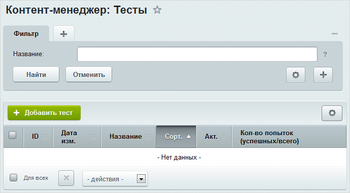
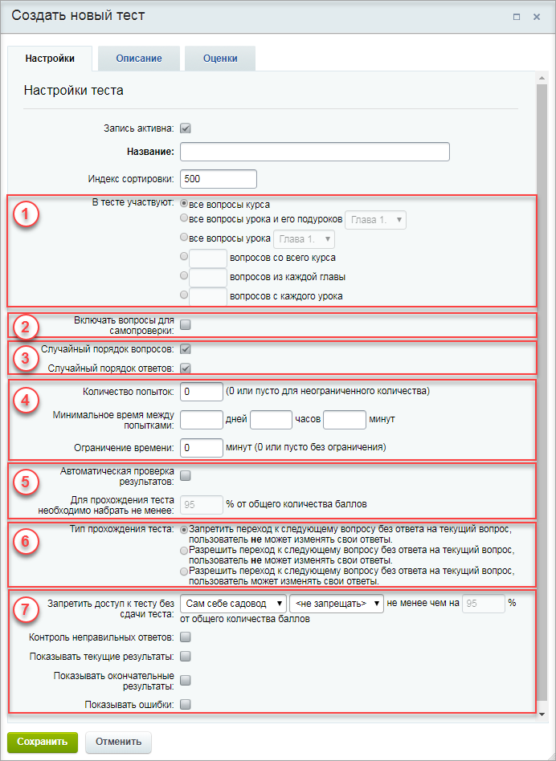
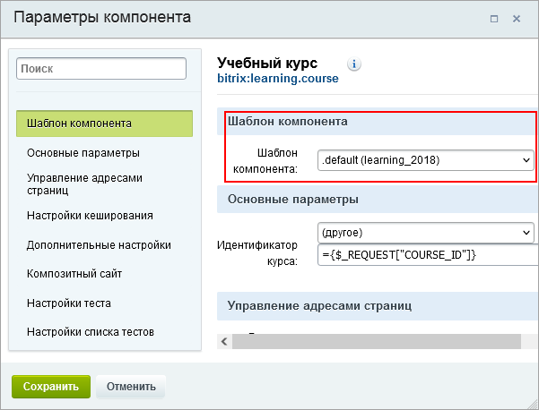
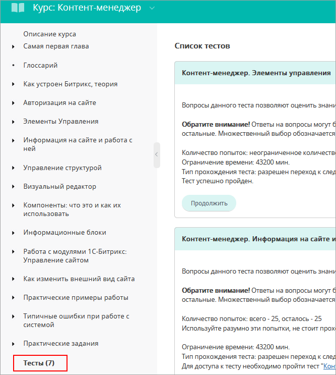

# Тесты

**Навигация**
- [← Оглавление курса](index.md)
- [← Предыдущий: 3104 — Вопросы](lesson_3104.md)
- [Следующий: 5075 — Публикация курса →](lesson_5075.md)

Официальная страница урока: https://dev.1c-bitrix.ru/learning/course/index.php?COURSE_ID=41&LESSON_ID=2877

Тесты для оценки знаний пользователей создаются на основе вопросов, задаваемых к урокам курса. Главное отличие итоговых тестов от тестов для самопроверки в том, что вся информация об их прохождении строго фиксируется (количество попыток, число набранных баллов и т.д.).

### Тест для самопроверки

Тест для самопроверки служит (как это уже понятно из названия) для проверки обучающимся того, как он усвоил материал. Это не итоговая проверка знаний, а промежуточная, без сбора информации о прохождении конкретных пользователей.

Тест для самопроверки генерируется автоматически из [созданных вопросов](/learning/course/index.php?COURSE_ID=34&LESSON_ID=11173), если у них при создании было отмечено поле **Для самопроверки**.

По этой ссылке откроется вопрос для самопроверки:

**Важно!** Тест для самопроверки будет удален тогда, когда не останется ни одного вопроса с пометкой **Для самопроверки**.

### Итоговый тест

Управление итоговыми тестами курса осуществляется на странице **Тесты** (Сервисы &gt; Обучение &gt; Курсы &gt; **название_курса** &gt; Тесты):

Для создания нового теста служит кнопка **Добавить тест**, расположенная на контекстной панели. В открывшейся форме необходимо задать параметры теста. Параметры сгруппированы по назначению:

1. Добавление вопросов в тест выполняется на основе параметров, указанных в поле **В тесте участвуют**. Уроки и подуроки могут быть выбраны из списка, только если они активны и в их [параметрах](lesson_2875.md#param) не отмечена опция "Не публиковать".
2. По умолчанию вопросы, участвующие в тесте для самопроверки, не включаются в проверочный тест. Чтобы включить данные вопросы в тест, нужно отметить соответствующую опцию.
3. Настройки теста позволяют определить порядок вывода вопросов и ответов на них.
4. Возможно ограничение количества попыток и времени, предоставляемых пользователю на одну попытку и между попытками.
5. Чтобы проверка результатов теста выполнялась автоматически (т.е. для того чтобы в журнале выводилось сообщение, является ли тест пройденным или нет), нужно отметить соответствующую опцию и ввести процент вопросов, на которые необходимо ответить правильно для успешного прохождения теста. Проценты вводятся в целых числах.
6. Настройки прохождения теста задаются в поле **Тип прохождения теста**.
7. Дополнительные условия теста могут задать порядок прохождения теста в группе тестов учебного курса и другие условия.

Тесты в публичной части отобразятся автоматически при использовании комплексного компонента

			Учебный курс

                    Комплексный компонент осуществляет полноценный вывод учебного курса. Компонент стандартный и входит в дистрибутив модуля.

						[Описание компонента «Учебный курс (комплексный компонент)» в пользовательской документации.](http://dev.1c-bitrix.ru/user_help/detail.php?ID=63239)

		.

**Примечание:**
	Если для публикации курса используется комплексный компонент

			Учебный курс

                    Комплексный компонент осуществляет полноценный вывод учебного курса. Компонент стандартный и входит в дистрибутив модуля.

						[Описание компонента «Учебный курс (комплексный компонент)» в пользовательской документации.](http://dev.1c-bitrix.ru/user_help/detail.php?ID=63239)

		 со стандартным

			шаблоном

                    

		, то страница со списком итоговых тестов будет расположена

			в конце основного курса

                    

		. Если же понадобится расположить её в другом месте (например, в конце главы или дочернего курса), то следует использовать простые компоненты раздела

			Обучение

                    Компонент выводит список активных тестов курса. Компонент является стандартным и входит в дистрибутив модуля.

						[Описание компонента «Список тестов» в пользовательской документации.](http://dev.1c-bitrix.ru/user_help/detail.php?ID=63250)

		, либо создавать собственный шаблон.

**Примечание:** подробное описание формы создания и редактирования теста представлено в [документации по продукту](http://dev.1c-bitrix.ru/user_help/service/learning/learn_test_edit.php).

### Документация по теме

- [Тесты](https://dev.1c-bitrix.ru/user_help/service/learning/learn_test_admin.php)
- [Создание и редактирование теста](https://dev.1c-bitrix.ru/user_help/service/learning/learn_test_edit.php)
