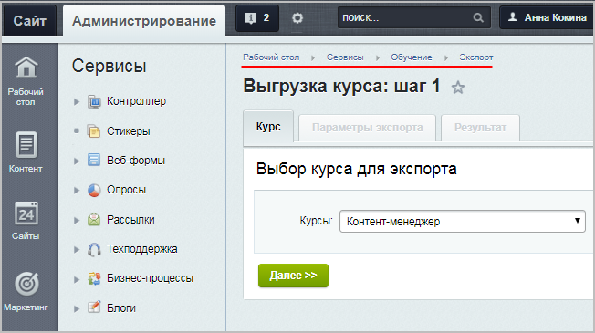
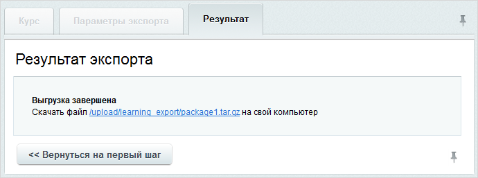
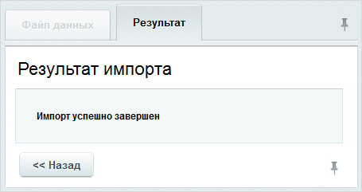

# Экспорт\импорт курсов

**Навигация**
- [← Оглавление курса](index.md)
- [← Предыдущий: 9105 — Настройки модуля Обучение](lesson_9105.md)
- [Следующий: 3105 — Результаты обучения →](lesson_3105.md)

Официальная страница урока: https://dev.1c-bitrix.ru/learning/course/index.php?COURSE_ID=41&LESSON_ID=2878

Используя средства системы, можно выполнить экспорт и/или импорт учебного курса в формате **.tar.gz**. Причем, если для курса созданы вопросы и итоговые тесты, то они также экспортируются (импортируются). Это очень удобно при перемещении курсов с сайта на сайт (например, со старого сайта нужно перенести обучающий курс на новый сайт).

### Экспорт курса

Экспорт курса выполняется с помощью специальной формы, расположенной на странице **Выгрузка курса** (Сервисы &gt; Обучение &gt; Экспорт).

С помощью выпадающего списка выберите учебный курс, который необходимо выгрузить, и нажмите кнопку **Далее**. Откроется следующий шаг процедуры экспорта.

Укажите

			имя файла

		 данных курса и нажмите кнопку **Начать выгрузку**.

Система выполнит выгрузку курса и выведет

			сообщение о завершении экспорта.

Теперь вы можете, например, загрузить курс с локальной установки продукта на ваш *Bitrix Framework*.

**Примечание**: При экспорте курса происходит изменение имен файлов картинок, загруженных в систему, в папку `/upload`. К существующим именам и в названии самой картинки, и в уроке (в коде вызова этой картинки) добавляется префикс из пяти случайных знаков и разделитель. Пример измененного имени файла: **6or1P.bitrix_blog.png**. Это не влияет на правильность отображения картинки в уроке.

### Импорт курса

Процедура импорта курса также выполняется в несколько шагов с помощью формы, расположенной на странице **Загрузка курса** (Сервисы &gt; Обучение &gt; Импорт).

С помощью кнопки **Открыть** укажите имя и путь к

			загружаемому файлу

                    Файл с архивом может быть загружен на сайт заранее, а может быть загружен в процессе импорта учебного курса.

[Подробнее ...](https://dev.1c-bitrix.ru/learning/course/index.php?COURSE_ID=34&LESSON_ID=1880#upload)

		 данных. В поле **Сайты** отметьте те сайты, к которым должен быть привязан загружаемый курс. Если импортируется курс в формате

			SCORM

**SCORM** (англ. Sharable Content Object Reference Model, «образцовая модель объекта

содержимого для совместного использования») — сборник спецификаций и стандартов, разработанный

для систем дистанционного обучения. Содержит требования к организации учебного материала и всей

системе дистанционного обучения.

SCORM позволяет обеспечить совместимость компонентов и возможность их многократного

использования: учебный материал представлен отдельными небольшими блоками, которые могут

включаться в разные учебные курсы и использоваться системой дистанционного обучения независимо

от того, кем, где и с помощью каких средств они были созданы. SCORM основан на стандарте XML.

[Подробнее](https://ru.wikipedia.org/wiki/SCORM)...

		, установите флажок в соответствующем поле. Нажмите кнопку **Загрузить данные**. Система выполнит загрузку курса и выведет

			соответствующее сообщение.

**Примечание**: На данный момент поддержка формата **SCORM** реализована не полностью. В текущей версии после импорта работает только просмотр курсов с публичной части. Мы планируем дальнейшую реализацию формата, но полноценной работы с курсами в формате SCORM как с курсами, созданными вручную, не будет, это связано с особенностями формата.

### Документация по теме

- [Экспорт курса](https://dev.1c-bitrix.ru/user_help/service/learning/learn_export.php)
- [Импорт курса](https://dev.1c-bitrix.ru/user_help/service/learning/learn_import.php)
