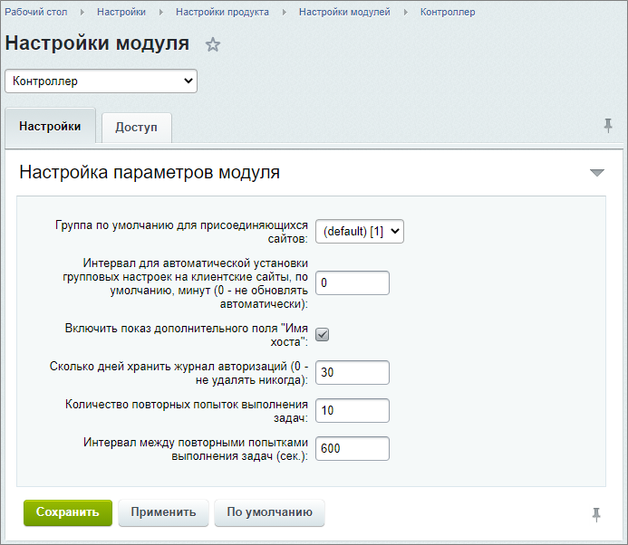

# Настройки модуля

**Навигация**
- [← Оглавление курса](index.md)
- [← Предыдущий: 8767 — Возможности и функционал Контроллера сайтов](lesson_8767.md)
- [Следующий: 2886 — Сайты →](lesson_2886.md)

Официальная страница урока: https://dev.1c-bitrix.ru/learning/course/index.php?COURSE_ID=41&LESSON_ID=2901

|  | Глобальные параметры модуля определяются на странице Настройки &gt; Настройки продукта &gt; Настройки модулей &gt; Контроллер. |
| --- | --- |

#### Настройки

На закладке **Настройки** указываются общие параметры модуля:

- Опция **Интервал для автоматической установки групповых настроек на клиентские сайты, по умолчанию, минут** позволяет задать интервал времени в минутах для автоматической установки групповых настроек на клиентские сайты по умолчанию. Если указано 0, то настройки клиентов не будут обновляться автоматически.
- Если имеются клиенты, использующие общее с контроллером ядро, то дополнительно будет доступна опция **Путь к папке с общим ядром (относительно корня сайта-контроллера)**.
- **Включить показ дополнительного поля "Имя хоста"** - при включении опции в форме создания/редактирования сайта будет доступно поле для задания альтернативного имени подключенного сайта;
- **Сколько дней хранить журнал авторизаций** - указание срока хранения записей в журнале авторизаций;
- **Количество повторных попыток выполнения задач** - указывается число попыток. А в следующей
  			опции
                      Интервал между повторными попытками выполнения задач (сек.)
  		 задается интервал в секундах между этими повторными попытками.

#### Доступ

на закладке **Доступ** можно настроить права на доступ к модулю для всех имеющихся в системе групп пользователей.

|  | #### Документация по теме: |
| --- | --- |

- [Настройки модуля](https://dev.1c-bitrix.ru/user_help/service/controller/settings.php)
