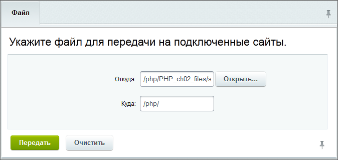

# Передача файла

**Навигация**
- [← Оглавление курса](index.md)
- [← Предыдущий: 2891 — Удаленное выполнение команд](lesson_2891.md)
- [Следующий: 3526 — Счётчики →](lesson_3526.md)

Официальная страница урока: https://dev.1c-bitrix.ru/learning/course/index.php?COURSE_ID=41&LESSON_ID=2912

|  | Страница Сервисы &gt; Контроллер &gt; Передача файла служит для отправки файлов на сайты-клиенты контроллера. Файл можно передать на какой-то конкретный сайт, на сайты определенной группы или же на все подчиненные сайты сразу. |
| --- | --- |

- Выберите в фильтре подчиненный сайт, на который необходимо передать файл;
  **Примечание:** В расширенном фильтре можно также выбрать и группу сайтов, на которые будет происходить передача файлов.
- В поле **Откуда** укажите путь к файлу, расположенному на контроллере;
- В поле **Куда** укажите путь на подчиненном сайте, куда будет скопирован файл;
- Нажмите кнопу **Передать**.

После операции передачи файла под таблицей будет отображено название сайта, для которого она выполнялась или же, в случае неудачной передачи, текст ошибки.

|  | #### Документация по теме: |
| --- | --- |

- [Передача файлов](https://dev.1c-bitrix.ru/user_help/service/controller/controller_upload_file.php)
