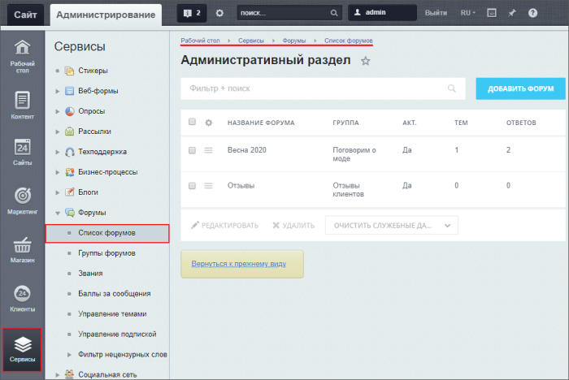
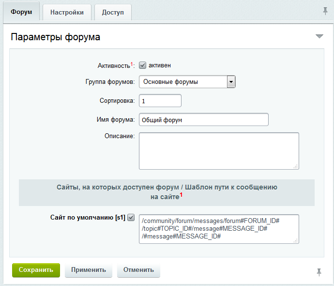
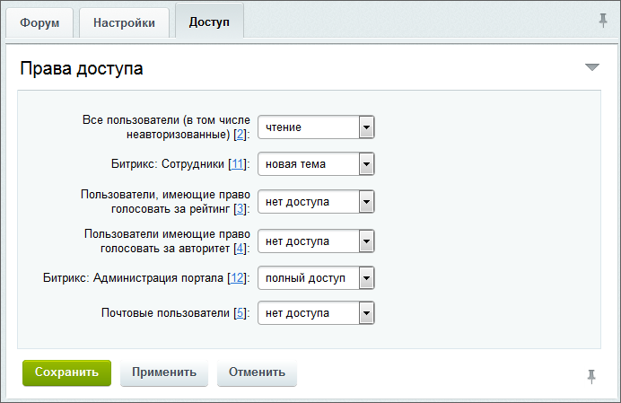

# Форумы: создание и управление

**Навигация**
- [← Оглавление курса](index.md)
- [← Предыдущий: 2963 — Группы форумов](lesson_2963.md)
- [Следующий: 2965 — Управление темами и подписками →](lesson_2965.md)

Официальная страница урока: https://dev.1c-bitrix.ru/learning/course/index.php?COURSE_ID=41&LESSON_ID=2964

### Управление форумами

Управление форумами осуществляется, как правило, в Административном разделе. Создание новых форумов возможно только в административном разделе. Список всех форумов размещается на странице Сервисы &gt; Форумы &gt; Список форумов:

#### Корректировка шаблонного текста

Частая задача администратора – корректировка шаблонного текста страниц **Помощь по форуму** и **Правила форума**. Простой вариант решения этой задачи:

В свойствах комплексного компонента  **bitrix:forum** в группе параметров **Основные настройки** убираем флажок в поле **Использовать простой режим настройки**. Появляются поля  **Путь к файлу, содержащему "Правила форума"** и **Путь к файлу, содержащему "Помощь по форуму"**.
Создаем файл с правилами, выкладываем в нужное место, прописываем путь к файлу в этих полях.

### Создание форума

Для создания нового форума используется кнопка **Новый форум**, расположенная на контекстной панели. Откроется форма создания. Поясним поля формы, значение которых может не совсем понятно из названия или имеет особенности.

1. на вкладке
  			Форум
                      
  		:

  - **Активность** – при отмеченной опции форум будет включен. Если форум неактивен, то он доступен только пользователям с правами на полный доступ к ним.
  - **Группа форумов** – при необходимости выбирается группа, к которой следует привязать форум. Группа может быть не установлена.
  - **Сайты, на которых доступен форум (Шаблон пути к сообщению на сайте)** – укажите сайт(ы), на которых доступен форум, и шаблон пути к сообщению.
2. на вкладке
  			Настройки
                      
  		:

  - **Индексация** – установленный флажок разрешает индексировать поиском сообщения форума;
  - **Модерация** – при отмеченной опции сообщения пользователей будут публиковаться на сайте только после проверки модератором;
  - **Одинаковые сообщения в теме** – запрет создания двух одинаковых сообщений в теме;
  - **Сортировать по** и **Направление сортировки** – выберите вариант сортировки сообщений, а также направление сортировки;
  - **Позволить загрузку** – разрешить загрузку присоединенных к сообщению файлов указанного типа;
  - **Допустимые расширения загружаемых файлов** – расширения файлов, разрешенных к загрузке;
  - **Пользовательские настройки** – при отмеченных опциях для незарегистрированных пользователей будет запрошен e-mail при добавлении сообщения и будет использована CAPTCHA;
  - **Регистрация новых сообщений в модуле статистики** – здесь настраиваются идентификаторы, с использованием которых создание нового сообщения на форуме будет регистрироваться в модуле **Веб-аналитика**;
  - **Настройки парсера** – указываются дополнительные настройки: ссылки, изображения, видео, теги, HTML-код, смайлики и т.д.
3. на вкладке
  			Доступ
                      
  		 определите
  			права доступа
                      Младшие права включаются в старшие (т.е. если группа обладает правом на модерирование, то она соответственно обладает правом читать сообщения, отвечать на сообщения, создавать новые темы, но не имеет права на редактирование сообщений). При определении прав пользователя, который принадлежит к нескольким группам, берется максимальное из прав.
  		 к форуму для групп пользователей:

  - **Нет доступа** – запрет на доступ;
  - **Чтение** – доступ на чтение сообщений без права создания новых тем;
  - **Ответ** – доступ к обсуждению тем без права создания новых тем;
  - **Новая тема** – доступ к обсуждению и созданию тем;
  - **Модерирование** – доступ к модерации. Например, модераторы могут скрыть или показать сообщение, но не могут отредактировать или удалить его. Члены группы с этим уровнем прав имеют возможность подписаться на получение копии всех сообщений форума по почте;
  - **Редактирование** – доступ к управлению чужими сообщениями на форуме;
  - **Полный доступ** – полный доступ к форуму, включая доступ к настройкам форума и прав доступа.

Чтобы отредактировать форум, воспользуйтесь пунктом контекстного меню

			Изменить

                    

		, откроется форма, аналогичная форме создания.

**Примечание:**Подробнее о значении полей формы создания/редактирования см. в [пользовательской документации](/user_help/service/forum/forum_edit.php) .

### Документация по теме

- [Список форумов](https://dev.1c-bitrix.ru/user_help/service/forum/forum_admin.php)
- [Создание и редактирование форума](https://dev.1c-bitrix.ru/user_help/service/forum/forum_edit.php)
