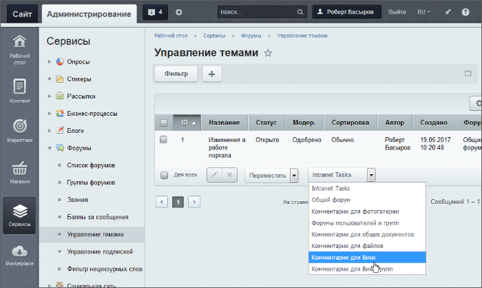

# Управление темами и подписками

**Навигация**
- [← Оглавление курса](index.md)
- [← Предыдущий: 2964 — Форумы: создание и управление](lesson_2964.md)
- [Следующий: 2966 — Звания и баллы →](lesson_2966.md)

Официальная страница урока: https://dev.1c-bitrix.ru/learning/course/index.php?COURSE_ID=41&LESSON_ID=2965

|  | ### Управление темами форумов |
| --- | --- |

Темы форумов создаются только в публичном разделе. В панели управления можно только менять название тем, но не создавать их.

Информация о темах форумов представлена на странице **Управление темами** (Сервисы &gt; Форумы &gt; Управление темами):

Используя панель **Действия**, можно быстро отредактировать или удалить отмеченные записи, а также переместить выбранные темы в указанный форум. Для этого выполните следующее:

- В колонке флажков отметьте темы, которые хотите перенести.
- В списке действий выберите **Переместить**.
- С помощью выпадающего списка укажите форум, куда будут перенесены темы.
- Нажмите кнопку **Применить**.

|  | #### Управление подписками пользователей |
| --- | --- |

Список пользователей с подпиской на форумы представлен на странице Управление подпиской (Сервисы &gt; Форумы &gt; Управление подпиской):

Для просмотра подписок некоторого пользователя используйте меню действий (пункт Изменить) либо двойной клик по соответствующей записи.

|  | #### Документация по теме: |
| --- | --- |

- [Управление темами](https://dev.1c-bitrix.ru/user_help/service/forum/forum_topics.php)
- [Управление подпиской](https://dev.1c-bitrix.ru/user_help/service/forum/forum_subscribe.php)
