# Создание виртуальных машин

**Навигация**
- [← Оглавление курса](index.md)
- [← Предыдущий: 3002 — Варианты конфигурации веб-кластера для решения практических задач](lesson_3002.md)
- [Следующий: 2976 — Настройка репликации MySQL →](lesson_2976.md)

Официальная страница урока: https://dev.1c-bitrix.ru/learning/course/index.php?COURSE_ID=41&LESSON_ID=2973

|  | ### Начинаем с создания машин |
| --- | --- |

На сайте [Amazon Web Services](http://aws.amazon.com/)

			создаем аккаунт

                    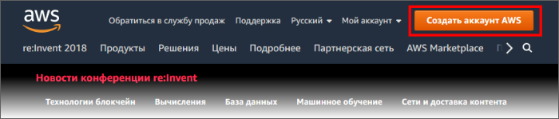

		. Создав аккаунт запускаем  виртуальную машину с помощью кнопки **Launch Instance**:

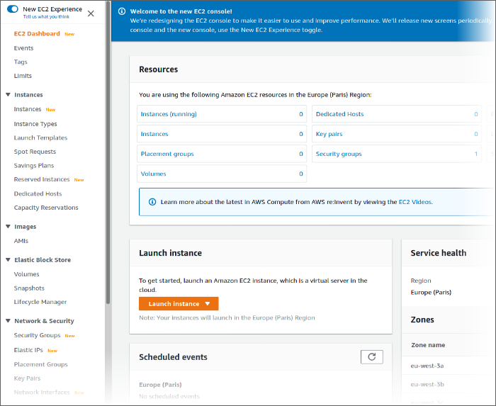

Далее нам нужно пройти мастер создания машин.

1. На первом шаге отфильтруйте образы по CentOS и 64 битам. Выберите подходящий вам или [рекомендуемый образ](https://www.1c-bitrix.ru/download/vmbitrix.php#tab-section-3).
  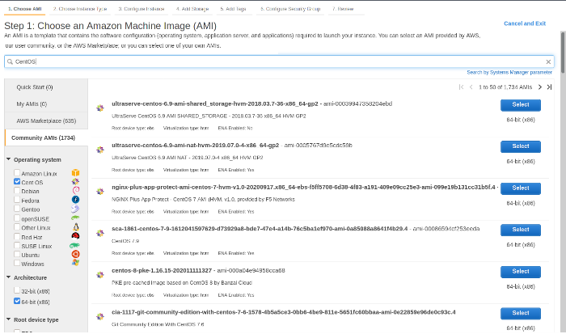
  **Примечание:** *"1С-Битрикс: Веб-окружение* - *Linux"* можно поставить и на другие [Linux платформы](http://www.1c-bitrix.ru/products/vmbitrix/).
2. В зависимости от ожидаемой нагрузки выбираем аппаратную конфигурацию виртуальной машины. В данном случае выбираем конфигурацию **m5.large**: 2 ядра примерно по 2 GHz и 7.5GB оперативной памяти:
  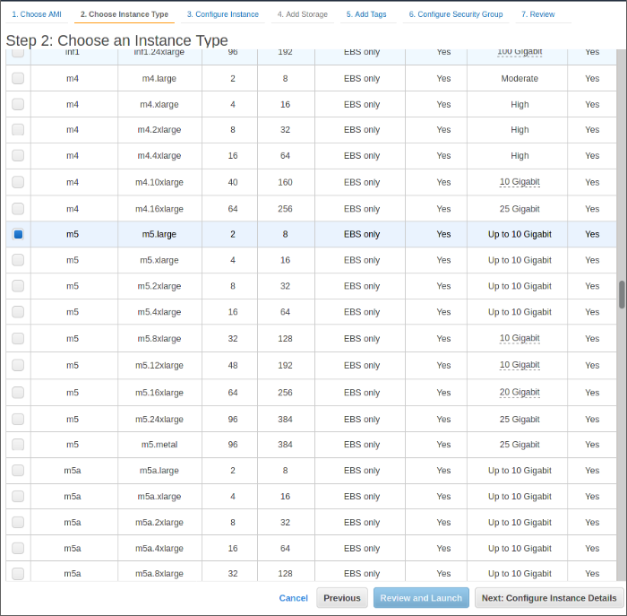
3. Конфигурацию машины рекомендуется оставить по умолчанию, но если вы достаточно квалифицированный администратор, то, конечно, никто не мешает выбрать то, что вам нужно.
  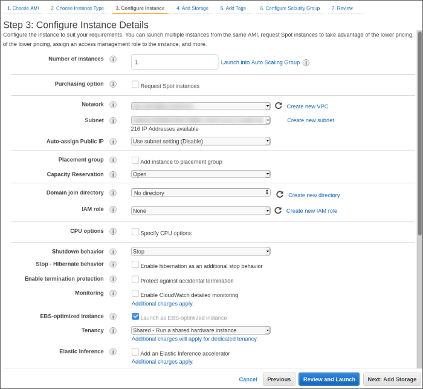
4. Задайте нужное число дисков с нужными параметрами. Рекомендуемые значения - на скриншоте.
  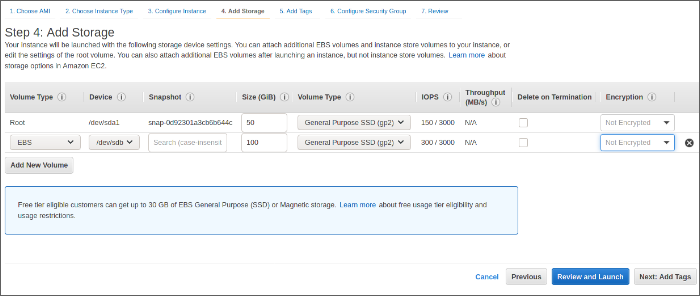
5. Задайте название, позволяющее отличить ее от других машин кластера и
  			другие теги
                      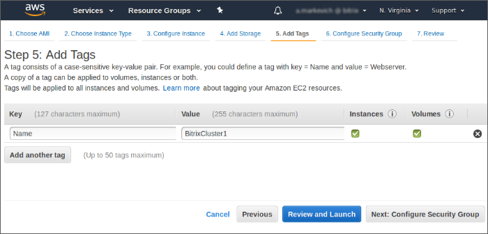
6. Создаём (либо выбираем) созданную раннее группу безопасности с нужным набором параметров. Рекомендуемые параметры - на скриншоте. Порт **22** используется **rsync/ssh**. После настройки кластера необходимо обязательно закрыть доступ извне кластера к портам memcached.
  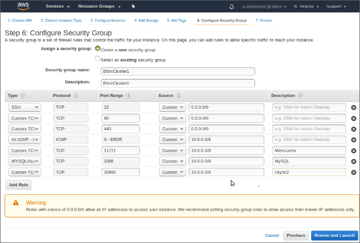
7. На последнем шаге проверьте ещё раз
  			все введённые значения
                      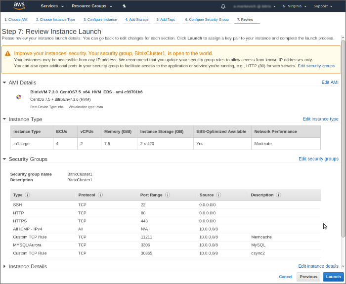
  		. Если всё верно,то нажмите **Launch**. Во всплывшем окне создаем (либо выбираем) сделанную ранее пару ключей (для последующей авторизации по SSH):
  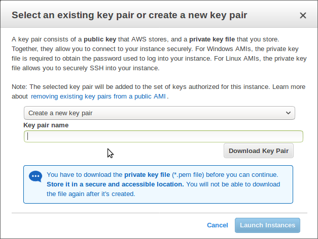
  Созданный закрытый ключ необходимо импортировать в **PuTTYgen** и пересохранить в формат закрытого ключа Putty (если Вы работаете на платформе *Windows*). Т.к. доступ на виртуальные машины осуществляется по умолчанию с использованием закрытого ключа, рекомендуется задать пароль для его защиты.

Всё, машина запущена!

Аналогично запускаем вторую виртуальную машину, но уже как slave:

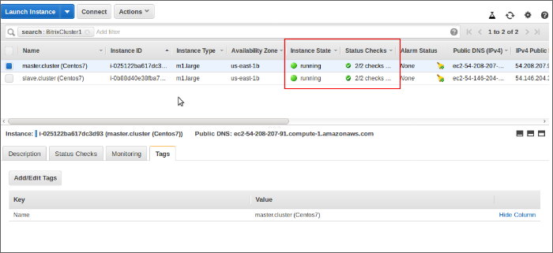

**Итог:** Запущены две виртуальные машины требуемой производительности с установленной 64-х разрядной операционной системой *CentOS*.

Для установки и настройки веб-платформы мы использовали бесплатный пакет [«1С-Битрикс: Веб-окружение» - Linux](http://www.1c-bitrix.ru/products/vmbitrix/). Данный пакет предназначен для быстрой и простой установки и конфигурации всего стека ПО, используемого продуктами *"1С-Битрикс"* на *Linux*-платформах.

Мы не ограничиваем использование той или иной веб-платформы. Можно использовать любой другой дистрибутив ОС, иные дистрибутивы и настройки серверного ПО. Однако мы рекомендуем использовать именно *"1С-Битрикс: Веб-окружение"*:

- как показывают тесты, прирост производительности на сервере, на котором установлено веб-окружение, по сравнению с "голым" сервером с настройками по умолчанию - как минимум, в 2-3 раза;
- требуется минимальное время для разворачивания системы - полностью настроенную среду можно получить в буквальном смысле в считанные минуты, использование веб-окружения по нашим подсчетам экономит 200-300 часов администрирования.
- Настройки веб-окружения сбалансированы под большие нагрузки.
