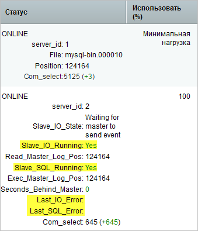
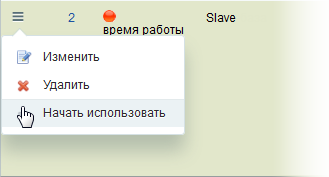

# Настройка репликации MySQL

**Навигация**
- [← Оглавление курса](index.md)
- [← Предыдущий: 2973 — Создание виртуальных машин](lesson_2973.md)
- [Следующий: 8615 — Аварийное переключение в случае отказа master →](lesson_8615.md)

Официальная страница урока: https://dev.1c-bitrix.ru/learning/course/index.php?COURSE_ID=41&LESSON_ID=2976

|  | ### Как настроить |
| --- | --- |


[Репликация MySQL](https://dev.mysql.com/doc/refman/8.0/en/replication.html) используется для решения следующих задач:


1. Увеличение производительности СУБД за счёт подключения к ней серверов при возрастающей нагрузке. Выделяется один сервер преимущественно для модификации данных (**master**) и остальные для чтения данных (**slaves**).Это особенно эффективно для веб-приложений, у которых большая часть запросов к СУБД - запросы на чтение.
2. Онлайн бэкап - данные передаются в режиме онлайн на резервные slave-сервера. При отказе основного сервера на одном из резервных slave серверов имеется "свежая" копия данных.
3. Эффективное резервное копировании: бэкап делается с резервного сервера без прерывания /замедления работы основного сервера СУБД. Для осуществления целостного
  			бинарного
                      Двоичный (bin’арный) бэкап
  		 бэкапа СУБД (в особенности **InnoDB**) можно остановить на необходимое время резервный сервер, выполнить бэкап и запустить резервный сервер снова.
4. Обеспечение высокой доступности: при выходе из строя одного из серверов СУБД система продолжает обрабатывать запросы.


|  | #### Надежность репликации |
| --- | --- |


Вечная проблема: либо производительность, либо надёжность. Для обеспечения максимальной надежности репликации рекомендуется установить следующие параметры MySQL:


```

innodb_flush_log_at_trx_commit = 1
sync_binlog = 1
sync_relay_log = 1
sync_relay_log_info = 1
```


**Примечание:** Установка именно таких параметров может привести к общему снижению производительности системы.


Для повышения производительности можно использовать такие параметры (чревато потерей данных нескольких транзакций в момент аварии на базе данных):


```

innodb_flush_log_at_trx_commit  = 2
sync_binlog = 0
```


|  | #### Динамический hostname |
| --- | --- |


Если у настраиваемого сервера динамический IP-адрес/hostname, рекомендуется явно задать параметры: relay-log, relay-log-index (актуально для версии MySQL 5.5).


|  | #### Привилегии |
| --- | --- |


Для работы репликации учетные записи основного и резервных master/slave-серверов должны иметь, кроме стандартных, также привилегии: `SUPER`, `REPLICATION CLIENT`, `REPLICATION SLAVE`.


## Учетные записи

Их три, но для простоты администрирования рекомендуется объединить в одну.

1. Учетная запись для работы приложения с базой данных (БД) для всех нод кластера (определяется в dbconn.php до версии 20.900.0 и в файле .settings.php с этой же версии).
  ```
  GRANT SELECT,LOCK TABLES,CREATE TEMPORARY TABLES,INSERT,UPDATE,DELETE,CREATE,DROP,ALTER,INDEX, REPLICATION CLIENT, RELOAD ON bitrixcluster.* TO 'bitrixcluster'@'%' IDENTIFIED BY '123456';
  ```
  `REPLICATION CLIENT` - для отображения статистики мастера.
  `RELOAD`- используется в master-БД во время переноса таблиц в slave-БД для `"FLUSH TABLES WITH READ LOCK"`.
  Под этой же учетной записью (именно логин/пароль) при добавлении slave-базы через административный интерфейс система пытается запустить потоки слейва (`CHANGE MASTER TO #логин/пароль учетной записи в master-БД#`), поэтому ей также нужны привилегии: **REPLICATION SLAVE**.
2. Учетная запись для управления slave-нодами из административного интерфейса веб-кластера. Создается в каждой slave-БД и указывается при подключении слейва в административном интерфейсе веб-кластера.
  `GRANT REPLICATION CLIENT on *.* TO 'bitrixcluster_slave'@'%' IDENTIFIED BY '123456';` - нужна для отображения статистики слейва в административном интерфейсе.
  `GRANT SUPER on *.* TO 'bitrixcluster_slave'@'%';` - нужна для отображения запуска/останова слейва и изменения параметров репликации из административного интерфейса слейвов веб-кластера.
  `GRANT SELECT,LOCK TABLES,CREATE TEMPORARY TABLES,INSERT,UPDATE,DELETE,CREATE,DROP,ALTER,INDEX ON bitrixcluster.* TO 'bitrixcluster_slave'@'%' IDENTIFIED BY '123456';` - нужна для первоначального экспорта в БД слейва данных из БД мастера.
3. Учетная запись для загрузки
  			бинлогов
                      Двоичный (bin’арный) лог. В этот лог записываются все команды изменения БД, и нужен он для репликации и восстановления. Очень  требователен к ресурсам.
  		 в slave-БД с master-БД (для собственно организации процесса репликации). Создается на master-БД для каждого подключения slave-БД (можно использовать одну учетную запись для всех слейвов).
  `GRANT REPLICATION SLAVE on *.* TO 'bitrixcluster_replica'@'%';`


|  | #### Временные зоны |
| --- | --- |


Если сервера СУБД кластера расположены в разных дата-центрах, необходимо настроить на них [единую временную зону](https://dev.mysql.com/doc/refman/8.0/en/replication-features-timezone.html).


|  | #### Настройка репликации в административном интерфейсе |
| --- | --- |


При добавлении резервного

			slave-сервера

                    Подключение к сайту дополнительных серверов баз данных позволяет снизить нагрузку на основную базу данных. В этом случае чтение данных происходит из дополнительных (slave) баз данных, а запись - в основную.

[Подробнее ...](lesson_2773.md)

		  СУБД мастер настройки репликации проверяет

			все необходимые параметры

                    

		. После успешного добавления slave-сервера отображается его

			статус

                    

		.


|  | #### Администрирование репликации |
| --- | --- |


Репликация после настройки работает надежно и требует [минимального администрирования](https://dev.mysql.com/doc/refman/8.0/en/replication-administration.html). Тем не менее, рекомендуется периодически проверять её состояние утилитами мониторинга операционной системы ([nagios](http://ru.wikipedia.org/wiki/Nagios), [zabbix](http://ru.wikipedia.org/wiki/Zabbix), [monit](http://mmonit.com/monit/), [linux-ha](http://en.wikipedia.org/wiki/Linux-HA)).


В маловероятном случае возникновения ошибки на slave-сервере переинициализируйте его - заново залейте данные с основного сервера. Для этого нужно его **Прекратить использовать**, а затем

			Начать использовать

                    

		 в разделе **Репликация** (Настройки &gt; Веб-кластер &gt; Репликация).


|  | #### Резервное копирование |
| --- | --- |


Можно свободно останавливать slave-сервера, в том числе для осуществления логического и целостного бинарного [резервного копирования](https://dev.mysql.com/doc/refman/8.0/en/replication-solutions-backups.html) средствами MySQL и операционной системы. При этом не прерывается работа основного сервера СУБД.
