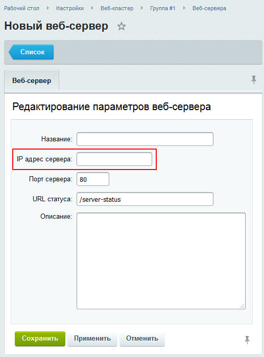

# Кластеризация веб-сервера

**Навигация**
- [← Оглавление курса](index.md)
- [← Предыдущий: 8615 — Аварийное переключение в случае отказа master](lesson_8615.md)
- [Следующий: 2987 — Синхронизация данных между серверами →](lesson_2987.md)

Официальная страница урока: https://dev.1c-bitrix.ru/learning/course/index.php?COURSE_ID=41&LESSON_ID=2977

### Несколько веб-серверов

При использовании нескольких веб-серверов для работы сайта любой запрос любого посетителя сайта может попасть на любой из

			узлов кластера

                    О том, как именно могут распределяться коннекты к разным веб-серверам смотрите [Способы балансировки нагрузки между нодами веб-сервера](lesson_2990.md)

		.

Такой принцип работы ставит две задачи:


1. На каждом веб-сервере должен **находиться одинаковый контент** (
  			файлы
                       Например, картинка, загруженная через административный интерфейс на одном веб-сервере, должна быть доступна для отдачи посетителю через другой веб-сервер.
  		).
2. Пользовательская **сессия должна быть "прозрачной"**  для всех
  			серверов веб-кластера
                      Например, после авторизации на одном из серверов пользователь должен считаться авторизованных и для всех других серверов. И наоборот, окончание сессии на любом сервере должно означать ее окончание на всех серверах сразу.
  		.

Не все эти задачи могут быть решены в полной степени на уровне веб-приложения. Опишем возможные подходы, покажем на примерах конкретные реализации и расскажем о тех инструментах модуля **Веб-кластер** платформы *"1С-Битрикс"*, которые помогают решить вопрос кластеризации веб-сервера.

### Решение задач

Существует два возможных метода обеспечения синхронизации данных на серверах:


1. Использование **общего дискового хранилища данных**.
2. Использование инструментов **синхронизации данных** между локальными хранилищами разных серверов.

Кроме того, можно использовать

			пул серверов

                    Пул серверов - это логически автономная область, содержащая один или несколько физических серверов.

		 memcached (что позволяет значительно сократить объем синхронизируемых файлов за счет вынесения кеша продукта с файловой системы в memcached) и различные варианты хранения пользовательских сессий.

Каждый веб-сервер кластера можно добавить в общий веб-кластер для мониторинга в административном интерфейсе в разделе

			Веб-сервера

                    На странице Веб-сервера (Настройки &gt; Веб-кластер &gt; [_название_группы_]  &gt; Веб-сервера) показаны статусы активности и текущей нагрузки веб-серверов. Страница носит информационный характер.

[Подробнее ...](lesson_2730.md)

		.


На каждом из серверов необходимо настроить страницу, на которой будет отображаться статистика веб-сервера *Apache* (с помощью модуля [mod_status](http://httpd.apache.org/docs/2.2/mod/mod_status.html)). Если используется *"1С-Битрикс: Веб-окружение"*, необходимо:

1. Внести изменения в конфигурационный файл Apache (`/etc/httpd/conf/httpd.conf`) - добавить:
  ```
  <IfModule mod_status.c>
  ExtendedStatus On
  <Location /server-status>
      SetHandler server-status
      Order allow,deny
      Allow from 10.0.0.1
      Allow from 10.0.0.2
      Deny from All
  </Location>
  </IfModule>
  ```
  Директива `Location` обозначает адрес, по которому будет доступна статистика, строки `Allow from` определяют, с каких IP-адресов статистика будет доступна для просмотра. Можно указать IP всех веб-серверов кластера.
  Перечитать конфигурационные файлы Apache с помощью команды:
  ```
  # service httpd reload
  ```
2. Внести изменения в конфигурационный файл nginx (`/etc/nginx/nginx.conf`) - в первой секции *server* добавить:
  ```
  Location ~ ^/server-status$
  {
    proxy_pass http://127.0.0.1:8888;
  }
  ```
  Перечитать конфигурационные файлы nginx с помощью команды:
  ```
  # service nginx reload
  ```
3. Отредактировать файл `/home/bitrix/www/.htaccess`, добавив после строки:
  ```
  RewriteCond %{REQUEST_FILENAME} !/bitrix/urlrewrite.php$
  ...строку:
  RewriteCond %{REQUEST_URI} !/server-status$
  ```

После внесения всех необходимых изменений адрес server-status'а можно добавить в

			конфигурацию кластера

                    

		.
