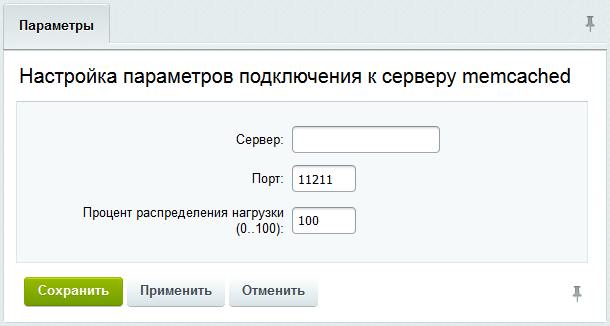
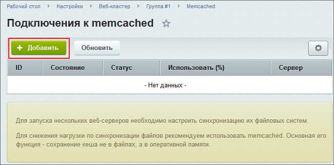
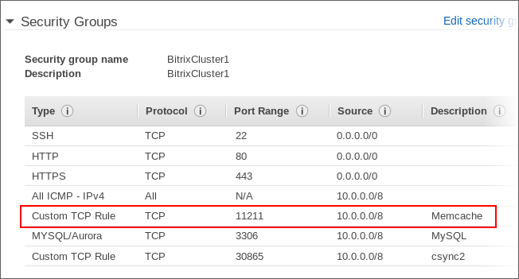

# Кластеризация кеша (memcached)

**Навигация**
- [← Оглавление курса](index.md)
- [← Предыдущий: 2987 — Синхронизация данных между серверами](lesson_2987.md)
- [Следующий: 2990 — Способы балансировки нагрузки между нодами веб-сервера →](lesson_2990.md)

Официальная страница урока: https://dev.1c-bitrix.ru/learning/course/index.php?COURSE_ID=41&LESSON_ID=2989

### Кеш храним в кластере

Для обеспечения максимальной производительности веб-кластера реализовано централизованное, разделяемое между нодами хранилище данных кэша - кэш, созданный в результате ресурсоемких вычислений нодой "А", будет использован нодой "B" и остальными нодами кластера. Чем больше нод, тем больший эффект даст использование централизованного кэша.

Для централизованного и надежного хранения данных кэша используется кластер серверов [memcached](http://en.wikipedia.org/wiki/Memcached).


Для запуска сервера memcached на *"1С-Битрикс: Веб-окружение" (Linux)* выполните команды:

```

# chkconfig memcached on
# service memcached start

```

### Улучшенная эффективность за счет вытеснения устаревших данных

За счет использования в сервере memcached алгоритма LRU в кэше будут храниться только наиболее актуальные данные, а редко используемые - вытесняться. Это не позволит объему кэша безгранично разрастаться в размерах (например, из-за ошибок разработчиков при интеграции), что приводило не только к неэффективному использованию ресурсов системы, но и отрицательно сказывалось на скорости работы с кэшем за счет роста его объема.

В результате кэш веб-кластера будет автоматически поддерживаться в максимально эффективном состоянии: как по скорости доступа, так и по использованию ресурсов.

Рекомендуется периодически анализировать использование кэша приложением и подобрать оптимальный размер кэша. Если сервера memcached имеют разный размер (обусловленный, возможно,  разным объемом оперативной памяти на физических серверах), можно регулировать их использование через задание

			Процент распределения нагрузки

                    

		.

### Улучшенная надежность и масштабируемость

За счет кластеризации данных кэша на нескольких серверах memcached выход из строя одного memcached сервера не выведет из строя подсистему кэширования. В случае увеличения объема данных кэша необходимо подключить к веб-кластеру дополнительный memcached сервер:




Если используется несколько memcache-серверов, нужно установить значение  переменной [memcache.hash_strategy string](http://www.php.net/manual/ru/memcache.ini.php#ini.memcache.hash-strategy) в **consistent** (по умолчанию это выключено!). Такое значение нужно для следующего: если один из мемкэшей сломается, начнется ресурсоемкая операция перетасовки ключей между мемкэшами, замедляющая работу веб-кластера. А если установить в **consistent** - проблем практически не будет.

### Безопасность

Необходимо открыть доступ к серверам memcached только для нод веб-кластера путем настройки файервола. При использовании хостинга *Amazon Web Services* это можно сделать через редактирование параметров группы безопасности (введите параметры, соответствующие вашей конфигурации веб-кластера):


