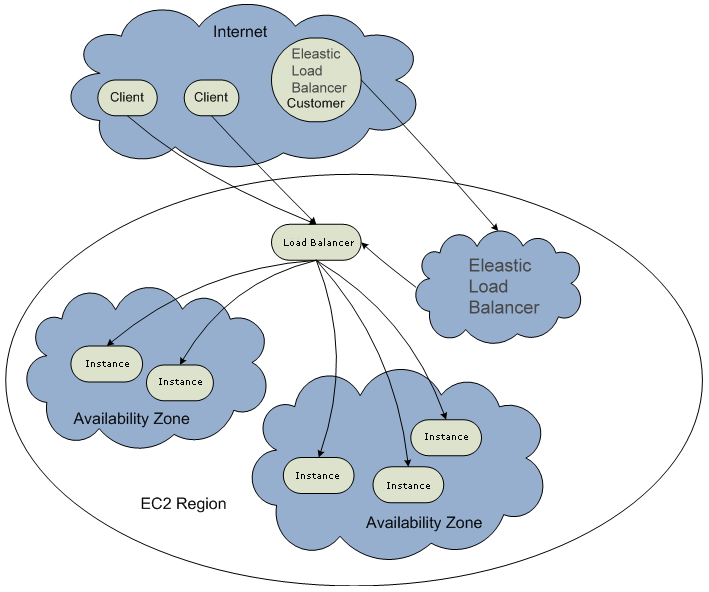
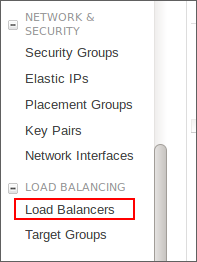
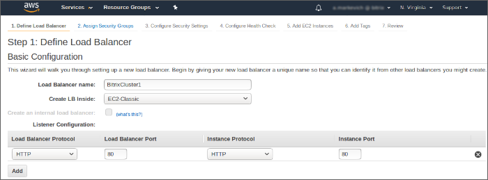
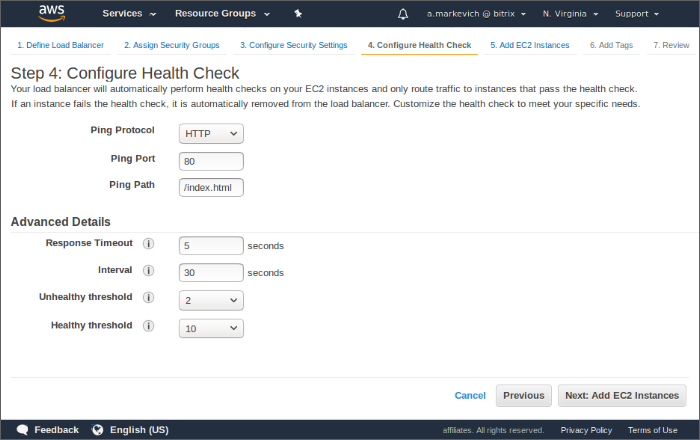
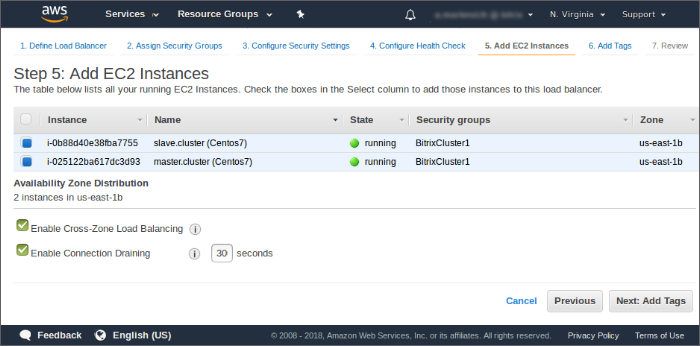

# Способы балансировки нагрузки между нодами веб-сервера

**Навигация**
- [← Оглавление курса](index.md)
- [← Предыдущий: 2989 — Кластеризация кеша (memcached)](lesson_2989.md)
- [Следующий: 2996 — Добавление ноды веб-кластера →](lesson_2996.md)

Официальная страница урока: https://dev.1c-bitrix.ru/learning/course/index.php?COURSE_ID=41&LESSON_ID=2990

**Как распределять нагрузку**

	Спектр инструментов, служащих для распределения и балансировки нагрузки между серверами, очень широк. Существуют как дорогие аппаратные решения (например, *Cisco CSS*, *Content Services Switch* - различных моделей), так и более простые (но тем не менее весьма эффективные) программные средства.

### Elastic Load Balancer (Amazon Web Services)

Балансировщик нагрузки AWS использует простой алгоритм балансировки (round robin) и настраивается достаточно просто. DNS-имя балансировщика создается автоматически, и необходимо создать для него [удобочитаемое CNAME](https://docs.aws.amazon.com/elasticloadbalancing/latest/userguide/what-is-load-balancing.html):


`my-load-balancer-1820597761.us-west-1.elb.amazonaws.com` -&gt; `www.mydomain.com`





В личном кабинете воспользуйтесь командой

			добавления балансировщика

                    

		. При выборе мастера создания и воспользуйтесь

			классическим сценарием

                    

		 для добавления. Пройдите все шаги мастера.

Балансировщик «слушает» порт 80 и перенаправляет

			запросы на 80 порт нод веб-кластера

                    

		.


Укажите страницу ноды для проверки и таймауты:



Рекомендуется в **Ping Path** задать страницу,

			обращения к которой не фиксируются

                    Можно ли отключить статистику на отдельно взятой странице?
Да, для этого необходимо в код страницы вставить следующее:

[Подробнее ...](https://dev.1c-bitrix.ru/learning/course/index.php?COURSE_ID=139&LESSON_ID=2866)

		 в модуле **Веб-аналитика**. Остальные параметры выбираются в зависимости от ожидаемой нагрузки.

Выбираем ноды, которые будут находиться за балансировщиком. В связи с простым алгоритмом балансировки (round robin), рекомендуется подбирать ноды примерно одинаковой производительности. Если ноды располагаются в разных дата-центрах (**availability zones**), то рекомендуется их одинаковое количество в каждом дата-центре.




Если мы хотим, чтобы все запросы от одних и тех же клиентов обрабатывались одними и теми же нодами кластера, необходимо добавить привязку сессии посетителя к ноде веб-кластера. Для этого в настройках балансировщика включаем привязку **Enable Load Balancer Generated Cookie Stickiness**.


Теперь, независимо от того, сколько нод кластера размещены за балансировщиком, они будут доступны по единому доменному имени: `www.mydomain.com`. В случае выхода ноды из строя/перегрузки балансировщик перестает направлять на нее посетителей кластера.

**Примечание:** Подробнее о балансировщике нагрузки читайте в официальной [документации AWS](https://docs.aws.amazon.com/elasticloadbalancing/latest/userguide/what-is-load-balancing.html).

### DNS

Самый простой способ балансирования нагрузки и распределения запросов между веб-серверами - использование механизма [round robin DNS](http://ru.wikipedia.org/wiki/Round_robin_DNS). У *Amazon* в сервисе *Route53* существует еще один простой и удобный механизм фейловера на базе DNS ([Route 53 Health Checks and DNS Failover](https://docs.aws.amazon.com/Route53/latest/DeveloperGuide/dns-failover.html)).

Спецификация стандарта DNS позволяет указать несколько разных IN A записей для одного имени. Например:

```

www  IN A  10.0.0.1
www  IN A  10.0.0.2
```

В этом случае DNS-сервер в ответ на запрос разрешения имени в IP-адрес будет выдавать не один адрес, а весь список:

```

# host www.domain.local
www.domain.local has address 10.0.0.1
www.domain.local has address 10.0.0.2
```

При этом с каждым новым запросом последовательность адресов в списке в ответе будет меняться. Таким образом клиентские запросы будут распределяться между разными адресами и будут попадать на разные серверы.

Использование **round robin DNS** - самый простой способ балансировки нагрузки, не требующий никаких дополнительных средств, однако он обладает целым рядом недостатков, поэтому мы рекомендуем использовать его только в том случае, если нет возможности применить какой-либо иной балансировщик.


Минусы применения round robin DNS:

- нет четкого критерия выбора IP из списка клиентом (может выбираться первый элемент, может кэшироваться последнее выбранное значение, возможны иные варианты): все зависит от реализации конкретного клиента;
- нет механизмов определения доступности узлов и возможности задания их "весов": в случае аварии на одном или нескольких узлах кластера нагрузка будет продолжать распределяться между рабочими и вышедшими из строя нодами;
- длительное время кэширования ответов DNS: в случае аварии и изменении тех или иных записей в DNS потребуется некоторое время (зависит от настроек DNS) для обновления данных на всех клиентах.

### nginx

Рассмотрим пример использования в качестве балансировщика http-сервера nginx. Для этих целей используется модуль [ngx_http_upstream](http://nginx.org/ru/docs/http/ngx_http_upstream_module.html).

При использовании *"1С-Битрикс: Веб-окружения"* nginx уже установлен на серверах веб-кластера. И для распределения нагрузки можно использовать непосредственно один из серверов кластера. Однако для более простого, гибкого и удобного конфигурирования лучше использовать отдельный сервер с установленным nginx в качестве балансировщика.

В простейшем примере фрагмент конфигурационного файла nginx (`/etc/nginx/nginx.conf`), обеспечивающего распределение нагрузки между серверами, будет выглядеть так (помимо стандартных директив, определяющих, например, пути и формат log-файлов и т.п.):

```

http {
    upstream backend {
        server node1.demo-cluster.ru;
        server node2.demo-cluster.ru;
    }

    server {
        listen   80;
        server_name  load_balancer;

        location / {
            proxy_set_header X-Real-IP $remote_addr;
            proxy_set_header X-Forwarded-For $proxy_add_x_forwarded_for;
            proxy_set_header Host $host:80;

            proxy_pass  http://backend;
        }

    }
}
```

В секции **upstream** задаются адреса серверов, между которыми будет распределяться нагрузка.

В DNS имя сайта указывается на тот IP, на котором работает сервер с nginx, распределяющем нагрузку.


Если не указаны какие-либо дополнительные параметры, запросы распределяются между серверами по принципу round robin.

Однако с помощью модуля [ngx_http_upstream](http://nginx.org/ru/docs/http/ngx_http_upstream_module.html) можно реализовать и более сложные конфигурации.

- В некоторых случаях бывает удобно передавать все запросы от одного клиента на один и тот же сервер, а между серверами распределять только запросы разных клиентов.
  Для реализации подобного функционала служит директива `ip_hash`. Пример:
  ```
  upstream backend
  {
      ip_hash;
      server node1.demo-cluster.ru;
      server node2.demo-cluster.ru;
  }
  ```
  В этом случае распределение запросов основано на IP-адресах клиентов.
- Если для узлов кластера используются серверы разной конфигурации (разной мощности), бывает полезно задать "вес" для тех или иных хостов, направляя на них больше или меньше запросов.
  Для этого служит параметр `weight` директивы `server`. Пример:
  ```
  upstream backend
  {
      server node1.demo-cluster.ru weight=3;
      server node2.demo-cluster.ru;
      server node3.demo-cluster.ru;
  }
  ```
  В такой конфигурации каждые 5 запросов будут распределяться следующим образом:
  **Обратите внимание:** для серверов, использующих метод распределения **ip_hash**, нельзя задать вес.

  - 3 - на node1.demo-cluster.ru;
  - 1 - на node2.demo-cluster.ru;
  - 1 - на node3.demo-cluster.ru.
- Можно настроить параметры, по которым будут определяться неработающие серверы.
  **[max_fails](http://nginx.org/ru/docs/http/ngx_http_upstream_module.html#server) = число** - задает число неудачных запросов к серверу в течение времени, заданного параметром `fail_timeout`, после которых он считается неработающим также в течение времени заданного параметром `fail_timeout`;
  **[fail_timeout](http://nginx.org/ru/docs/http/ngx_http_upstream_module.html#server) = время**
  Пример:
  ```
  upstream backend
  {
      server node1.demo-cluster.ru max_fails=3 fail_timeout=30s;
      server node2.demo-cluster.ru max_fails=3 fail_timeout=30s;
  }
  ```
  Если при запросе к серверу произошла ошибка, запрос будет передан на следующий сервер. Если произошло 3 ошибки в течение 30 секунд, то на 30 секунд сервер будет помечен неработающим, и в течение этого времени новые запросы не будут на него отправляться.

**Примечание**: Пример настройки балансировщика на NGINX - универсальный. Его можно брать за основу для настройки на любом другом сервисе.
