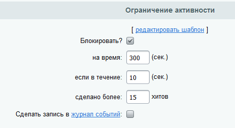
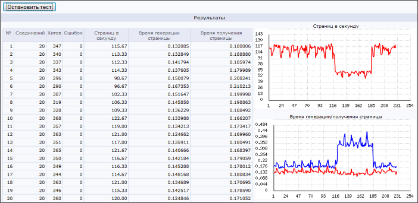
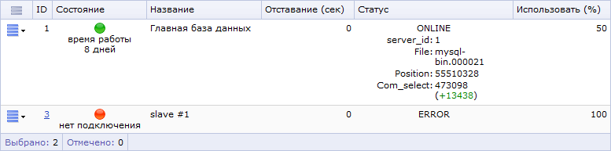

# Нагрузочное тестирование кластера, анализ различных сценариев и выводы

**Навигация**
- [← Оглавление курса](index.md)
- [← Предыдущий: 2996 — Добавление ноды веб-кластера](lesson_2996.md)
- [Следующий: 4551 — Возможности модуля Веб-формы →](lesson_4551.md)

Официальная страница урока: https://dev.1c-bitrix.ru/learning/course/index.php?COURSE_ID=41&LESSON_ID=3001

### Проверяем работу

Существует множество утилит для проведения

			нагрузочных тестов веб-систем

                    Есть такой миф из XP/TDD, что можно полностью покрыть веб-приложение модульными и функциональными тестами, написать большое количество Selenium-тестов, кликающих по системе снаружи и без страха вносить в систему доработки и выкладывать на рабочий сервер через процесс непрерывной интеграции.

[Подробнее ...](https://dev.1c-bitrix.ru/learning/course/index.php?COURSE_ID=38&CHAPTER_ID=02911)

		. От достаточно простых (*ab*, входящая в дистрибутив *Apache*, *siege*, *httperf*) до мощных инструментов, позволяющих задавать любые пользовательские сценарии и предоставляющих самую разнообразную статистическую информацию (*JMeter*, *tsung*, *WAPT*).

Кроме этих утилит вы можете использовать

			Монитор производительности

                    Монитор производительности показывает скорость работы сайта на хостинге, выявляет узкие места (скрипты на сайте, которые потребляют наибольшее число системных ресурсов) и основные ошибки настройки сервера.

[Подробнее ...](https://dev.1c-bitrix.ru/learning/course/index.php?COURSE_ID=32&CHAPTER_ID=04904)

		 платформы *"1С-Битрикс"* доступен встроенный инструмент тестирования нагрузки.

**Обратите внимание:** для минимизации влияния самого тестирующего скрипта на результаты тестов рекомендуется запускать его не на самих тестируемых серверах, а на отдельном хосте.

На тестируемом сайте необходимо на время проведения теста отключить опцию (

			Блокировать?

                    

		) в настройках модуля **Веб-аналитика**, закладка **Настройки**, секция **Ограничение активности**.

Покажем, как работает этот инструмент, и проведем несколько тестов.

### Первый тест - рост нагрузки

Параметры проводимых тестов:

- **Сервер** - в нашем случае мы даем тестовую нагрузку на балансировщик (*nginx*), который распределяет нагрузку между двумя веб-серверами кластера (на каждом сервере работают и добавлены в кластер веб-сервер, MySQL, memcached);
- **Страница** - URL, на который отправляются запросы;
- **Начальное количество одновременных соединений**, **Конечное количество**, **Шаг увеличения соединений** - параметры нагрузки.

В нашем тестовом примере мы начинаем отправлять запросы на индексную страницу в 10 одновременных потоков и постепенно увеличиваем их количество до 200.

По графику **Время генерации/получения страницы** мы видим что:

- вся система сбалансирована по нагрузке, с ее ростом не наступает деградация производительности системы (скорость генерации страниц сервером практически не изменяется, это видно на красном графике);
- увеличивается время отдачи страниц клиентам, растет очередь (синий график).

### Второй тест - эмуляция аварии (отключения) сервера со slave базой данных MySQL

Во втором тесте мы

			эмулируем отключение одной из машин кластера

                    

		 (той, на которой работает slave-база данных MySQL).

Небольшие пики на графиках – моменты синхронизации контента (у нас в тесте установлен частый период обновлений, его можно уменьшить).

Большой «провал» красного графика (и «всплеск» на синем графике) – момент отключения одной из машин кластера.

### Третий тест - эмуляция аварии (отключения) сервера с master базой данных MySQL

Отключение сервера с master-базой данных MySQL отличается от предыдущего теста тем, что необходимо выполнить ряд действий для переключения базы данных slave в режим мастера. Общая схема действий подробно описана в главе

			Настройка репликации MySQL, аварийное переключение slave-&gt;master

                    В случае отказа основного (master) сервера СУБД, необходимо вручную или автоматически скриптом переключить кластер на другой master-сервер СУБД. Для этого обычно slave-сервер, хранящий последние реплицированные данные, переводят в режим основного.

[Подробнее ...](lesson_2976.md#slave_master)

		.
