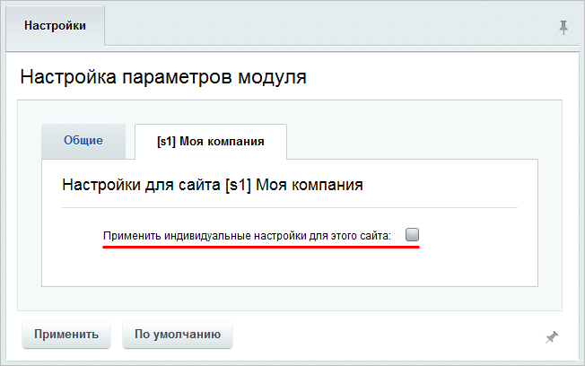
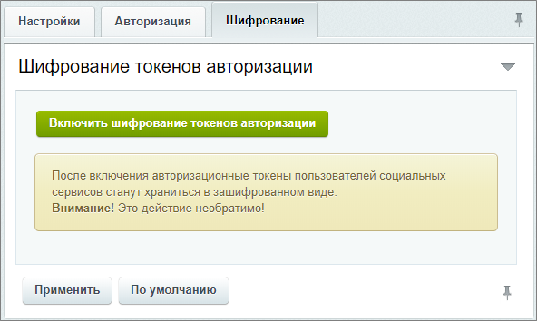
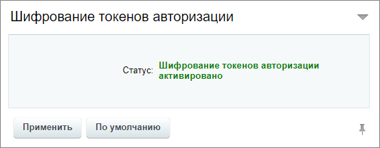

# Настройка модуля

**Навигация**
- [← Оглавление курса](index.md)
- [← Предыдущий: 20126 — Проверьте себя](lesson_20126.md)
- [Следующий: 23044 — Добавление сервисов в форму авторизации →](lesson_23044.md)

Официальная страница урока: https://dev.1c-bitrix.ru/learning/course/index.php?COURSE_ID=41&LESSON_ID=3036

### Настройка параметров модуля

Для управления сервисами необходимо перейти на страницу настроек модуля **Социальные сервисы** (Настройки &gt; Настройки продукта &gt; Настройки модулей &gt; Социальные сервисы).

Рассмотрим закладку **Настройки**:

- **Разрешить отправку активностей пользователей в социальные сети** - отправка в соцсети активности пользователей, например при начале или завершении рабочего дня;
  **Примечание**: Указанная настройка только для
  			Битрикс24
  Одним из важнейших показателей, характеризующих ответственность ваших сотрудников является рабочее время. Используйте инструмент **Рабочий день** и учитывайте рабочее время, не отрываясь от собственных дел. Не нужно вводить никаких дополнительных условий и нанимать HR-менеджера - система сама покажет вам, как люди выполняют свою работу.
  Подробнее на [helpdesk.bitrix24.ru](https://helpdesk.bitrix24.ru/open/5355941/)
  		.
- **Транслировать твиты пользователей с хештегом в живую ленту** - указываются хештеги, с которым будут
  			транслироваться твиты пользователя
                      **Примечание:**Предварительно нужно настроить сервис X, а также пользователь должен указать свой X-аккаунт в **Профиле пользователя** в публичной части сайта.
  [Подробнее](https://dev.1c-bitrix.ru/learning/course/index.php?COURSE_ID=41&LESSON_ID=7135)...
  		 в Живую ленту;
- Далее из списка выбираются необходимые **социальные сервисы**, с помощью которых будет доступна авторизация;
- Ниже под каждым сервисом есть рекомендации и ссылки для регистрации сайта в своей системе получения соответствующих уникальных идентификаторов и секретных ключей. А в главе [Примеры настройки некоторых сервисов](https://dev.1c-bitrix.ru/learning/course/index.php?COURSE_ID=41&CHAPTER_ID=03040&LESSON_PATH=3911.4772.3040) приведены инструкции по подключению.

Если требуется использовать разные социальные сервисы авторизации на дополнительных сайтах, то перейдите на вкладку нужного сайта и включите их с помощью опции

			Применить индивидуальные настройки для этого сайта

                    

		. Дальнейшие настройки аналогичны общим, указанным выше.

**На что еще требуется обратить внимание при настройке проекта**:

- Некоторые сервисы требуют обращения только по **HTTPS**. Поэтому крайне желательно, чтобы **PHP** был собран с библиотекой **openssl**.
- Если на проекте используются различного вида редиректы (**mod_rewrite**), убедитесь, что при редиректе не перекодируются параметры **GET**.

### Регистрация и авторизация

На вкладке **Авторизация** разрешите, если необходимо, регистрацию новых пользователей

			через соцсети

                    В противном случае можно будет только авторизовываться с помощью аккаунтов соцсетей, предварительно привязанных к профилю пользователя.

		. Также определите группы пользователей сайта, для которых запрещена авторизация через соцсервисы и привязка соцсервисов к своим аккаунтам:

**Примечание:** В опции **Регистрация новых пользователей** указывается разрешено ли посетителям самостоятельно регистрироваться на сайте. За это отвечает опция **Позволять ли пользователям регистрироваться самостоятельно?** в настройках главного модуля на вкладке **Авторизация** (Настройки &gt; Настройки продукта &gt; Настройки модулей &gt; Главный модуль).

### Шифрование токенов авторизации

**Примечание**: Шифрование токенов авторизации доступно с версии 19.0.100 модуля Социальные сервисы.

Нажатие кнопки

			Включить шифрование токенов авторизации

                    Обратите внимание на предупреждение. Включение шифрования - необратимое действие.

		 включает хранение авторизационных токенов пользователей социальных сервисов в зашифрованном виде.

После включения функции, а также на всех

			новых установках продукта

                    На новых установках продукта шифрование включено автоматически.
 Новая установка - это установка, выполненная из дистрибутива с версией модуля выше 19.0.100

		, на закладке **Шифрование** отобразится статус: **Шифрование токенов авторизации активировано**

### Документация по теме

- [Настройки модуля](https://dev.1c-bitrix.ru/user_help/service/socialservices/settings.php)
