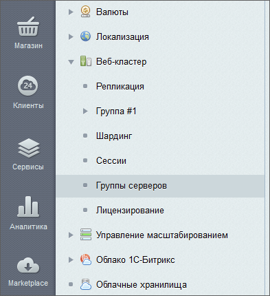

# Настройки модуля и группы серверов

**Навигация**
- [← Оглавление курса](index.md)
- [← Предыдущий: 3018 — Что может Веб-кластер](lesson_3018.md)
- [Следующий: 2773 — Master-Slave репликация →](lesson_2773.md)

Официальная страница урока: https://dev.1c-bitrix.ru/learning/course/index.php?COURSE_ID=41&LESSON_ID=3079

### Настройки - проще некуда

Форма настроек модуля имеет единственную настройку:

**Максимально возможное время отставания slave базы данных от master (сек.)** - время отставания slave базы данных от master, после которого она будет автоматически отключена для снижения риска рассинхронизации данных.

Отставание slave базы данных возможно при большом количестве обновлений основной (master) базы данных, недостаточно быстром соединении между master и slave базами данных, недостаточной производительности slave базы данных.

**Примечание:** Время отставания базы данных отображается в таблице на странице

			Репликация

                    Репликация базы данных - это процесс создания и поддержания в актуальном состоянии её копии....

[Подробнее ...](https://dev.1c-bitrix.ru/learning/course/index.php?COURSE_ID=35&CHAPTER_ID=02719&LESSON_PATH=3906.6663.4750.2719)

		.

### Группирование серверов

Группы - сущность созданная только для удобства работы. Они используются для объединения "узлов" в рамках гео-кластера. Это позволяет расположить в различных географически расположенных дата-центрах собственные: Cервера баз данных, Memcached-сервера, Веб-сервера.

Создание групп происходит на странице Настройки &gt; Веб-кластер &gt; Группы серверов. Создание группы - это просто задать ей название.

**Важно!** Для каждого веб-сервера одной группы в файле **dbconn.php** должна быть определена переменная `BX_CLUSTER_GROUP`, значение которой соответствует идентификатору группы. Например: `define("BX_CLUSTER_GROUP", 1)`.

Название второй группы может быть **"Группа #2"**, но в переменной `BX_CLUSTER_GROUP` необходимо указать  реальный (автоинкрементный) идентификатор этой группы, который можно посмотреть на странице со списком групп серверов (Настройки &gt; Веб-кластер &gt; Группы серверов).

Файл **dbconn.php** не должен синхронизироваться между группами.

### Документация по теме

- [Настройки модуля](https://dev.1c-bitrix.ru/user_help/settings/cluster/settings.php)
