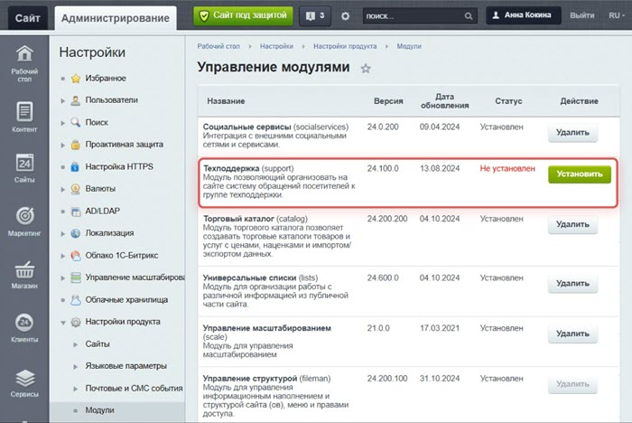
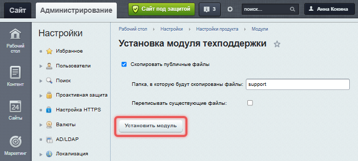
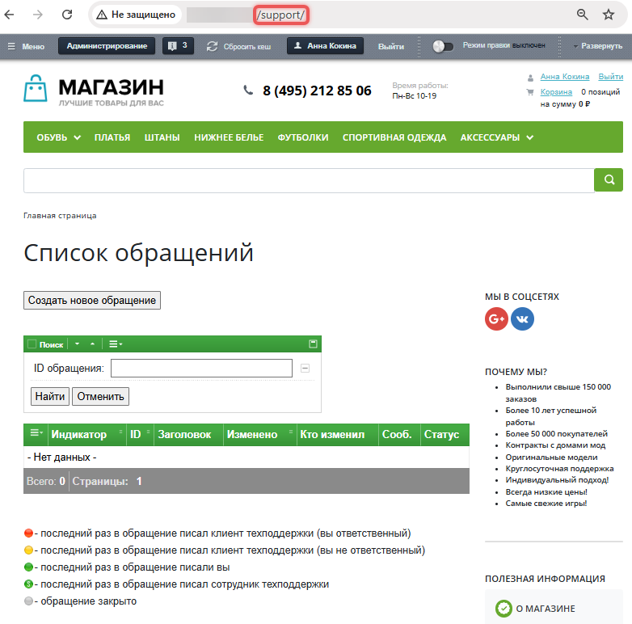

# Как установить модуль Техподдержка

**Навигация**
- [← Оглавление курса](index.md)
- [← Предыдущий: 2617 — Организация работы службы поддержки](lesson_2617.md)
- [Следующий: 9109 — Настройки модуля Техподдержка →](lesson_9109.md)

Официальная страница урока: https://dev.1c-bitrix.ru/learning/course/index.php?COURSE_ID=41&LESSON_ID=31026

1. Перейдите на страницу *Настройки &gt; Настройки продукта &gt; Модули*. Найдите в списке модуль Техподдержка и нажмите кнопку «Установить».
  
2. Если вы хотите автоматически создать публичную часть для работы техподдержки, отметьте опцию «Скопировать публичные файлы» и укажите папку, в которую будут скопированы файлы. Можете создать новую папку, указав ее название.
  Если вы ранее уже устанавливали модуль и хотите обновить файлы в указанной папке, отметьте опцию «Переписывать существующие файлы».
  Нажмите кнопку «Установить модуль».
  

Чтобы увидеть публичный интерфейс техподдержки, введите в браузере адрес сайта и пропишите название созданной папки.

Публичный интерфейс создан с использованием компонента [Техподдержка](https://dev.1c-bitrix.ru/user_help/components/services/support/support_ticket.php). Вы можете изменить параметры компонента: количество обращений и сообщений на одной странице, максимальную длину сообщения, направление сортировки сообщений. Подробнее читайте в уроке [Как настроить компонент](https://dev.1c-bitrix.ru/learning/course/index.php?COURSE_ID=34&LESSON_ID=9165).
