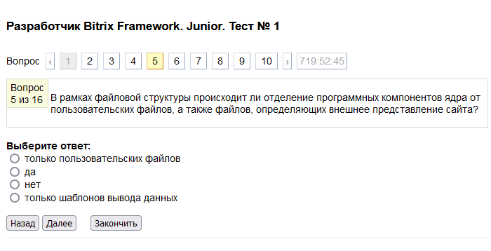
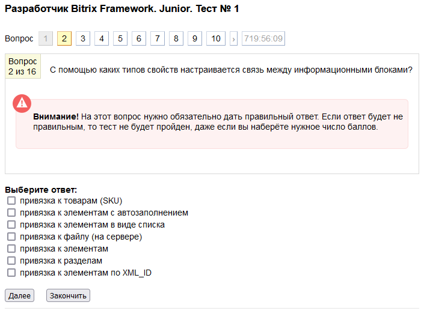
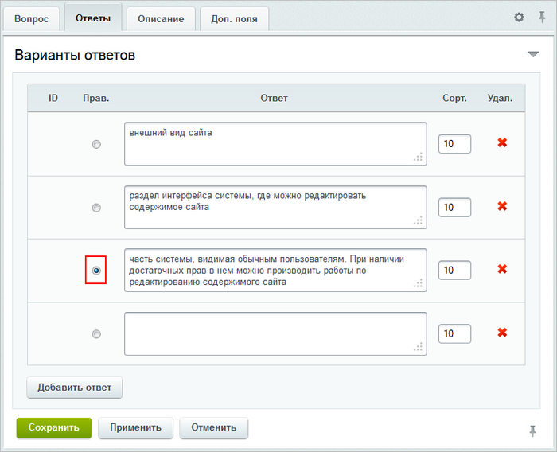

# Вопросы

**Навигация**
- [← Оглавление курса](index.md)
- [← Предыдущий: 2875 — Главы и уроки](lesson_2875.md)
- [Следующий: 2877 — Тесты →](lesson_2877.md)

Официальная страница урока: https://dev.1c-bitrix.ru/learning/course/index.php?COURSE_ID=41&LESSON_ID=3104

### Процесс создания

В обучающем курсе есть возможность создать вопросы для двух типов тестов:

- тест для самопроверки
- итоговый тест

Вопросы можно включать в тот или иной тест.

Вопросы по материалам курса могут быть привязаны непосредственно к курсу (т.е. созданы в самом верхнем уровне), к главам или урокам курса. Вопросы для самопроверки логичнее создавать для урока, чтобы сперва изучить материал, а затем пройти тест для самопроверки.

Перейти к созданию вопроса можно следующими способами:

- с помощью ссылки "**+**", расположенной в столбце **Вопросов** на странице со списком уроков/глав/курсов (Сервисы &gt; Обучение &gt; Курсы&gt; Название курса):
  
- с помощью кнопки **Добавить вопрос**, расположенной на странице со списком всех вопросов определенного урока/главы/курса (Сервисы &gt; Обучение &gt; Курсы&gt; Название курса &gt; Вопросы):
  

Если вы осуществляете переход с помощью кнопки **Добавить вопрос**, то следует сразу выбрать тип вопроса:

- **одиночный выбор** – в списке предложенных вариантов ответов может быть выбран
  			только один ответ
                      
  		;
- **множественный выбор** – в списке предложенных вариантов ответов может быть выбрано
  			несколько ответов
                      
  		.
- **сортировка** – в списке предложенных вариантов ответов необходимо расставить ответы
  			в нужном порядке
                      
  		;
- **текстовый ответ** – выводится
  			текстовое поле для самостоятельного ответа
                      
  		 обучаемым.
  **Примечание:** Для вопросов данного типа доступна возможность отправки письма с ответом преподавателю (т.е. автору) урока. Причем вы можете внести изменения в почтовый шаблон и добавить получателей, которым будет отправляться данное письмо. Оно отправляется по событию **NEW_LEARNING_TEXT_ANSWER** (Настройки &gt; Настройки продукта &gt; Почтовые события &gt; Типы почтовых событий).

В остальных случаях необходимый тип вопроса указывается в момент создания вопроса с помощью специальной формы создания (редактирования). На закладке **Вопрос** данной формы указывается текст самого вопроса:

Если вам требуется изменить привязку вопроса к уроку, то в поле **Урок** нажмите ссылку **сменить**. Откроется окно выбора главы/урока, к которому вопрос должен быть привязан.

Для включения вопроса в тест для самопроверки (данный тест будет доступен пользователям после изучения материалов урока, указанного в поле **Урок**) отметьте поле **Для самопроверки**. В тестах для самопроверки при неправильном ответе можно выводить сообщение, которое указывается в поле **Сообщение при неправильном ответе**. В итоговых тестах эта опция не работает.

Если на вопрос обязательно нужен правильный ответ, то выберите соответствующую опцию **Обязателен правильный ответ**. Тогда, если на этот вопрос не был дан правильный ответ, тест считается не пройденным (независимо от количества набранных баллов).
Внимание! В результатах теста не выводится сообщение о том, что не был правильно отвечен вопрос с опцией **Обязателен правильный ответ**. Поэтому, для удобства пользователей, при создании вопроса рекомендуется в закладке **Описание** указать, что включена опция необходимости правильного ответа.

К вопросу можно добавить изображение с помощью кнопки **Добавить файл**.

### Закладка Ответы, Описание и Доп. поля

На закладке Ответы указываются варианты ответов:

**Примечание**: Если необходимо добавить больше четырех ответов, то следует нажать кнопку **Добавить ответ** для добавления поля ответа.

В поле **Сорт.** указываются порядок отображения ответов (сортировка будет учитываться, если в тесте, в котором содержится данный вопрос, отключена опция **Случайный порядок ответов**).

**Важно!** Не забудьте отметить правильный вариант (варианты) ответа.

Для удаления ответа необходимо нажать кнопку  рядом с соответствующей записью.

На закладке **Описание** можно более подробно описать вопрос, а на закладке **Доп. поля** заполнить имеющиеся пользовательские поля для вопросов или перейти к добавлению новых полей.

После сохранения вопрос будет добавлен в общий список вопросов урока/главы/курса.
