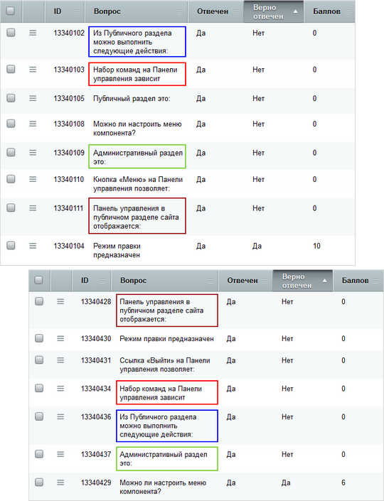

# Результаты обучения

**Навигация**
- [← Оглавление курса](index.md)
- [← Предыдущий: 2878 — Экспорт\импорт курсов](lesson_2878.md)
- [Следующий: 5792 — Учебные группы →](lesson_5792.md)

Официальная страница урока: https://dev.1c-bitrix.ru/learning/course/index.php?COURSE_ID=41&LESSON_ID=3105

Результаты обучения можно оценить с помощью соответствующих страниц в разделе **Обучение** (Сервисы &gt; Обучение) Административного раздела сайта:

### Попытки и результаты прохождения тестов

По итогам курса пользователям можно предложить пройти один или несколько тестов для проверки полученных знаний. Попытки прохождения тестов фиксируются на странице **Попытки** Сервисы &gt; Обучение &gt; Попытки.

Результат прохождения теста (по итогам наиболее результативной попытки) отражается на странице **Журнал** (Сервисы &gt; Обучение &gt; Журнал):

Если тест проверяется не автоматически, то в журнале выводится только количество набранных баллов.

Если включен **Контроль неправильных ответов**, то прохождение теста завершится при первом же неверном ответе.

В параметрах теста можно задать число попыток прохождения.  С помощью поля **Дополнительные попытки** добавляются попытки конкретному пользователю в конкретном тесте:

1. С помощью фильтра найдите нужного учащегося и тест;
2. Поставьте флажок в первой колонке и в панели действий выберите команду **Редактировать**. Все поля, в которых допустимо редактирование данных, станут активными.
3. Добавьте нужное число попыток в поле **Дополнительные попытки** и сохраните изменения.

### Сертификация

На странице **Сертификация** (Сервисы &gt; Обучение &gt; Сертификация) размещается список обучаемых, успешно сдавших все итоговые тесты учебного курса, а также общая статистика сдачи тестов.

С сертификатами можно выполнить следующие

			действия:

- активировать/деактивировать
- изменить данные
- удалить

**Примечание**:

			Список

		 пройденных и непройденных курсов текущего пользователя можно вывести в публичном разделе сайта с помощью компонента

			Отчет по курсам

                    Компонент выводит список пройденных и непройденных курсов текущего пользователя. Компонент является стандартным и входит в дистрибутив модуля.

						[Описание компонента «Отчет по курсам» в пользовательской документации.](http://dev.1c-bitrix.ru/user_help/detail.php?ID=63245)

		.

Штатно в модуле **Обучение** не предусмотрен механизм генерации файлов цифровых сертификатов о прохождении учебного курса.

### Пример работы со статистикой

Допустим, мы хотим понять, какой материал хуже всего усвоен тем или иным учащимся.

Выполним следующие несложные действия:

1. На странице **Список попыток** с помощью фильтра находим результаты нужного пользователя и нужного теста.
2. В отдельных вкладках браузера открываем результаты прохождения каждого теста. Результаты открываются по клику на ссылку в колонке **Вопросов**.
3. В каждой открывшейся вкладке сортируем вопросы кликом по колонке **Верно отвечен**, таким образом, чтобы наверху оказались неверно отвеченные вопросы.
4. Сравниваем результаты и ищем закономерности:
  

### Документация по теме

- [Результаты теста](https://dev.1c-bitrix.ru/user_help/service/learning/learn_test_result_admin.php)
- [Редактирование результата](https://dev.1c-bitrix.ru/user_help/service/learning/learn_test_result_edit.php)
- [Попытки](https://dev.1c-bitrix.ru/user_help/service/learning/learn_attempt_admin.php)
- [Журнал](https://dev.1c-bitrix.ru/user_help/service/learning/learn_gradebook_admin.php)
- [Сертификация](https://dev.1c-bitrix.ru/user_help/service/learning/learn_certification_admin.php)
