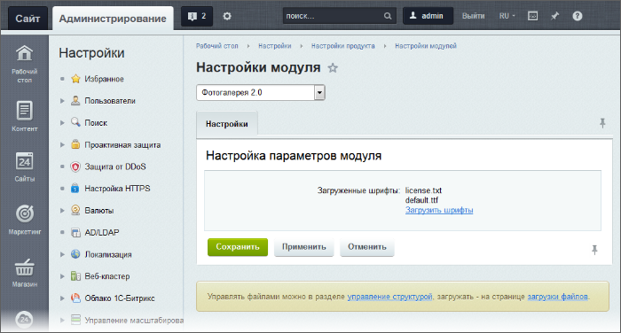
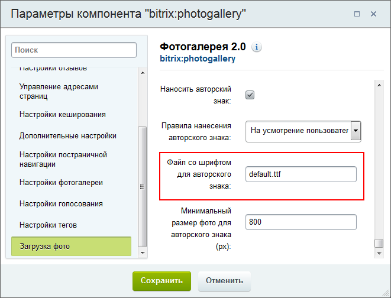

# Настройка модуля

**Навигация**
- [← Оглавление курса](index.md)
- [← Предыдущий: 13450 — Практические задания](lesson_13450.md)
- [Следующий: 6471 — Работа с комментариями многопользовательской галереи →](lesson_6471.md)

Официальная страница урока: https://dev.1c-bitrix.ru/learning/course/index.php?COURSE_ID=41&LESSON_ID=3123

|  | ### Настройка модуля |
| --- | --- |

Настройка модуля крайне проста и заключается в загрузке шрифтов для авторского знака. Это выполняется на странице настройки модуля **Фотогалерея 2.0** (Настройки &gt; Настройки продукта &gt; Настройки модулей &gt; Фотогалерея 2.0):

В секции **Загруженные шрифты** отображаются системные шрифты и добавленные пользователем шрифты для нанесения авторского знака. Загруженный шрифт для нанесения авторского знака выбирается в

			настройках комплексных компонентов

                    

		:

- Фотогалерея 2.0 (bitrix:photogallery)
                      Комплексный компонент **Фотогалерея 2.0** позволяет получить полнофункциональную фотогалерею,
   создавая физически только одну страницу.
  						[Описание компонента «Фотогалерея 2.0 (комплексный компонент)» в пользовательской документации.](http://dev.1c-bitrix.ru/user_help/detail.php?ID=91321)
- Фотогалерея 2.0 (многопользовательская) (bitrix:photogallery_user)
                      Комплексный компонент **Фотогалерея 2.0 (многопользовательская)** позволяет получить полнофункциональную многопользовательскую фотогалерею, создавая физически только одну страницу.
  						[Описание компонента «Фотогалерея 2.0 (многопользовательская) (комплексный компонент)» в пользовательской документации.](http://dev.1c-bitrix.ru/user_help/detail.php?ID=139125)

С помощью ссылки **Загрузить шрифты** загрузите собственные шрифты. Поддерживаются TTF-, OTF- и PS-шрифты.

**Примечание**: Обычно администратор выполняет только настройку модуля. Непосредственную работу по созданию и наполнению галерей ведёт [Контент-менеджер](https://dev.1c-bitrix.ru/learning/course/index.php?COURSE_ID=34&CHAPTER_ID=04481&LESSON_PATH=3905.4753.4481).

|  | #### Документация по теме: |
| --- | --- |

- [Настройки модуля](https://dev.1c-bitrix.ru/user_help/content/iblock/photogallery/settings.php)
- [Описание компонентов модуля](http://dev.1c-bitrix.ru/user_help/service/photogallery/components_2/index.php)

<!-- &lt;b&gt;Дополнительные эскизы&lt;/b&gt;
&lt;p&gt;В данной секции задаются параметры дополнительных эскизов: указываются произвольные &lt;b&gt;Название&lt;/b&gt;, &lt;b&gt;Код&lt;/b&gt;, &lt;b&gt;Размер (px)&lt;/b&gt; и &lt;b&gt;Качество (%)&lt;/b&gt; эскиза.

В результате, если в компоненте выбран дополнительный эскиз, то при загрузке картинки будет создана дополнительная копия картинки указанного размера и просмотр списка фотографий альбома будет возможен в нескольких вариантах.&lt;/p&gt;

&lt;p&gt;&lt;div class="hint"&gt;&lt;b&gt;Примечание: &lt;/b&gt;Код эскиза не может начинаться с цифры. &lt;/div&gt;&lt;/p&gt; -->
