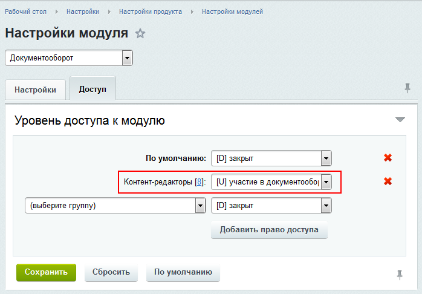

# Документооборот в структуре файлов

**Навигация**
- [← Оглавление курса](index.md)
- [← Предыдущий: 3130 — Настройка модуля](lesson_3130.md)
- [Следующий: 3124 — Статусы, создание и настройка →](lesson_3124.md)

Официальная страница урока: https://dev.1c-bitrix.ru/learning/course/index.php?COURSE_ID=41&LESSON_ID=3125

Настройка документооборота на последовательную работу над страницами сайта включает в себя настройку прав модулей **Документооборот** и **Управление структурой**, настройки в менеджере файлов для папок, участвующих в документообороте и [создание и настройку](lesson_3124.md) необходимых статусов для документов.

### Настройка прав модуля Документооборот

В модуле **Документооборот** для той группы пользователей, кто будет работать с документами установите право **Участие в документообороте**:

**Внимание для администраторов Битрикс24 в коробке!** Этот пункт недоступен для пользователя корпоративного портала с правами **Администрация портала**, эту операцию должен выполнять пользователь с правами **Администратор системы**.

### Настройка прав модуля Управление структурой

В модуле **Управление структурой** для той группы пользователей, кто будет работать с документами установите право **Редактирование файлов и папок**:

### Настройки в менеджере файлов

   В **Менеджере файлов** для папок и файлов, с которыми будет работать пользователь, для этой же группы

			установите право

                    

		 доступа **Документооборот**:

Пользователи группы, предназначенной для документооборота, должны иметь право доступа на чтение к папке `/bitrix/admin`.

### Документация по теме

- [Создание и редактирование документа](https://dev.1c-bitrix.ru/user_help/content/workflow/workflow_doc_edit.php)
- [Документы](https://dev.1c-bitrix.ru/user_help/content/workflow/workflow_list.php)
