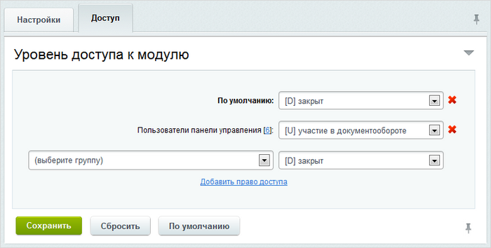

# Настройка модуля

**Навигация**
- [← Оглавление курса](index.md)
- [← Предыдущий: 6855 — Возможности Документооборота](lesson_6855.md)
- [Следующий: 3125 — Документооборот в структуре файлов →](lesson_3125.md)

Официальная страница урока: https://dev.1c-bitrix.ru/learning/course/index.php?COURSE_ID=41&LESSON_ID=3130

|  | ### Настраиваем модуль |
| --- | --- |

Управление настройками модуля выполняется на странице настройки модуля **Документооборот** (Настройки &gt; Настройки продукта &gt; Настройки модулей &gt; Документооборот).

На закладке **Настройки** суть полей ясна из названия, в крайнем случае обратитесь к

			пользовательской документации

                    Пользовательская документация содержит описание компонентов системы и описание полей настроек административной части системы.
[Подробнее...](https://dev.1c-bitrix.ru/user_help/content/workflow/settings.php)

		. Но одно поле поясним. Это поле **Группа администраторов документооборота**. Для нормальной работы документооборота нужно создавать, изменять статусы. Делается это, если у пользователя есть полный доступ к модулю Документооборот. Давать права полного доступа сотрудникам, работающим с документами нецелесообразно. Поэтому есть такое поле, в котором указывается какая группа пользователей будут администраторами.

На закладке **Доступ** настраиваются

			уровни прав доступа

                    

		 к модулю для групп пользователей сайта.

Для пользователей, которые должны работать с документами, установите право - **Участие в документообороте**, для тех кто контролирует работу можно установить право **Просмотр без права модификации**.
