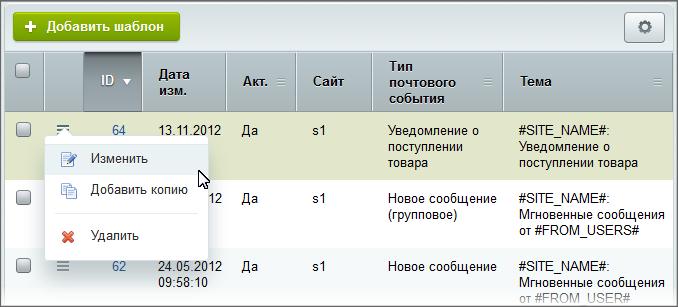
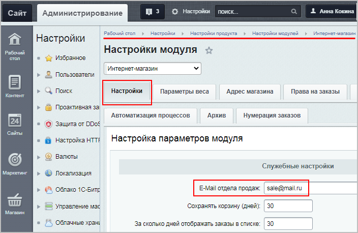

# Работа с почтовыми шаблонами

**Навигация**
- [← Оглавление курса](index.md)
- [← Предыдущий: 3534 — Типы событий](lesson_3534.md)
- [Следующий: 2945 — Настройка почты на Linux →](lesson_2945.md)

Официальная страница урока: https://dev.1c-bitrix.ru/learning/course/index.php?COURSE_ID=41&LESSON_ID=3523

Почтовые шаблоны расположены на странице Настройки &gt; Настройки продукта &gt; Почтовые и СМС события &gt; Почтовые шаблоны.


### Форма редактирования


Чтобы отредактировать почтовый шаблон, выберите пункт **Изменить** в меню действий нужного шаблона:





Откроется

			форма редактирования


		 почтового шаблона. Суть большинства параметров ясна из названия, опишем только некоторые:


- **От кого** - указывается адрес отправителя почтового сообщения. Для шаблонов, связанных с работой интернет-магазина, по умолчанию установлен макрос `#SALE_EMAIL#` (это
  			E-Mail отдела продаж
  Настройки &gt; Настройки продукта &gt; Настройки модулей &gt; Интернет-магазин (вкладка **Настройки**):
  
  		, указанный в настройках модуля **Интернет-магазин**). Вместо данного макроса можно указать прямой адрес отправителя.
- **Кому** - указываются
  			адреса
                      Адреса перечисляются через запятую.
  
  		 тех, кому будут отправлены письма.
  **Примечание**: Если в поля **От кого** и **Кому** почтового шаблона не проставлены конкретные адреса электронной почты, то подставляются адреса по умолчанию. Система сначала подставляет адрес из настроек сайта, к которому привязан шаблон, и затем, если такой адрес не обнаружен, из настроек **Главного модуля**. Поскольку адрес по умолчанию в обоих случаях один, то он будет подставлен в оба поля.
- **Скрытая копия** - о факте отправки письма на электронные адреса, указанные в данном поле, не будут знать ни главный адресат, ни получатели, указанные в поле **Копия**. Кроме того, адресаты, указанные в поле **Скрытая копия**, также не будут видеть друг друга в получателях письма.
- **Важность** - нажмите на стрелочку и укажите степень важности отсылаемого уведомления: высокая, нормальная или низкая.
- **Тема** - укажите тему письма. Удобно использовать для рассылок определённой тематики. Тема должна быть предварительно создана.


В блоке **Сообщение** составьте уведомление, которое Вы хотите разослать пользователям. При редактировании сообщения можно выбрать более удобный для Вас в данной форме формат представления сообщения: **Текст**, **HTML** или **Визуальный редактор**.


В конце каждого почтового шаблона указаны

			макросы


**Макрос** - специальный код, вместо которого подставляется уникальное значение определённого параметра.

		, **доступные именно для этого шаблона**. Такие макросы Вы можете вставлять в

			поля письма


		 или в само сообщение:


**Примечание:**Если в описании макроса указано, что параметр устанавливается в настройках, то зачастую имеются в виду настройки Главного модуля.


Кроме макросов, в почтовых шаблонах можно указать php-код (с версии главного модуля 15.0.7). К примеру:


```
Добрый день!
Ваш логин: #LOGIN#
Текущая дата: <?=date('d.m.Y')?>
```


### Добавление шаблона


Нажав кнопку **Добавить шаблон** на контекстной панели, Вы откроете форму добавления. Она фактически идентична форме редактирования шаблона, за исключением того, что Вам нужно выбрать тип ранее созданного

			почтового события


Введите название создаваемого типа. Поставьте галочки напротив заголовков тех языковых описаний, на которых хотите представить свой новый тип, и заполните поля **Сортировка**, **Название** и **Описание**. В поле **Описание** введите доступные поля (макросы вида `#SOMETHING#,`), которые должны использоваться при написании тела сообщения почтового шаблона, который будет принадлежать создаваемому вами типу.

[Подробнее](lesson_3534.md)...

		, к которому будет привязан шаблон:


Чтобы увидеть все поля формы, нажмите **показать дополнительные заголовки...**.


**Примечание**: Оценить внешний вид созданного письма можно только отправив это письмо. Соответственно, нужно выполнить условия срабатывания

			почтового события


Типы почтовых событий описаны на странице Настройки &gt; Настройки продукта &gt; Почтовые события &gt; Типы почтовых событий.

[Подробнее](lesson_3534.md)...

		, по которому запустится процесс отправки писем по шаблону.

Поэтому для тестирования почтового шаблона удобнее сначала в поле **Кому** указать собственный адрес, затем выполнить отправку письма и оценить его внешний вид. А уже после тестирования заполнить поля **Кому**, **Копия** и **Скрытая копия**.


### Визуальный редактор


С версии Главного модуля 15.0.7 в теле сообщения появилась возможность размещать компоненты. Список компонентов, которые

			можно использовать


В визуальном редакторе при редактировании почтового шаблона отображаются только те компоненты, у которых в файле описания (**.description.php**) указан тип `"TYPE" => "mail"`.

[Подробнее](lesson_3523.md)...

		 в почтовых шаблонах, отображается в

			визуальном редакторе


Компоненты отображаются на специальной панели в визуальном редакторе. Компоненты разделены на группы (например - контент, общение, магазин). Строка поиска чуть ниже поможет вам найти компонент по названию.

[Подробнее](https://dev.1c-bitrix.ru/learning/course/index.php?COURSE_ID=34&LESSON_ID=9163)...

		. С помощью компонентов можно указать дополнительную информацию (например, подробную информацию о заказе):


В форме редактирования нужного почтового шаблона выберите режим визуального редактора, найдите справа в списке компонентов подходящий вам компонент и перетяните его влево в рабочую область, а затем

			настройте


О том, как настраивать компонент, читайте [в соответствующем уроке](https://dev.1c-bitrix.ru/learning/course/index.php?COURSE_ID=34&LESSON_ID=9165) учебного курса "Контент-менеджер".

Описания полей всех компонентов приведены [в пользовательской документации](https://dev.1c-bitrix.ru/user_help/components/index.php).

		 компонент.


## Ограничения при размещении компонентов

При размещении компонентов нужно учитывать, что:


- Подключение компонентов выполняется методом `EventMessageThemeCompiler::includeComponent()` вместо метода
  			CMain::IncludeComponent
  Метод подключает компонент 2.0. Нестатический метод.
  [Подробнее](https://dev.1c-bitrix.ru/api_help/main/reference/cmain/includecomponent.php)...
  		, хотя передаваемые аргументы нового метода аналогичны аргументам `IncludeComponent`.
- В визуальном редакторе при редактировании почтового шаблона отображаются только те почтовые компоненты, у которых в файле описания (**.description.php**) указан тип `"TYPE" => "mail"`. Например:
  ```
  <?if (!defined("B_PROLOG_INCLUDED") || B_PROLOG_INCLUDED!==true) die();
  $arComponentDescription = array(
  	"NAME" => GetMessage("SBBS_DEFAULT_TEMPLATE_NAME"),
  	"TYPE" => "mail",
  	"DESCRIPTION" => GetMessage("SBBS_DEFAULT_TEMPLATE_DESCRIPTION"),
  	"ICON" => "/images/sale_basket.gif",
  	"PATH" => array(
  		"ID" => "e-store",
  		"CHILD" => array(
  			"ID" => "sale_basket",
  			"NAME" => GetMessage("SBBS_NAME")
  		)
  	),
  );
  ?>
  ```
  Без этого компонент можно будет подключить только вставив код вызова вручную.
- Подключенный в почтовом шаблоне компонент может выполняться на хите (отправка письма на хите), соответственно, компонент не должен использовать:

  - глобальный объект
    			USER
    Глобальный объект класса CUser, хранит в себе данные авторизации текущего пользователя, предназначен для манипуляции параметрами текущего пользователя.
    [Подробнее](https://dev.1c-bitrix.ru/api_help/main/general/magic_vars.php#user)...
    		, так как в нём содержатся данные о том кто сделал хит, а не о том, кому отправляется письмо;
  - константы
    			SITE_ID
    Идентификатор текущего сайта при использовании в Публичной части, код языка при использовании в административной части.
    [Подробнее](https://dev.1c-bitrix.ru/api_help/main/general/constants.php#site_id)...
    		,
    			LANGUAGE_ID
    Если это публичная часть, то в данной константе храниться поле "Язык" из настроек текущего сайта, если административная часть, то в данной константе храниться идентификатор текущего языка.
    [Подробнее](https://dev.1c-bitrix.ru/api_help/main/general/constants.php#language_id)...
    		,
    			SITE_TEMPLATE_ID
    Идентификатор текущего шаблона сайта.
    [Подробнее](https://dev.1c-bitrix.ru/api_help/main/general/constants.php#site_template_id)...
    		.
    Вместо них нужно использовать вызовы методов:
    `$this->getSiteId()` - сайт, указанный в почтовом событии,
    `$this->getLanguageId()` - язык сайта, указанного в почтовом событии,
    `$this->getSiteTemplateId()` - шаблон сайта, указанного в почтовом событии.


**Внимание!** При отправке письма по шаблону будет выполнен код компонента. Языковые файлы в компоненте будут подключены для того языка, который указан в настройках сайта, привязанного к почтовому событию. Для письма используется та кодировка, которая указана в настройках сайта, код которого передан в событии.


Таким образом, если на сайте используется

			многосайтовость с разными языками,


Многосайтовость и языковые версии сайта – это разные понятия, хотя иногда взаимосвязанные. При необходимости языковые версии можно реализовать и как отдельные языковые папки (разделы) в составе одного сайта, и как отдельные сайты.


В данном случае следует предварительно проанализировать, какая именно информация должна быть представлена на различных языках и какие действия с объектами сайта предполагается производить.

[Подробнее](https://dev.1c-bitrix.ru/learning/course/index.php?COURSE_ID=103&LESSON_ID=284&LESSON_PATH=8799.284)...

		 то на хите по русскоязычному сайту может быть отправлено письмо для другого языка.


### Темы оформления


Тема оформления - это шаблон оформления сообщения. Создаётся из списка тем со страницы Настройки &gt; Настройки продукта &gt; Почтовые и СМС события &gt; Темы оформления. Технология создания темы аналогична созданию

			шаблона сайта


**Шаблон дизайна** - это внешний вид сайта, в котором определяется расположение различных элементов на сайте, художественный стиль и способ отображения страниц. Включает в себя программный html- и php-код, графические элементы, таблицы стилей, дополнительные файлы для отображения контента. Может так же включать в себя шаблоны компонентов, шаблоны готовых страниц и сниппеты.

[Подробнее](https://dev.1c-bitrix.ru/learning/course/index.php?COURSE_ID=43&LESSON_ID=2820)...

		 и имеет аналогичную форму.  Технически тема оформления - это шаблон сайта в папке `/bitrix/templates`. При создании именно темы для почтовых сообщений нужно выбрать значение **Шаблон для почтовых писем** в поле **Тип**. В этом случае в файле описания (**.description.php**) будет указан тип `"TYPE" => "mail"`:


```
<?$arTemplate = array(
	"NAME" => "Тестовая тема оформления",
	"DESCRIPTION" => "Тестовая тема оформления",
	"SORT" => "",
	"TYPE" => "mail",
);
?>
```


Стили, указанные в файлах стилей, будут вставлены в письмо (inline) в том месте, где будет вызов `<?=$this->showStyles()?>`


Темы оформления, так же как и шаблоны сайта, могут содержать php-код.


Поиск шаблона почтового компонента выполняется по стандартному алгоритму. Если у почтового шаблона, где подключается компонент, проставлена тема оформления,
то папка темы оформления используется в качестве текущего шаблона сайта при поиске шаблона компонента.


### Документация по теме


- [Почтовые шаблоны](https://dev.1c-bitrix.ru/user_help/settings/settings/mail_events/message_admin.php)
- [Создание и редактирование почтового шаблона](https://dev.1c-bitrix.ru/user_help/settings/settings/mail_events/message_edit.php)
- [Создание и редактирование темы](https://dev.1c-bitrix.ru/user_help/settings/settings/mail_events/message_theme_edit.php)
- [Почтовые уведомления о заказах](https://dev.1c-bitrix.ru/learning/course/index.php?COURSE_ID=42&LESSON_ID=20050) (урок в курсе "Администратор. Бизнес")
- [Как прикрепить файл к письму из почтового шаблона в 1С Битрикс](https://dev.1c-bitrix.ru/community/webdev/user/114106/blog/9787/) (блог)
- [Почтовый шаблон со вложенным файлом](https://dev.1c-bitrix.ru/support/forum/forum6/topic89169/) (форум разработчиков)
- [Как в 1С-Битрикс прикрепить к письму файлы из шаблона почтового события при отправке](https://devfix.ru/web_studio/blogs/722/) (статья веб-студии "DevFIX")
