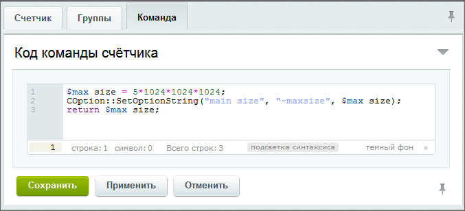

# Счётчики

**Навигация**
- [← Оглавление курса](index.md)
- [← Предыдущий: 2912 — Передача файла](lesson_2912.md)
- [Следующий: 3587 — Авторизация →](lesson_3587.md)

Официальная страница урока: https://dev.1c-bitrix.ru/learning/course/index.php?COURSE_ID=41&LESSON_ID=3526

Модуль **Контроллер** позволяет создавать и применять на сайтах счётчики.


### Счётчики


> **Счётчик** - инструмент для выполнения на удалённых сайтах определённого php-кода в заданный период времени.


В системе созданы и  могут быть применены к группам сайтов 4 штатных счётчика:


- Размер свободного дискового пространства
- Количество сайтов
- Количество пользователей
- Дата последней авторизации


На странице Сервисы &gt; Контроллер &gt; Счётчики можно создать и отредактировать собственные счётчики.


Параметры счётчика настраиваются на странице редактирования конкретного счётчика, параметры запуска - на странице редактирования группы сайтов.


### Создание и настройка запуска


Открыв форму создания счётчика, заполните его поля:





Для настройки запуска счётчика откройте форму редактирования группы сайтов (Сервисы &gt; Контроллер &gt; Группы) на закладке **Счётчики**:


Отметьте нужные для данной группы сайтов счётчики и установите периодичность их запуска. Результаты работы отображаются в форме сайта, подчиненного контроллеру, на закладке **Счётчики**.


### История изменений


Каждый счётчик ведёт свою историю изменений. Для её просмотра воспользуйтесь кнопкой

			История

                    

		 в форме редактирования Счётчика. Откроется история изменений счётчиков, которая кроме просмотра истории позволяет восстановить любую команду.


### Примеры кодов счётчиков


Пользователи

			экстранета

                    **Экстранет** - расширение корпоративного портала, которое позволяет компании осуществлять конфиденциальную связь с поставщиками, дистрибьюторами и другими внешними пользователями без доступа их к внутрикорпоративной информации.
[Подробнее...](https://dev.1c-bitrix.ru/learning/course/index.php?COURSE_ID=48&CHAPTER_ID=04756)


```
$counter = 0;
$rsUsers = CUser::GetList($o="ID", $b="asc", array("ACTIVE"=>"Y","=UF_DEPARTMENT"=>false), array("SELECT"=>array("ID")));
while($arUser = $rsUsers->Fetch())
  if($arUser["EXTERNAL_AUTH_ID"] !== "__controller")
    $counter++;
return $counter;
```


Выставление лимита в 5GB (Тип - Число, формат - как размер файла)


```
$max_size = 5*1024*1024*1024;
COption::SetOptionString("main_size", "~max_size", $max_size);
return $max_size;
```


Объем файлов в облаке (Тип - Число, формат - как размер файла)


```
$file_size = 0.0;
if(CModule::IncludeModule('clouds'))
{
  $rsBuckets = CCloudStorageBucket::GetList();
  while($arBucket = $rsBuckets->Fetch())
    $file_size += $arBucket["FILE_SIZE"];
}

COption::SetOptionString("main_size", "~cloud", $file_size);
$params = array("status" => "d", "time" => time());
COption::SetOptionString("main_size", "~cloud_params", serialize($params));

return $file_size;
```


### Документация по теме


- [Счетчики](https://dev.1c-bitrix.ru/user_help/service/controller/controller_counter_admin.php)
- [Создание счетчика](https://dev.1c-bitrix.ru/user_help/service/controller/controller_counter_edit.php)
