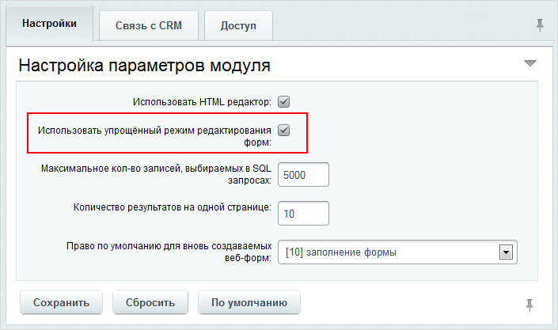
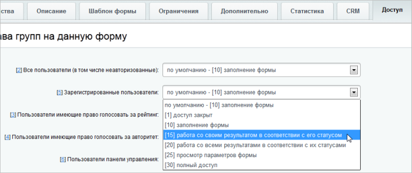
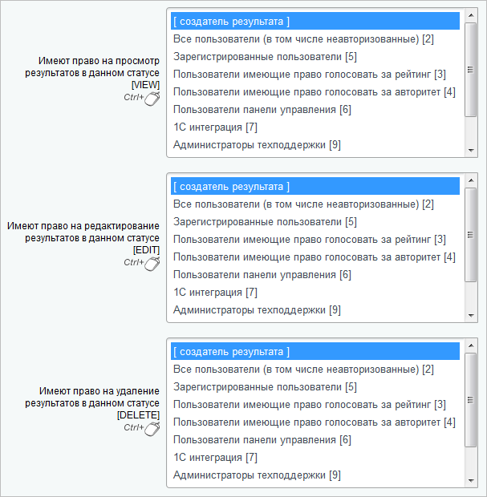

# Настройка доступа к собственным результатам заполнения веб-формы

**Навигация**
- [← Оглавление курса](index.md)
- [← Предыдущий: 2858 — Настройки модуля](lesson_2858.md)
- [Следующий: 6749 — ТЗ на систему Вопрос-ответ →](lesson_6749.md)

Официальная страница урока: https://dev.1c-bitrix.ru/learning/course/index.php?COURSE_ID=41&LESSON_ID=3846

|  | #### Как настроить доступ |
| --- | --- |

Доступ пользователя к результатам заполнения веб-формы в упрощённом режиме задаётся в настройках модуля **Веб-формы**. Если выставить **полный доступ**, то все члены группы пользователей будут иметь доступ ко всем веб-формам. Такое решение удобное, но не всегда правильное.

Более гибко ограничение прав реализовано в расширенном режиме редактирования. В настройках модуля Веб-формы для группы пользователя обозначьте  право доступа как **доступ открыт** и выключите

			использование упрощённого режима

                    

		 редактирования веб-форм.

Определите доступ непосредственно к конкретной веб-форме (Сервисы &gt; Веб-формы &gt; Настройка форм &gt; Имя_формы):

Создайте для данной формы статусы или используйте уже существующие, но в том и другом случае у соответствующей группы пользователей должен быть доступ к работе с результатами в данном статусе:

Для доступа в административном интерфейсе к результатам заполнения веб-формы нужно чтобы пользователь имел как минимум право

			Чтение

                    На странице Контент &gt; Структура сайта &gt; Файлы и папки &gt; bitrix, в меню действий папки `/admin` кликните пункт **Права на доступ продукта** (либо **Свойства папки**, а затем перейдите на закладку **Доступ**) и укажите данное право для группы, к которой принадлежит пользователь..

		 на папку `/bitrix/admin/`.

|  | #### Документация по теме: |
| --- | --- |

- [Веб-формы](http://dev.1c-bitrix.ru/user_help/service/form/index.php)
