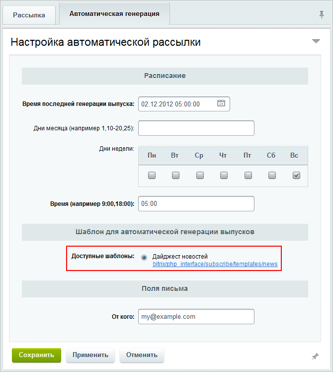
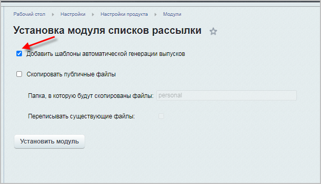
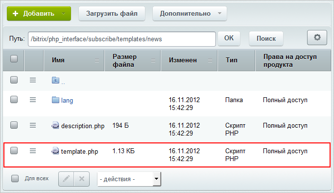
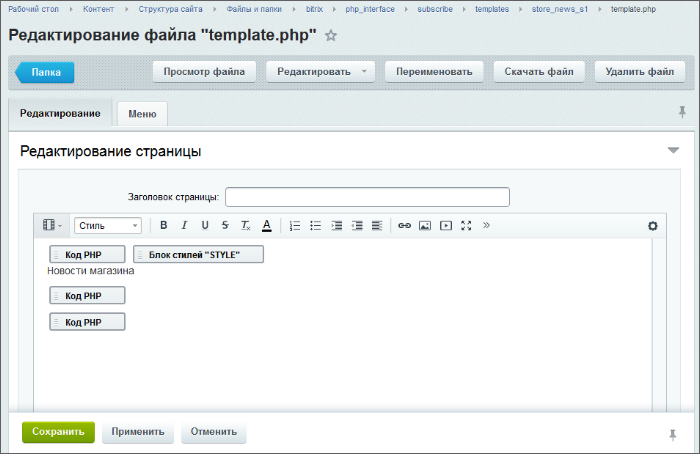

# Шаблон рассылки

**Навигация**
- [← Оглавление курса](index.md)
- [← Предыдущий: 9111 — Настройки модуля Подписка и Рассылки](lesson_9111.md)
- [Следующий: 20220 — Проверьте себя →](lesson_20220.md)

Официальная страница урока: https://dev.1c-bitrix.ru/learning/course/index.php?COURSE_ID=41&LESSON_ID=4810

В каждом дистрибутиве продукта есть образец шаблона рассылки. Как любая универсальная вещь, он нуждается в адаптации под конкретный сайт. Администратор может отредактировать шаблон по умолчанию или создать новый.

### Редактирование шаблона

1. Из формы создания рассылки перейдите по ссылке с названием
  			доступного шаблона
                      
  		.
  **Примечание**: Если у Вас не отображаются доступные шаблоны, то в списке модулей (Настройки &gt; Настройки продукта &gt; Модули) удалите и вновь установите модуль **Подписка, рассылки**, отметив опцию
  			Добавить шаблоны автоматической генерации выпусков.
  
2. Затем на открывшейся странице **Менеджера файлов** перейдите к
  			редактированию файла шаблона
                      
  		.
3. Шаблон редактируется так же как и обычная страница сайта. В нём может быть размещена как статическая информация (например, приветствие), так и программный скрипт или визуальные компоненты, использованием которых будет выполняться выборка информации.
  

### Создание шаблона

Создание нового шаблона заключается в копировании папки с текущим шаблоном (в дистрибутиве он называется **news** и расположен по пути: `/bitrix/php_interface/subscribe/templates/` и редактированием его под свои потребности.

**Внимание!** По умолчанию шаблоны для автоматической генерации выпусков лежат в директории `/bitrix/php_interface/subscribe/templates`. Для поддержки версионности при разработке сайта в ядре 14.0.1 была введена поддержка папки [/local](https://dev.1c-bitrix.ru/learning/course/?COURSE_ID=43&LESSON_ID=5119#local), что облегчает совместную разработку сайта. А с версии 16.5 модуля **Подписка, Рассылки** шаблоны для автоматической генерации выпусков можно хранить в папке `/local/php_interface/subscribe/templates`.

Приоритет всегда у папки `/local` перед `/bitrix`, т.е  если в `/local/php_interface/subscribe/templates` и в `/bitrix/php_interface/subscribe/templates` будут находиться шаблоны с одинаковым названием, то шаблон будет выбираться из папки `/local`.
