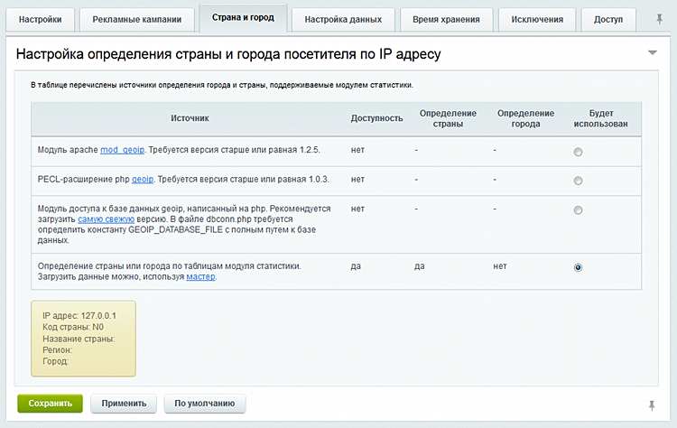

# Примеры кастомизации

**Навигация**
- [← Оглавление курса](index.md)
- [← Предыдущий: 12307 — Как подключить электронную торговлю Google](lesson_12307.md)
- [Следующий: 2095 — Поисковая оптимизация →](lesson_2095.md)

Официальная страница урока: https://dev.1c-bitrix.ru/learning/course/index.php?COURSE_ID=41&LESSON_ID=4966

|  | #### Пара примеров для разработчиков |
| --- | --- |


Для корректного определения геолокации в настройках модуля Аналитики настройте закладку

			Страна и город

                    На закладке выполняется настройка параметров определения страны и города посетителя по IP адресу.



[Подробнее](/user_help/statistic/settings.php#tab_city)...

		.


1. **Определение текущих посетителей в онлайне**. Может использоваться как для кейса "Количество людей на сайте", так и для таких кейсов как "Данную страницу сейчас просматривают".


```
if (\Bitrix\Main\Loader::includeModule('statistic'))
{
   $res = \CUserOnline::getList($guests, $sessions);
   echo 'Всего ' . $guests . ' гостей, и ' .$sessions . ' сессий';
   echo '';
   while ($row = $res->fetch())
   {
      echo 'Гость #' . $row['ID'] .
          ', из ' . $row['REGION_NAME'] .
          ', его IP = ' . $row['IP_LAST'] .
         ', последний хит был на ' . $row['URL_LAST'];
      echo '';
   }
}
```


Выведет примерно следующее:


```
Всего 24 гостей, и 24 сессий
Гость #8982548, из Москва, его IP = 178.208.*.*, последний хит был на https://....
Гость #8982547, из Санкт-Петербург, его IP = 5.188.*.*, последний хит был на https://....
...
```


2. **Определение текущего города**:


```
if (\Bitrix\Main\Loader::includeModule('statistic'))
{
   $res = \CGuest::getList(
      $by = 's_last_date',
      $order = 'desc',
      [
         'SESS_GUEST_ID' => $_SESSION['SESS_GUEST_ID']
      ],
      $isfiltered
   );
   if ($row = $res->fetch())
   {
      echo 'Ваш город: ' . $row['LAST_REGION_NAME'];
   }
}
//>> Ваш город: Москва
```


Может применяться для передачи данного города при оформлении заказа (нужен отдельный скрипт обработки, чтобы оформление заказа понимало данный город). Или для показа определенных типов цен в конкретном городе (требует также дополнительного программирования).
