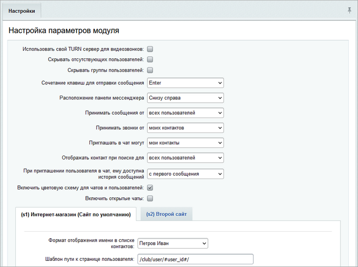

# Веб-мессенджер: настройки модуля

**Навигация**
- [← Оглавление курса](index.md)
- [← Предыдущий: 4562 — Wiki](lesson_4562.md)
- [Следующий: 5266 — Календарь событий →](lesson_5266.md)

Официальная страница урока: https://dev.1c-bitrix.ru/learning/course/index.php?COURSE_ID=41&LESSON_ID=4996

**Внимание**: в *1С-Битрикс: Управление сайтом* поддержка чата (модуля im) прекращена.


|  | Для настройки модуля **Веб-мессенджер** перейдите на страницу  Настройки &gt; Настройки продукта &gt; Настройки модулей &gt; Веб-мессенджер |
| --- | --- |





На закладке **Настройки** задаются глобальные настройки параметров модуля, которые определяют:


- сервер видеозвонков;
- отображение истории, контактов, сообщений по умолчанию;
- расположение панели мессенджера;
- настройки приватности (для *«1С-Битрикс: Управление сайтом»*);
- указанию для каждого сайта шаблона пути к странице пользователя для правильной работы модуля с профилем пользователя и добавлению в друзья (для *«1С-Битрикс: Управление сайтом»*);
- указание формата отображения имени в списке контактов.


**Внимание**: Для улучшения быстродействия модуля **Веб-мессенджер** версии **17.0.4 и выше** необходимо:

- Обновить вашу БД MySQL до версии 5.6.
- После этого [в командной строке базы данных](/learning/course/index.php?COURSE_ID=41&LESSON_ID=2029) выполнить следующий запрос:
  ```
  CREATE fulltext index IXF_IM_MESS_1 on b_im_message
  ```


Если вы устанавливали продукт на сервер с уже установленной БД MySQL 5.6 и выше, то вам ничего делать не нужно.


**Примечание**: подробное описание каждого параметра приведено в [пользовательской документации](/user_help/service/im/settings.php) по модулю **Веб-мессенджер**.


|  | #### Документация по теме: |
| --- | --- |


- [Настройка модуля Push and Pull](lesson_2033.md)
- [Телефония](/learning/course/index.php?COURSE_ID=48&CHAPTER_ID=02699)
- [Настройки модуля (документация)](http://dev.1c-bitrix.ru/user_help/service/im/settings.php)
