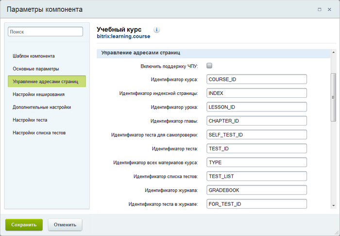
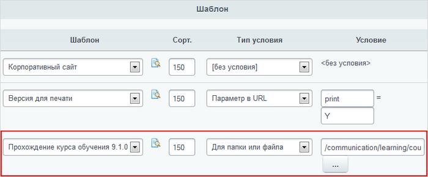

# Публикация курса

**Навигация**
- [← Оглавление курса](index.md)
- [← Предыдущий: 2877 — Тесты](lesson_2877.md)
- [Следующий: 20114 — Проверьте себя →](lesson_20114.md)

Официальная страница урока: https://dev.1c-bitrix.ru/learning/course/index.php?COURSE_ID=41&LESSON_ID=5075

|  | ### Публикация списка курсов |
| --- | --- |

Страница со списком курсов создается с помощью компонента

			Список курсов

						[Описание компонента «Список курсов» в пользовательской документации.](http://dev.1c-bitrix.ru/user_help/detail.php?ID=63243)

		 (**learning.course.list**), который

			размещается

Мы полагаем что вы уже изучили начальный курс Контент-менеджера и знаете как правильно разместить компонент на странице и как настроить его. Если вы, всё же, этого не знаете, то почитайте об этом [здесь](https://dev.1c-bitrix.ru/learning/course/index.php?COURSE_ID=34&CHAPTER_ID=06945&LESSON_PATH=3905.4457.6945)

		 на

			уже созданной странице

                    Мы полагаем что вы уже изучили начальный курс Контент-менеджера и знаете как создавать страницы. Если вы, всё же, этого не знаете, то почитайте о том как создавать страницы [здесь](https://dev.1c-bitrix.ru/learning/course/index.php?COURSE_ID=34&LESSON_ID=1911).

		 в структуре вашего сайта.

**Важно!** В настройках компонента указывается адрес страницы для детального просмотра курса. Если страница с указанным именем не существует, то ее необходимо создать.

|  | ### Публикация курса |
| --- | --- |

Публичный интерфейс для детального просмотра курса создается с помощью комплексного компонента

			Учебный курс

                    Комплексный компонент осуществляет полноценный вывод учебного курса. Компонент стандартный и входит в дистрибутив модуля.

						[Описание компонента «Учебный курс (комплексный компонент)» в пользовательской документации.](http://dev.1c-bitrix.ru/user_help/detail.php?ID=63239)

		 (**learning.course**). С помощью данного комплексного компонента осуществляется показ не только глав и уроков курса, но и созданных к курсу итоговых тестов.

**Примечание:** размещение компонента выполняется на странице с именем, указанным в настройках компонента **Список курсов**.

Обратите внимание, если в настройках компонента отмечена опция **Включить поддержку ЧПУ**, то необходимо указать адреса всех страниц курса. В противном случае следует задать переменные, которым будут передаваться идентификаторы страниц. Без особой необходимости **не рекомендуется менять**  используемые по умолчанию значения переменных.

В обучающем разделе вашего *Bitrix Framework* вы можете опубликовать дополнительную информацию для пользователей, используя такие компоненты как

			Отчет по курсам

                    Компонент выводит список пройденных и непройденных курсов текущего пользователя. Компонент является стандартным и входит в дистрибутив модуля.

						[Описание компонента «Отчет по курсам» в пользовательской документации.](http://dev.1c-bitrix.ru/user_help/detail.php?ID=63245)

		 (**learning.student.certificates**),

			Журнал студента

						[Описание компонента «Журнал студента» в пользовательской документации.](http://dev.1c-bitrix.ru/user_help/detail.php?ID=63244)

		 (**learning.student.gradebook**) и др.

**Важно!** Показ детального описания, разделов, страниц и тестов курса выполняется на основе отдельного шаблона дизайна. Условия применения шаблона дизайна, используемого для просмотра курсов, задаются также как и для других шаблонов. Т.е.

			на странице настроек *Bitrix Framework*

		  следует указать, к каким страницам или страницам какого раздела будет применяться шаблон.
